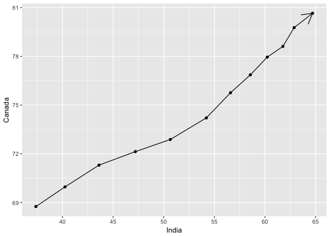
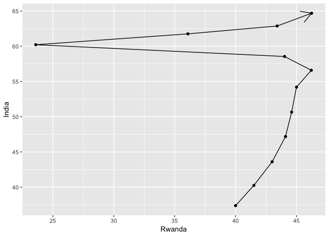

hw04-MaunishUBC
================

### Homework 04: Tidy data and joins

Install packages for analysis

``` r
library(gapminder)
head(gapminder)
```

    ## # A tibble: 6 x 6
    ##       country continent  year lifeExp      pop gdpPercap
    ##        <fctr>    <fctr> <int>   <dbl>    <int>     <dbl>
    ## 1 Afghanistan      Asia  1952  28.801  8425333  779.4453
    ## 2 Afghanistan      Asia  1957  30.332  9240934  820.8530
    ## 3 Afghanistan      Asia  1962  31.997 10267083  853.1007
    ## 4 Afghanistan      Asia  1967  34.020 11537966  836.1971
    ## 5 Afghanistan      Asia  1972  36.088 13079460  739.9811
    ## 6 Afghanistan      Asia  1977  38.438 14880372  786.1134

``` r
library(tidyverse)
```

    ## Loading tidyverse: ggplot2
    ## Loading tidyverse: tibble
    ## Loading tidyverse: tidyr
    ## Loading tidyverse: readr
    ## Loading tidyverse: purrr
    ## Loading tidyverse: dplyr

    ## Conflicts with tidy packages ----------------------------------------------

    ## filter(): dplyr, stats
    ## lag():    dplyr, stats

``` r
library(kableExtra)
```

### Data Reshaping: Activity\#2

#### Break the dataset so that it has information for 3 countries: Canada, India and Rwanda

``` r
life_exp_countries <- gapminder %>% 
  filter(country %in% c("Canada", "India", "Rwanda")) %>% 
  select(country, year, lifeExp)
```

    ## Warning: package 'bindrcpp' was built under R version 3.3.2

``` r
life_exp_countries
```

    ## # A tibble: 36 x 3
    ##    country  year lifeExp
    ##     <fctr> <int>   <dbl>
    ##  1  Canada  1952   68.75
    ##  2  Canada  1957   69.96
    ##  3  Canada  1962   71.30
    ##  4  Canada  1967   72.13
    ##  5  Canada  1972   72.88
    ##  6  Canada  1977   74.21
    ##  7  Canada  1982   75.76
    ##  8  Canada  1987   76.86
    ##  9  Canada  1992   77.95
    ## 10  Canada  1997   78.61
    ## # ... with 26 more rows

#### Let's reshape this such that each row is a year and each column is a country

``` r
life_exp_countries_untidy <- spread(life_exp_countries, key = "country", value = lifeExp)
life_exp_countries_untidy %>% kable(row.names = TRUE, align = 'c') %>% 
  kable_styling()
```

<table class="table" style="margin-left: auto; margin-right: auto;">
<thead>
<tr>
<th style="text-align:left;">
</th>
<th style="text-align:center;">
year
</th>
<th style="text-align:center;">
Canada
</th>
<th style="text-align:center;">
India
</th>
<th style="text-align:center;">
Rwanda
</th>
</tr>
</thead>
<tbody>
<tr>
<td style="text-align:left;">
1
</td>
<td style="text-align:center;">
1952
</td>
<td style="text-align:center;">
68.750
</td>
<td style="text-align:center;">
37.373
</td>
<td style="text-align:center;">
40.000
</td>
</tr>
<tr>
<td style="text-align:left;">
2
</td>
<td style="text-align:center;">
1957
</td>
<td style="text-align:center;">
69.960
</td>
<td style="text-align:center;">
40.249
</td>
<td style="text-align:center;">
41.500
</td>
</tr>
<tr>
<td style="text-align:left;">
3
</td>
<td style="text-align:center;">
1962
</td>
<td style="text-align:center;">
71.300
</td>
<td style="text-align:center;">
43.605
</td>
<td style="text-align:center;">
43.000
</td>
</tr>
<tr>
<td style="text-align:left;">
4
</td>
<td style="text-align:center;">
1967
</td>
<td style="text-align:center;">
72.130
</td>
<td style="text-align:center;">
47.193
</td>
<td style="text-align:center;">
44.100
</td>
</tr>
<tr>
<td style="text-align:left;">
5
</td>
<td style="text-align:center;">
1972
</td>
<td style="text-align:center;">
72.880
</td>
<td style="text-align:center;">
50.651
</td>
<td style="text-align:center;">
44.600
</td>
</tr>
<tr>
<td style="text-align:left;">
6
</td>
<td style="text-align:center;">
1977
</td>
<td style="text-align:center;">
74.210
</td>
<td style="text-align:center;">
54.208
</td>
<td style="text-align:center;">
45.000
</td>
</tr>
<tr>
<td style="text-align:left;">
7
</td>
<td style="text-align:center;">
1982
</td>
<td style="text-align:center;">
75.760
</td>
<td style="text-align:center;">
56.596
</td>
<td style="text-align:center;">
46.218
</td>
</tr>
<tr>
<td style="text-align:left;">
8
</td>
<td style="text-align:center;">
1987
</td>
<td style="text-align:center;">
76.860
</td>
<td style="text-align:center;">
58.553
</td>
<td style="text-align:center;">
44.020
</td>
</tr>
<tr>
<td style="text-align:left;">
9
</td>
<td style="text-align:center;">
1992
</td>
<td style="text-align:center;">
77.950
</td>
<td style="text-align:center;">
60.223
</td>
<td style="text-align:center;">
23.599
</td>
</tr>
<tr>
<td style="text-align:left;">
10
</td>
<td style="text-align:center;">
1997
</td>
<td style="text-align:center;">
78.610
</td>
<td style="text-align:center;">
61.765
</td>
<td style="text-align:center;">
36.087
</td>
</tr>
<tr>
<td style="text-align:left;">
11
</td>
<td style="text-align:center;">
2002
</td>
<td style="text-align:center;">
79.770
</td>
<td style="text-align:center;">
62.879
</td>
<td style="text-align:center;">
43.413
</td>
</tr>
<tr>
<td style="text-align:left;">
12
</td>
<td style="text-align:center;">
2007
</td>
<td style="text-align:center;">
80.653
</td>
<td style="text-align:center;">
64.698
</td>
<td style="text-align:center;">
46.242
</td>
</tr>
</tbody>
</table>
#### Generate scatter plots of one country against another

``` r
life_exp_countries_untidy %>% ggplot(aes(India, Canada)) +
  geom_point() + 
  geom_path(arrow = arrow())
```



``` r
life_exp_countries_untidy %>% ggplot(aes(Rwanda, Canada)) +
  geom_point() + 
  geom_path(arrow = arrow())
```


``` r
life_exp_countries_untidy %>% ggplot(aes(Rwanda, India)) +
  geom_point() + 
  geom_path(arrow = arrow())
```



### Join Prompts: Activity 1

``` r
head(gapminder) 
```

    ## # A tibble: 6 x 6
    ##       country continent  year lifeExp      pop gdpPercap
    ##        <fctr>    <fctr> <int>   <dbl>    <int>     <dbl>
    ## 1 Afghanistan      Asia  1952  28.801  8425333  779.4453
    ## 2 Afghanistan      Asia  1957  30.332  9240934  820.8530
    ## 3 Afghanistan      Asia  1962  31.997 10267083  853.1007
    ## 4 Afghanistan      Asia  1967  34.020 11537966  836.1971
    ## 5 Afghanistan      Asia  1972  36.088 13079460  739.9811
    ## 6 Afghanistan      Asia  1977  38.438 14880372  786.1134

``` r
capital_info <- read_csv("http://techslides.com/demos/country-capitals.csv")
```

    ## Parsed with column specification:
    ## cols(
    ##   CountryName = col_character(),
    ##   CapitalName = col_character(),
    ##   CapitalLatitude = col_character(),
    ##   CapitalLongitude = col_double(),
    ##   CountryCode = col_character(),
    ##   ContinentName = col_character()
    ## )

``` r
capital_info
```

    ## # A tibble: 245 x 6
    ##                                 CountryName       CapitalName
    ##                                       <chr>             <chr>
    ##  1                               Somaliland          Hargeisa
    ##  2 South Georgia and South Sandwich Islands King Edward Point
    ##  3      French Southern and Antarctic Lands Port-aux-Français
    ##  4                                Palestine         Jerusalem
    ##  5                            Aland Islands         Mariehamn
    ##  6                                    Nauru             Yaren
    ##  7                             Saint Martin           Marigot
    ##  8                                  Tokelau             Atafu
    ##  9                           Western Sahara          El-Aaiún
    ## 10                              Afghanistan             Kabul
    ## # ... with 235 more rows, and 4 more variables: CapitalLatitude <chr>,
    ## #   CapitalLongitude <dbl>, CountryCode <chr>, ContinentName <chr>

To make the capital\_info dataset comparable to gapminder rename *CountryName* as **country** and *CapitalName* as **capital**

``` r
capital_info_tidy <- capital_info %>% rename(country = CountryName, capital = CapitalName, capital_latitude = CapitalLatitude) %>% 
  select(country, capital, capital_latitude)

capital_info_tidy %>% kable(row.names = TRUE) %>% 
  kable_styling()
```

<table class="table" style="margin-left: auto; margin-right: auto;">
<thead>
<tr>
<th style="text-align:left;">
</th>
<th style="text-align:left;">
country
</th>
<th style="text-align:left;">
capital
</th>
<th style="text-align:left;">
capital\_latitude
</th>
</tr>
</thead>
<tbody>
<tr>
<td style="text-align:left;">
1
</td>
<td style="text-align:left;">
Somaliland
</td>
<td style="text-align:left;">
Hargeisa
</td>
<td style="text-align:left;">
9.55
</td>
</tr>
<tr>
<td style="text-align:left;">
2
</td>
<td style="text-align:left;">
South Georgia and South Sandwich Islands
</td>
<td style="text-align:left;">
King Edward Point
</td>
<td style="text-align:left;">
-54.283333
</td>
</tr>
<tr>
<td style="text-align:left;">
3
</td>
<td style="text-align:left;">
French Southern and Antarctic Lands
</td>
<td style="text-align:left;">
Port-aux-Français
</td>
<td style="text-align:left;">
-49.35
</td>
</tr>
<tr>
<td style="text-align:left;">
4
</td>
<td style="text-align:left;">
Palestine
</td>
<td style="text-align:left;">
Jerusalem
</td>
<td style="text-align:left;">
31.766666666666666
</td>
</tr>
<tr>
<td style="text-align:left;">
5
</td>
<td style="text-align:left;">
Aland Islands
</td>
<td style="text-align:left;">
Mariehamn
</td>
<td style="text-align:left;">
60.116667
</td>
</tr>
<tr>
<td style="text-align:left;">
6
</td>
<td style="text-align:left;">
Nauru
</td>
<td style="text-align:left;">
Yaren
</td>
<td style="text-align:left;">
-0.5477
</td>
</tr>
<tr>
<td style="text-align:left;">
7
</td>
<td style="text-align:left;">
Saint Martin
</td>
<td style="text-align:left;">
Marigot
</td>
<td style="text-align:left;">
18.0731
</td>
</tr>
<tr>
<td style="text-align:left;">
8
</td>
<td style="text-align:left;">
Tokelau
</td>
<td style="text-align:left;">
Atafu
</td>
<td style="text-align:left;">
-9.166667
</td>
</tr>
<tr>
<td style="text-align:left;">
9
</td>
<td style="text-align:left;">
Western Sahara
</td>
<td style="text-align:left;">
El-Aaiún
</td>
<td style="text-align:left;">
27.153611
</td>
</tr>
<tr>
<td style="text-align:left;">
10
</td>
<td style="text-align:left;">
Afghanistan
</td>
<td style="text-align:left;">
Kabul
</td>
<td style="text-align:left;">
34.516666666666666
</td>
</tr>
<tr>
<td style="text-align:left;">
11
</td>
<td style="text-align:left;">
Albania
</td>
<td style="text-align:left;">
Tirana
</td>
<td style="text-align:left;">
41.31666666666667
</td>
</tr>
<tr>
<td style="text-align:left;">
12
</td>
<td style="text-align:left;">
Algeria
</td>
<td style="text-align:left;">
Algiers
</td>
<td style="text-align:left;">
36.75
</td>
</tr>
<tr>
<td style="text-align:left;">
13
</td>
<td style="text-align:left;">
American Samoa
</td>
<td style="text-align:left;">
Pago Pago
</td>
<td style="text-align:left;">
-14.266666666666667
</td>
</tr>
<tr>
<td style="text-align:left;">
14
</td>
<td style="text-align:left;">
Andorra
</td>
<td style="text-align:left;">
Andorra la Vella
</td>
<td style="text-align:left;">
42.5
</td>
</tr>
<tr>
<td style="text-align:left;">
15
</td>
<td style="text-align:left;">
Angola
</td>
<td style="text-align:left;">
Luanda
</td>
<td style="text-align:left;">
-8.833333333333334
</td>
</tr>
<tr>
<td style="text-align:left;">
16
</td>
<td style="text-align:left;">
Anguilla
</td>
<td style="text-align:left;">
The Valley
</td>
<td style="text-align:left;">
18.216666666666665
</td>
</tr>
<tr>
<td style="text-align:left;">
17
</td>
<td style="text-align:left;">
Antigua and Barbuda
</td>
<td style="text-align:left;">
Saint John's
</td>
<td style="text-align:left;">
17.116666666666667
</td>
</tr>
<tr>
<td style="text-align:left;">
18
</td>
<td style="text-align:left;">
Argentina
</td>
<td style="text-align:left;">
Buenos Aires
</td>
<td style="text-align:left;">
-34.583333333333336
</td>
</tr>
<tr>
<td style="text-align:left;">
19
</td>
<td style="text-align:left;">
Armenia
</td>
<td style="text-align:left;">
Yerevan
</td>
<td style="text-align:left;">
40.166666666666664
</td>
</tr>
<tr>
<td style="text-align:left;">
20
</td>
<td style="text-align:left;">
Aruba
</td>
<td style="text-align:left;">
Oranjestad
</td>
<td style="text-align:left;">
12.516666666666667
</td>
</tr>
<tr>
<td style="text-align:left;">
21
</td>
<td style="text-align:left;">
Australia
</td>
<td style="text-align:left;">
Canberra
</td>
<td style="text-align:left;">
-35.266666666666666
</td>
</tr>
<tr>
<td style="text-align:left;">
22
</td>
<td style="text-align:left;">
Austria
</td>
<td style="text-align:left;">
Vienna
</td>
<td style="text-align:left;">
48.2
</td>
</tr>
<tr>
<td style="text-align:left;">
23
</td>
<td style="text-align:left;">
Azerbaijan
</td>
<td style="text-align:left;">
Baku
</td>
<td style="text-align:left;">
40.38333333333333
</td>
</tr>
<tr>
<td style="text-align:left;">
24
</td>
<td style="text-align:left;">
Bahamas
</td>
<td style="text-align:left;">
Nassau
</td>
<td style="text-align:left;">
25.083333333333332
</td>
</tr>
<tr>
<td style="text-align:left;">
25
</td>
<td style="text-align:left;">
Bahrain
</td>
<td style="text-align:left;">
Manama
</td>
<td style="text-align:left;">
26.233333333333334
</td>
</tr>
<tr>
<td style="text-align:left;">
26
</td>
<td style="text-align:left;">
Bangladesh
</td>
<td style="text-align:left;">
Dhaka
</td>
<td style="text-align:left;">
23.716666666666665
</td>
</tr>
<tr>
<td style="text-align:left;">
27
</td>
<td style="text-align:left;">
Barbados
</td>
<td style="text-align:left;">
Bridgetown
</td>
<td style="text-align:left;">
13.1
</td>
</tr>
<tr>
<td style="text-align:left;">
28
</td>
<td style="text-align:left;">
Belarus
</td>
<td style="text-align:left;">
Minsk
</td>
<td style="text-align:left;">
53.9
</td>
</tr>
<tr>
<td style="text-align:left;">
29
</td>
<td style="text-align:left;">
Belgium
</td>
<td style="text-align:left;">
Brussels
</td>
<td style="text-align:left;">
50.833333333333336
</td>
</tr>
<tr>
<td style="text-align:left;">
30
</td>
<td style="text-align:left;">
Belize
</td>
<td style="text-align:left;">
Belmopan
</td>
<td style="text-align:left;">
17.25
</td>
</tr>
<tr>
<td style="text-align:left;">
31
</td>
<td style="text-align:left;">
Benin
</td>
<td style="text-align:left;">
Porto-Novo
</td>
<td style="text-align:left;">
6.483333333333333
</td>
</tr>
<tr>
<td style="text-align:left;">
32
</td>
<td style="text-align:left;">
Bermuda
</td>
<td style="text-align:left;">
Hamilton
</td>
<td style="text-align:left;">
32.28333333333333
</td>
</tr>
<tr>
<td style="text-align:left;">
33
</td>
<td style="text-align:left;">
Bhutan
</td>
<td style="text-align:left;">
Thimphu
</td>
<td style="text-align:left;">
27.466666666666665
</td>
</tr>
<tr>
<td style="text-align:left;">
34
</td>
<td style="text-align:left;">
Bolivia
</td>
<td style="text-align:left;">
La Paz
</td>
<td style="text-align:left;">
-16.5
</td>
</tr>
<tr>
<td style="text-align:left;">
35
</td>
<td style="text-align:left;">
Bosnia and Herzegovina
</td>
<td style="text-align:left;">
Sarajevo
</td>
<td style="text-align:left;">
43.86666666666667
</td>
</tr>
<tr>
<td style="text-align:left;">
36
</td>
<td style="text-align:left;">
Botswana
</td>
<td style="text-align:left;">
Gaborone
</td>
<td style="text-align:left;">
-24.633333333333333
</td>
</tr>
<tr>
<td style="text-align:left;">
37
</td>
<td style="text-align:left;">
Brazil
</td>
<td style="text-align:left;">
Brasilia
</td>
<td style="text-align:left;">
-15.783333333333333
</td>
</tr>
<tr>
<td style="text-align:left;">
38
</td>
<td style="text-align:left;">
British Virgin Islands
</td>
<td style="text-align:left;">
Road Town
</td>
<td style="text-align:left;">
18.416666666666668
</td>
</tr>
<tr>
<td style="text-align:left;">
39
</td>
<td style="text-align:left;">
Brunei Darussalam
</td>
<td style="text-align:left;">
Bandar Seri Begawan
</td>
<td style="text-align:left;">
4.883333333333333
</td>
</tr>
<tr>
<td style="text-align:left;">
40
</td>
<td style="text-align:left;">
Bulgaria
</td>
<td style="text-align:left;">
Sofia
</td>
<td style="text-align:left;">
42.68333333333333
</td>
</tr>
<tr>
<td style="text-align:left;">
41
</td>
<td style="text-align:left;">
Burkina Faso
</td>
<td style="text-align:left;">
Ouagadougou
</td>
<td style="text-align:left;">
12.366666666666667
</td>
</tr>
<tr>
<td style="text-align:left;">
42
</td>
<td style="text-align:left;">
Myanmar
</td>
<td style="text-align:left;">
Rangoon
</td>
<td style="text-align:left;">
16.8
</td>
</tr>
<tr>
<td style="text-align:left;">
43
</td>
<td style="text-align:left;">
Burundi
</td>
<td style="text-align:left;">
Bujumbura
</td>
<td style="text-align:left;">
-3.3666666666666667
</td>
</tr>
<tr>
<td style="text-align:left;">
44
</td>
<td style="text-align:left;">
Cambodia
</td>
<td style="text-align:left;">
Phnom Penh
</td>
<td style="text-align:left;">
11.55
</td>
</tr>
<tr>
<td style="text-align:left;">
45
</td>
<td style="text-align:left;">
Cameroon
</td>
<td style="text-align:left;">
Yaounde
</td>
<td style="text-align:left;">
3.8666666666666667
</td>
</tr>
<tr>
<td style="text-align:left;">
46
</td>
<td style="text-align:left;">
Canada
</td>
<td style="text-align:left;">
Ottawa
</td>
<td style="text-align:left;">
45.416666666666664
</td>
</tr>
<tr>
<td style="text-align:left;">
47
</td>
<td style="text-align:left;">
Cape Verde
</td>
<td style="text-align:left;">
Praia
</td>
<td style="text-align:left;">
14.916666666666666
</td>
</tr>
<tr>
<td style="text-align:left;">
48
</td>
<td style="text-align:left;">
Cayman Islands
</td>
<td style="text-align:left;">
George Town
</td>
<td style="text-align:left;">
19.3
</td>
</tr>
<tr>
<td style="text-align:left;">
49
</td>
<td style="text-align:left;">
Central African Republic
</td>
<td style="text-align:left;">
Bangui
</td>
<td style="text-align:left;">
4.366666666666666
</td>
</tr>
<tr>
<td style="text-align:left;">
50
</td>
<td style="text-align:left;">
Chad
</td>
<td style="text-align:left;">
N'Djamena
</td>
<td style="text-align:left;">
12.1
</td>
</tr>
<tr>
<td style="text-align:left;">
51
</td>
<td style="text-align:left;">
Chile
</td>
<td style="text-align:left;">
Santiago
</td>
<td style="text-align:left;">
-33.45
</td>
</tr>
<tr>
<td style="text-align:left;">
52
</td>
<td style="text-align:left;">
China
</td>
<td style="text-align:left;">
Beijing
</td>
<td style="text-align:left;">
39.916666666666664
</td>
</tr>
<tr>
<td style="text-align:left;">
53
</td>
<td style="text-align:left;">
Christmas Island
</td>
<td style="text-align:left;">
The Settlement
</td>
<td style="text-align:left;">
-10.416666666666666
</td>
</tr>
<tr>
<td style="text-align:left;">
54
</td>
<td style="text-align:left;">
Cocos Islands
</td>
<td style="text-align:left;">
West Island
</td>
<td style="text-align:left;">
-12.166666666666666
</td>
</tr>
<tr>
<td style="text-align:left;">
55
</td>
<td style="text-align:left;">
Colombia
</td>
<td style="text-align:left;">
Bogota
</td>
<td style="text-align:left;">
4.6
</td>
</tr>
<tr>
<td style="text-align:left;">
56
</td>
<td style="text-align:left;">
Comoros
</td>
<td style="text-align:left;">
Moroni
</td>
<td style="text-align:left;">
-11.7
</td>
</tr>
<tr>
<td style="text-align:left;">
57
</td>
<td style="text-align:left;">
Democratic Republic of the Congo
</td>
<td style="text-align:left;">
Kinshasa
</td>
<td style="text-align:left;">
-4.316666666666666
</td>
</tr>
<tr>
<td style="text-align:left;">
58
</td>
<td style="text-align:left;">
Republic of Congo
</td>
<td style="text-align:left;">
Brazzaville
</td>
<td style="text-align:left;">
-4.25
</td>
</tr>
<tr>
<td style="text-align:left;">
59
</td>
<td style="text-align:left;">
Cook Islands
</td>
<td style="text-align:left;">
Avarua
</td>
<td style="text-align:left;">
-21.2
</td>
</tr>
<tr>
<td style="text-align:left;">
60
</td>
<td style="text-align:left;">
Costa Rica
</td>
<td style="text-align:left;">
San Jose
</td>
<td style="text-align:left;">
9.933333333333334
</td>
</tr>
<tr>
<td style="text-align:left;">
61
</td>
<td style="text-align:left;">
Cote d'Ivoire
</td>
<td style="text-align:left;">
Yamoussoukro
</td>
<td style="text-align:left;">
6.816666666666666
</td>
</tr>
<tr>
<td style="text-align:left;">
62
</td>
<td style="text-align:left;">
Croatia
</td>
<td style="text-align:left;">
Zagreb
</td>
<td style="text-align:left;">
45.8
</td>
</tr>
<tr>
<td style="text-align:left;">
63
</td>
<td style="text-align:left;">
Cuba
</td>
<td style="text-align:left;">
Havana
</td>
<td style="text-align:left;">
23.116666666666667
</td>
</tr>
<tr>
<td style="text-align:left;">
64
</td>
<td style="text-align:left;">
Curaçao
</td>
<td style="text-align:left;">
Willemstad
</td>
<td style="text-align:left;">
12.1
</td>
</tr>
<tr>
<td style="text-align:left;">
65
</td>
<td style="text-align:left;">
Cyprus
</td>
<td style="text-align:left;">
Nicosia
</td>
<td style="text-align:left;">
35.166666666666664
</td>
</tr>
<tr>
<td style="text-align:left;">
66
</td>
<td style="text-align:left;">
Czech Republic
</td>
<td style="text-align:left;">
Prague
</td>
<td style="text-align:left;">
50.083333333333336
</td>
</tr>
<tr>
<td style="text-align:left;">
67
</td>
<td style="text-align:left;">
Denmark
</td>
<td style="text-align:left;">
Copenhagen
</td>
<td style="text-align:left;">
55.666666666666664
</td>
</tr>
<tr>
<td style="text-align:left;">
68
</td>
<td style="text-align:left;">
Djibouti
</td>
<td style="text-align:left;">
Djibouti
</td>
<td style="text-align:left;">
11.583333333333334
</td>
</tr>
<tr>
<td style="text-align:left;">
69
</td>
<td style="text-align:left;">
Dominica
</td>
<td style="text-align:left;">
Roseau
</td>
<td style="text-align:left;">
15.3
</td>
</tr>
<tr>
<td style="text-align:left;">
70
</td>
<td style="text-align:left;">
Dominican Republic
</td>
<td style="text-align:left;">
Santo Domingo
</td>
<td style="text-align:left;">
18.466666666666665
</td>
</tr>
<tr>
<td style="text-align:left;">
71
</td>
<td style="text-align:left;">
Ecuador
</td>
<td style="text-align:left;">
Quito
</td>
<td style="text-align:left;">
-0.21666666666666667
</td>
</tr>
<tr>
<td style="text-align:left;">
72
</td>
<td style="text-align:left;">
Egypt
</td>
<td style="text-align:left;">
Cairo
</td>
<td style="text-align:left;">
30.05
</td>
</tr>
<tr>
<td style="text-align:left;">
73
</td>
<td style="text-align:left;">
El Salvador
</td>
<td style="text-align:left;">
San Salvador
</td>
<td style="text-align:left;">
13.7
</td>
</tr>
<tr>
<td style="text-align:left;">
74
</td>
<td style="text-align:left;">
Equatorial Guinea
</td>
<td style="text-align:left;">
Malabo
</td>
<td style="text-align:left;">
3.75
</td>
</tr>
<tr>
<td style="text-align:left;">
75
</td>
<td style="text-align:left;">
Eritrea
</td>
<td style="text-align:left;">
Asmara
</td>
<td style="text-align:left;">
15.333333333333334
</td>
</tr>
<tr>
<td style="text-align:left;">
76
</td>
<td style="text-align:left;">
Estonia
</td>
<td style="text-align:left;">
Tallinn
</td>
<td style="text-align:left;">
59.43333333333333
</td>
</tr>
<tr>
<td style="text-align:left;">
77
</td>
<td style="text-align:left;">
Ethiopia
</td>
<td style="text-align:left;">
Addis Ababa
</td>
<td style="text-align:left;">
9.033333333333333
</td>
</tr>
<tr>
<td style="text-align:left;">
78
</td>
<td style="text-align:left;">
Falkland Islands
</td>
<td style="text-align:left;">
Stanley
</td>
<td style="text-align:left;">
-51.7
</td>
</tr>
<tr>
<td style="text-align:left;">
79
</td>
<td style="text-align:left;">
Faroe Islands
</td>
<td style="text-align:left;">
Torshavn
</td>
<td style="text-align:left;">
62
</td>
</tr>
<tr>
<td style="text-align:left;">
80
</td>
<td style="text-align:left;">
Fiji
</td>
<td style="text-align:left;">
Suva
</td>
<td style="text-align:left;">
-18.133333333333333
</td>
</tr>
<tr>
<td style="text-align:left;">
81
</td>
<td style="text-align:left;">
Finland
</td>
<td style="text-align:left;">
Helsinki
</td>
<td style="text-align:left;">
60.166666666666664
</td>
</tr>
<tr>
<td style="text-align:left;">
82
</td>
<td style="text-align:left;">
France
</td>
<td style="text-align:left;">
Paris
</td>
<td style="text-align:left;">
48.86666666666667
</td>
</tr>
<tr>
<td style="text-align:left;">
83
</td>
<td style="text-align:left;">
French Polynesia
</td>
<td style="text-align:left;">
Papeete
</td>
<td style="text-align:left;">
-17.533333333333335
</td>
</tr>
<tr>
<td style="text-align:left;">
84
</td>
<td style="text-align:left;">
Gabon
</td>
<td style="text-align:left;">
Libreville
</td>
<td style="text-align:left;">
0.38333333333333336
</td>
</tr>
<tr>
<td style="text-align:left;">
85
</td>
<td style="text-align:left;">
The Gambia
</td>
<td style="text-align:left;">
Banjul
</td>
<td style="text-align:left;">
13.45
</td>
</tr>
<tr>
<td style="text-align:left;">
86
</td>
<td style="text-align:left;">
Georgia
</td>
<td style="text-align:left;">
Tbilisi
</td>
<td style="text-align:left;">
41.68333333333333
</td>
</tr>
<tr>
<td style="text-align:left;">
87
</td>
<td style="text-align:left;">
Germany
</td>
<td style="text-align:left;">
Berlin
</td>
<td style="text-align:left;">
52.516666666666666
</td>
</tr>
<tr>
<td style="text-align:left;">
88
</td>
<td style="text-align:left;">
Ghana
</td>
<td style="text-align:left;">
Accra
</td>
<td style="text-align:left;">
5.55
</td>
</tr>
<tr>
<td style="text-align:left;">
89
</td>
<td style="text-align:left;">
Gibraltar
</td>
<td style="text-align:left;">
Gibraltar
</td>
<td style="text-align:left;">
36.13333333333333
</td>
</tr>
<tr>
<td style="text-align:left;">
90
</td>
<td style="text-align:left;">
Greece
</td>
<td style="text-align:left;">
Athens
</td>
<td style="text-align:left;">
37.983333333333334
</td>
</tr>
<tr>
<td style="text-align:left;">
91
</td>
<td style="text-align:left;">
Greenland
</td>
<td style="text-align:left;">
Nuuk
</td>
<td style="text-align:left;">
64.18333333333334
</td>
</tr>
<tr>
<td style="text-align:left;">
92
</td>
<td style="text-align:left;">
Grenada
</td>
<td style="text-align:left;">
Saint George's
</td>
<td style="text-align:left;">
12.05
</td>
</tr>
<tr>
<td style="text-align:left;">
93
</td>
<td style="text-align:left;">
Guam
</td>
<td style="text-align:left;">
Hagatna
</td>
<td style="text-align:left;">
13.466666666666667
</td>
</tr>
<tr>
<td style="text-align:left;">
94
</td>
<td style="text-align:left;">
Guatemala
</td>
<td style="text-align:left;">
Guatemala City
</td>
<td style="text-align:left;">
14.616666666666667
</td>
</tr>
<tr>
<td style="text-align:left;">
95
</td>
<td style="text-align:left;">
Guernsey
</td>
<td style="text-align:left;">
Saint Peter Port
</td>
<td style="text-align:left;">
49.45
</td>
</tr>
<tr>
<td style="text-align:left;">
96
</td>
<td style="text-align:left;">
Guinea
</td>
<td style="text-align:left;">
Conakry
</td>
<td style="text-align:left;">
9.5
</td>
</tr>
<tr>
<td style="text-align:left;">
97
</td>
<td style="text-align:left;">
Guinea-Bissau
</td>
<td style="text-align:left;">
Bissau
</td>
<td style="text-align:left;">
11.85
</td>
</tr>
<tr>
<td style="text-align:left;">
98
</td>
<td style="text-align:left;">
Guyana
</td>
<td style="text-align:left;">
Georgetown
</td>
<td style="text-align:left;">
6.8
</td>
</tr>
<tr>
<td style="text-align:left;">
99
</td>
<td style="text-align:left;">
Haiti
</td>
<td style="text-align:left;">
Port-au-Prince
</td>
<td style="text-align:left;">
18.533333333333335
</td>
</tr>
<tr>
<td style="text-align:left;">
100
</td>
<td style="text-align:left;">
Vatican City
</td>
<td style="text-align:left;">
Vatican City
</td>
<td style="text-align:left;">
41.9
</td>
</tr>
<tr>
<td style="text-align:left;">
101
</td>
<td style="text-align:left;">
Honduras
</td>
<td style="text-align:left;">
Tegucigalpa
</td>
<td style="text-align:left;">
14.1
</td>
</tr>
<tr>
<td style="text-align:left;">
102
</td>
<td style="text-align:left;">
Hungary
</td>
<td style="text-align:left;">
Budapest
</td>
<td style="text-align:left;">
47.5
</td>
</tr>
<tr>
<td style="text-align:left;">
103
</td>
<td style="text-align:left;">
Iceland
</td>
<td style="text-align:left;">
Reykjavik
</td>
<td style="text-align:left;">
64.15
</td>
</tr>
<tr>
<td style="text-align:left;">
104
</td>
<td style="text-align:left;">
India
</td>
<td style="text-align:left;">
New Delhi
</td>
<td style="text-align:left;">
28.6
</td>
</tr>
<tr>
<td style="text-align:left;">
105
</td>
<td style="text-align:left;">
Indonesia
</td>
<td style="text-align:left;">
Jakarta
</td>
<td style="text-align:left;">
-6.166666666666667
</td>
</tr>
<tr>
<td style="text-align:left;">
106
</td>
<td style="text-align:left;">
Iran
</td>
<td style="text-align:left;">
Tehran
</td>
<td style="text-align:left;">
35.7
</td>
</tr>
<tr>
<td style="text-align:left;">
107
</td>
<td style="text-align:left;">
Iraq
</td>
<td style="text-align:left;">
Baghdad
</td>
<td style="text-align:left;">
33.333333333333336
</td>
</tr>
<tr>
<td style="text-align:left;">
108
</td>
<td style="text-align:left;">
Ireland
</td>
<td style="text-align:left;">
Dublin
</td>
<td style="text-align:left;">
53.31666666666667
</td>
</tr>
<tr>
<td style="text-align:left;">
109
</td>
<td style="text-align:left;">
Isle of Man
</td>
<td style="text-align:left;">
Douglas
</td>
<td style="text-align:left;">
54.15
</td>
</tr>
<tr>
<td style="text-align:left;">
110
</td>
<td style="text-align:left;">
Israel
</td>
<td style="text-align:left;">
Jerusalem
</td>
<td style="text-align:left;">
31.766666666666666
</td>
</tr>
<tr>
<td style="text-align:left;">
111
</td>
<td style="text-align:left;">
Italy
</td>
<td style="text-align:left;">
Rome
</td>
<td style="text-align:left;">
41.9
</td>
</tr>
<tr>
<td style="text-align:left;">
112
</td>
<td style="text-align:left;">
Jamaica
</td>
<td style="text-align:left;">
Kingston
</td>
<td style="text-align:left;">
18
</td>
</tr>
<tr>
<td style="text-align:left;">
113
</td>
<td style="text-align:left;">
Japan
</td>
<td style="text-align:left;">
Tokyo
</td>
<td style="text-align:left;">
35.68333333333333
</td>
</tr>
<tr>
<td style="text-align:left;">
114
</td>
<td style="text-align:left;">
Jersey
</td>
<td style="text-align:left;">
Saint Helier
</td>
<td style="text-align:left;">
49.18333333333333
</td>
</tr>
<tr>
<td style="text-align:left;">
115
</td>
<td style="text-align:left;">
Jordan
</td>
<td style="text-align:left;">
Amman
</td>
<td style="text-align:left;">
31.95
</td>
</tr>
<tr>
<td style="text-align:left;">
116
</td>
<td style="text-align:left;">
Kazakhstan
</td>
<td style="text-align:left;">
Astana
</td>
<td style="text-align:left;">
51.166666666666664
</td>
</tr>
<tr>
<td style="text-align:left;">
117
</td>
<td style="text-align:left;">
Kenya
</td>
<td style="text-align:left;">
Nairobi
</td>
<td style="text-align:left;">
-1.2833333333333332
</td>
</tr>
<tr>
<td style="text-align:left;">
118
</td>
<td style="text-align:left;">
Kiribati
</td>
<td style="text-align:left;">
Tarawa
</td>
<td style="text-align:left;">
-0.8833333333333333
</td>
</tr>
<tr>
<td style="text-align:left;">
119
</td>
<td style="text-align:left;">
North Korea
</td>
<td style="text-align:left;">
Pyongyang
</td>
<td style="text-align:left;">
39.016666666666666
</td>
</tr>
<tr>
<td style="text-align:left;">
120
</td>
<td style="text-align:left;">
South Korea
</td>
<td style="text-align:left;">
Seoul
</td>
<td style="text-align:left;">
37.55
</td>
</tr>
<tr>
<td style="text-align:left;">
121
</td>
<td style="text-align:left;">
Kosovo
</td>
<td style="text-align:left;">
Pristina
</td>
<td style="text-align:left;">
42.666666666666664
</td>
</tr>
<tr>
<td style="text-align:left;">
122
</td>
<td style="text-align:left;">
Kuwait
</td>
<td style="text-align:left;">
Kuwait City
</td>
<td style="text-align:left;">
29.366666666666667
</td>
</tr>
<tr>
<td style="text-align:left;">
123
</td>
<td style="text-align:left;">
Kyrgyzstan
</td>
<td style="text-align:left;">
Bishkek
</td>
<td style="text-align:left;">
42.86666666666667
</td>
</tr>
<tr>
<td style="text-align:left;">
124
</td>
<td style="text-align:left;">
Laos
</td>
<td style="text-align:left;">
Vientiane
</td>
<td style="text-align:left;">
17.966666666666665
</td>
</tr>
<tr>
<td style="text-align:left;">
125
</td>
<td style="text-align:left;">
Latvia
</td>
<td style="text-align:left;">
Riga
</td>
<td style="text-align:left;">
56.95
</td>
</tr>
<tr>
<td style="text-align:left;">
126
</td>
<td style="text-align:left;">
Lebanon
</td>
<td style="text-align:left;">
Beirut
</td>
<td style="text-align:left;">
33.86666666666667
</td>
</tr>
<tr>
<td style="text-align:left;">
127
</td>
<td style="text-align:left;">
Lesotho
</td>
<td style="text-align:left;">
Maseru
</td>
<td style="text-align:left;">
-29.316666666666666
</td>
</tr>
<tr>
<td style="text-align:left;">
128
</td>
<td style="text-align:left;">
Liberia
</td>
<td style="text-align:left;">
Monrovia
</td>
<td style="text-align:left;">
6.3
</td>
</tr>
<tr>
<td style="text-align:left;">
129
</td>
<td style="text-align:left;">
Libya
</td>
<td style="text-align:left;">
Tripoli
</td>
<td style="text-align:left;">
32.88333333333333
</td>
</tr>
<tr>
<td style="text-align:left;">
130
</td>
<td style="text-align:left;">
Liechtenstein
</td>
<td style="text-align:left;">
Vaduz
</td>
<td style="text-align:left;">
47.13333333333333
</td>
</tr>
<tr>
<td style="text-align:left;">
131
</td>
<td style="text-align:left;">
Lithuania
</td>
<td style="text-align:left;">
Vilnius
</td>
<td style="text-align:left;">
54.68333333333333
</td>
</tr>
<tr>
<td style="text-align:left;">
132
</td>
<td style="text-align:left;">
Luxembourg
</td>
<td style="text-align:left;">
Luxembourg
</td>
<td style="text-align:left;">
49.6
</td>
</tr>
<tr>
<td style="text-align:left;">
133
</td>
<td style="text-align:left;">
Macedonia
</td>
<td style="text-align:left;">
Skopje
</td>
<td style="text-align:left;">
42
</td>
</tr>
<tr>
<td style="text-align:left;">
134
</td>
<td style="text-align:left;">
Madagascar
</td>
<td style="text-align:left;">
Antananarivo
</td>
<td style="text-align:left;">
-18.916666666666668
</td>
</tr>
<tr>
<td style="text-align:left;">
135
</td>
<td style="text-align:left;">
Malawi
</td>
<td style="text-align:left;">
Lilongwe
</td>
<td style="text-align:left;">
-13.966666666666667
</td>
</tr>
<tr>
<td style="text-align:left;">
136
</td>
<td style="text-align:left;">
Malaysia
</td>
<td style="text-align:left;">
Kuala Lumpur
</td>
<td style="text-align:left;">
3.1666666666666665
</td>
</tr>
<tr>
<td style="text-align:left;">
137
</td>
<td style="text-align:left;">
Maldives
</td>
<td style="text-align:left;">
Male
</td>
<td style="text-align:left;">
4.166666666666667
</td>
</tr>
<tr>
<td style="text-align:left;">
138
</td>
<td style="text-align:left;">
Mali
</td>
<td style="text-align:left;">
Bamako
</td>
<td style="text-align:left;">
12.65
</td>
</tr>
<tr>
<td style="text-align:left;">
139
</td>
<td style="text-align:left;">
Malta
</td>
<td style="text-align:left;">
Valletta
</td>
<td style="text-align:left;">
35.88333333333333
</td>
</tr>
<tr>
<td style="text-align:left;">
140
</td>
<td style="text-align:left;">
Marshall Islands
</td>
<td style="text-align:left;">
Majuro
</td>
<td style="text-align:left;">
7.1
</td>
</tr>
<tr>
<td style="text-align:left;">
141
</td>
<td style="text-align:left;">
Mauritania
</td>
<td style="text-align:left;">
Nouakchott
</td>
<td style="text-align:left;">
18.066666666666666
</td>
</tr>
<tr>
<td style="text-align:left;">
142
</td>
<td style="text-align:left;">
Mauritius
</td>
<td style="text-align:left;">
Port Louis
</td>
<td style="text-align:left;">
-20.15
</td>
</tr>
<tr>
<td style="text-align:left;">
143
</td>
<td style="text-align:left;">
Mexico
</td>
<td style="text-align:left;">
Mexico City
</td>
<td style="text-align:left;">
19.433333333333334
</td>
</tr>
<tr>
<td style="text-align:left;">
144
</td>
<td style="text-align:left;">
Federated States of Micronesia
</td>
<td style="text-align:left;">
Palikir
</td>
<td style="text-align:left;">
6.916666666666667
</td>
</tr>
<tr>
<td style="text-align:left;">
145
</td>
<td style="text-align:left;">
Moldova
</td>
<td style="text-align:left;">
Chisinau
</td>
<td style="text-align:left;">
47
</td>
</tr>
<tr>
<td style="text-align:left;">
146
</td>
<td style="text-align:left;">
Monaco
</td>
<td style="text-align:left;">
Monaco
</td>
<td style="text-align:left;">
43.733333333333334
</td>
</tr>
<tr>
<td style="text-align:left;">
147
</td>
<td style="text-align:left;">
Mongolia
</td>
<td style="text-align:left;">
Ulaanbaatar
</td>
<td style="text-align:left;">
47.916666666666664
</td>
</tr>
<tr>
<td style="text-align:left;">
148
</td>
<td style="text-align:left;">
Montenegro
</td>
<td style="text-align:left;">
Podgorica
</td>
<td style="text-align:left;">
42.43333333333333
</td>
</tr>
<tr>
<td style="text-align:left;">
149
</td>
<td style="text-align:left;">
Montserrat
</td>
<td style="text-align:left;">
Plymouth
</td>
<td style="text-align:left;">
16.7
</td>
</tr>
<tr>
<td style="text-align:left;">
150
</td>
<td style="text-align:left;">
Morocco
</td>
<td style="text-align:left;">
Rabat
</td>
<td style="text-align:left;">
34.016666666666666
</td>
</tr>
<tr>
<td style="text-align:left;">
151
</td>
<td style="text-align:left;">
Mozambique
</td>
<td style="text-align:left;">
Maputo
</td>
<td style="text-align:left;">
-25.95
</td>
</tr>
<tr>
<td style="text-align:left;">
152
</td>
<td style="text-align:left;">
Namibia
</td>
<td style="text-align:left;">
Windhoek
</td>
<td style="text-align:left;">
-22.566666666666666
</td>
</tr>
<tr>
<td style="text-align:left;">
153
</td>
<td style="text-align:left;">
Nepal
</td>
<td style="text-align:left;">
Kathmandu
</td>
<td style="text-align:left;">
27.716666666666665
</td>
</tr>
<tr>
<td style="text-align:left;">
154
</td>
<td style="text-align:left;">
Netherlands
</td>
<td style="text-align:left;">
Amsterdam
</td>
<td style="text-align:left;">
52.35
</td>
</tr>
<tr>
<td style="text-align:left;">
155
</td>
<td style="text-align:left;">
New Caledonia
</td>
<td style="text-align:left;">
Noumea
</td>
<td style="text-align:left;">
-22.266666666666666
</td>
</tr>
<tr>
<td style="text-align:left;">
156
</td>
<td style="text-align:left;">
New Zealand
</td>
<td style="text-align:left;">
Wellington
</td>
<td style="text-align:left;">
-41.3
</td>
</tr>
<tr>
<td style="text-align:left;">
157
</td>
<td style="text-align:left;">
Nicaragua
</td>
<td style="text-align:left;">
Managua
</td>
<td style="text-align:left;">
12.133333333333333
</td>
</tr>
<tr>
<td style="text-align:left;">
158
</td>
<td style="text-align:left;">
Niger
</td>
<td style="text-align:left;">
Niamey
</td>
<td style="text-align:left;">
13.516666666666667
</td>
</tr>
<tr>
<td style="text-align:left;">
159
</td>
<td style="text-align:left;">
Nigeria
</td>
<td style="text-align:left;">
Abuja
</td>
<td style="text-align:left;">
9.083333333333334
</td>
</tr>
<tr>
<td style="text-align:left;">
160
</td>
<td style="text-align:left;">
Niue
</td>
<td style="text-align:left;">
Alofi
</td>
<td style="text-align:left;">
-19.016666666666666
</td>
</tr>
<tr>
<td style="text-align:left;">
161
</td>
<td style="text-align:left;">
Norfolk Island
</td>
<td style="text-align:left;">
Kingston
</td>
<td style="text-align:left;">
-29.05
</td>
</tr>
<tr>
<td style="text-align:left;">
162
</td>
<td style="text-align:left;">
Northern Mariana Islands
</td>
<td style="text-align:left;">
Saipan
</td>
<td style="text-align:left;">
15.2
</td>
</tr>
<tr>
<td style="text-align:left;">
163
</td>
<td style="text-align:left;">
Norway
</td>
<td style="text-align:left;">
Oslo
</td>
<td style="text-align:left;">
59.916666666666664
</td>
</tr>
<tr>
<td style="text-align:left;">
164
</td>
<td style="text-align:left;">
Oman
</td>
<td style="text-align:left;">
Muscat
</td>
<td style="text-align:left;">
23.616666666666667
</td>
</tr>
<tr>
<td style="text-align:left;">
165
</td>
<td style="text-align:left;">
Pakistan
</td>
<td style="text-align:left;">
Islamabad
</td>
<td style="text-align:left;">
33.68333333333333
</td>
</tr>
<tr>
<td style="text-align:left;">
166
</td>
<td style="text-align:left;">
Palau
</td>
<td style="text-align:left;">
Melekeok
</td>
<td style="text-align:left;">
7.483333333333333
</td>
</tr>
<tr>
<td style="text-align:left;">
167
</td>
<td style="text-align:left;">
Panama
</td>
<td style="text-align:left;">
Panama City
</td>
<td style="text-align:left;">
8.966666666666667
</td>
</tr>
<tr>
<td style="text-align:left;">
168
</td>
<td style="text-align:left;">
Papua New Guinea
</td>
<td style="text-align:left;">
Port Moresby
</td>
<td style="text-align:left;">
-9.45
</td>
</tr>
<tr>
<td style="text-align:left;">
169
</td>
<td style="text-align:left;">
Paraguay
</td>
<td style="text-align:left;">
Asuncion
</td>
<td style="text-align:left;">
-25.266666666666666
</td>
</tr>
<tr>
<td style="text-align:left;">
170
</td>
<td style="text-align:left;">
Peru
</td>
<td style="text-align:left;">
Lima
</td>
<td style="text-align:left;">
-12.05
</td>
</tr>
<tr>
<td style="text-align:left;">
171
</td>
<td style="text-align:left;">
Philippines
</td>
<td style="text-align:left;">
Manila
</td>
<td style="text-align:left;">
14.6
</td>
</tr>
<tr>
<td style="text-align:left;">
172
</td>
<td style="text-align:left;">
Pitcairn Islands
</td>
<td style="text-align:left;">
Adamstown
</td>
<td style="text-align:left;">
-25.066666666666666
</td>
</tr>
<tr>
<td style="text-align:left;">
173
</td>
<td style="text-align:left;">
Poland
</td>
<td style="text-align:left;">
Warsaw
</td>
<td style="text-align:left;">
52.25
</td>
</tr>
<tr>
<td style="text-align:left;">
174
</td>
<td style="text-align:left;">
Portugal
</td>
<td style="text-align:left;">
Lisbon
</td>
<td style="text-align:left;">
38.71666666666667
</td>
</tr>
<tr>
<td style="text-align:left;">
175
</td>
<td style="text-align:left;">
Puerto Rico
</td>
<td style="text-align:left;">
San Juan
</td>
<td style="text-align:left;">
18.466666666666665
</td>
</tr>
<tr>
<td style="text-align:left;">
176
</td>
<td style="text-align:left;">
Qatar
</td>
<td style="text-align:left;">
Doha
</td>
<td style="text-align:left;">
25.283333333333335
</td>
</tr>
<tr>
<td style="text-align:left;">
177
</td>
<td style="text-align:left;">
Romania
</td>
<td style="text-align:left;">
Bucharest
</td>
<td style="text-align:left;">
44.43333333333333
</td>
</tr>
<tr>
<td style="text-align:left;">
178
</td>
<td style="text-align:left;">
Russia
</td>
<td style="text-align:left;">
Moscow
</td>
<td style="text-align:left;">
55.75
</td>
</tr>
<tr>
<td style="text-align:left;">
179
</td>
<td style="text-align:left;">
Rwanda
</td>
<td style="text-align:left;">
Kigali
</td>
<td style="text-align:left;">
-1.95
</td>
</tr>
<tr>
<td style="text-align:left;">
180
</td>
<td style="text-align:left;">
Saint Barthelemy
</td>
<td style="text-align:left;">
Gustavia
</td>
<td style="text-align:left;">
17.883333333333333
</td>
</tr>
<tr>
<td style="text-align:left;">
181
</td>
<td style="text-align:left;">
Saint Helena
</td>
<td style="text-align:left;">
Jamestown
</td>
<td style="text-align:left;">
-15.933333333333334
</td>
</tr>
<tr>
<td style="text-align:left;">
182
</td>
<td style="text-align:left;">
Saint Kitts and Nevis
</td>
<td style="text-align:left;">
Basseterre
</td>
<td style="text-align:left;">
17.3
</td>
</tr>
<tr>
<td style="text-align:left;">
183
</td>
<td style="text-align:left;">
Saint Lucia
</td>
<td style="text-align:left;">
Castries
</td>
<td style="text-align:left;">
14
</td>
</tr>
<tr>
<td style="text-align:left;">
184
</td>
<td style="text-align:left;">
Saint Pierre and Miquelon
</td>
<td style="text-align:left;">
Saint-Pierre
</td>
<td style="text-align:left;">
46.766666666666666
</td>
</tr>
<tr>
<td style="text-align:left;">
185
</td>
<td style="text-align:left;">
Saint Vincent and the Grenadines
</td>
<td style="text-align:left;">
Kingstown
</td>
<td style="text-align:left;">
13.133333333333333
</td>
</tr>
<tr>
<td style="text-align:left;">
186
</td>
<td style="text-align:left;">
Samoa
</td>
<td style="text-align:left;">
Apia
</td>
<td style="text-align:left;">
-13.816666666666666
</td>
</tr>
<tr>
<td style="text-align:left;">
187
</td>
<td style="text-align:left;">
San Marino
</td>
<td style="text-align:left;">
San Marino
</td>
<td style="text-align:left;">
43.93333333333333
</td>
</tr>
<tr>
<td style="text-align:left;">
188
</td>
<td style="text-align:left;">
Sao Tome and Principe
</td>
<td style="text-align:left;">
Sao Tome
</td>
<td style="text-align:left;">
0.3333333333333333
</td>
</tr>
<tr>
<td style="text-align:left;">
189
</td>
<td style="text-align:left;">
Saudi Arabia
</td>
<td style="text-align:left;">
Riyadh
</td>
<td style="text-align:left;">
24.65
</td>
</tr>
<tr>
<td style="text-align:left;">
190
</td>
<td style="text-align:left;">
Senegal
</td>
<td style="text-align:left;">
Dakar
</td>
<td style="text-align:left;">
14.733333333333333
</td>
</tr>
<tr>
<td style="text-align:left;">
191
</td>
<td style="text-align:left;">
Serbia
</td>
<td style="text-align:left;">
Belgrade
</td>
<td style="text-align:left;">
44.833333333333336
</td>
</tr>
<tr>
<td style="text-align:left;">
192
</td>
<td style="text-align:left;">
Seychelles
</td>
<td style="text-align:left;">
Victoria
</td>
<td style="text-align:left;">
-4.616666666666667
</td>
</tr>
<tr>
<td style="text-align:left;">
193
</td>
<td style="text-align:left;">
Sierra Leone
</td>
<td style="text-align:left;">
Freetown
</td>
<td style="text-align:left;">
8.483333333333333
</td>
</tr>
<tr>
<td style="text-align:left;">
194
</td>
<td style="text-align:left;">
Singapore
</td>
<td style="text-align:left;">
Singapore
</td>
<td style="text-align:left;">
1.2833333333333332
</td>
</tr>
<tr>
<td style="text-align:left;">
195
</td>
<td style="text-align:left;">
Sint Maarten
</td>
<td style="text-align:left;">
Philipsburg
</td>
<td style="text-align:left;">
18.016666666666666
</td>
</tr>
<tr>
<td style="text-align:left;">
196
</td>
<td style="text-align:left;">
Slovakia
</td>
<td style="text-align:left;">
Bratislava
</td>
<td style="text-align:left;">
48.15
</td>
</tr>
<tr>
<td style="text-align:left;">
197
</td>
<td style="text-align:left;">
Slovenia
</td>
<td style="text-align:left;">
Ljubljana
</td>
<td style="text-align:left;">
46.05
</td>
</tr>
<tr>
<td style="text-align:left;">
198
</td>
<td style="text-align:left;">
Solomon Islands
</td>
<td style="text-align:left;">
Honiara
</td>
<td style="text-align:left;">
-9.433333333333334
</td>
</tr>
<tr>
<td style="text-align:left;">
199
</td>
<td style="text-align:left;">
Somalia
</td>
<td style="text-align:left;">
Mogadishu
</td>
<td style="text-align:left;">
2.066666666666667
</td>
</tr>
<tr>
<td style="text-align:left;">
200
</td>
<td style="text-align:left;">
South Africa
</td>
<td style="text-align:left;">
Pretoria
</td>
<td style="text-align:left;">
-25.7
</td>
</tr>
<tr>
<td style="text-align:left;">
201
</td>
<td style="text-align:left;">
South Sudan
</td>
<td style="text-align:left;">
Juba
</td>
<td style="text-align:left;">
4.85
</td>
</tr>
<tr>
<td style="text-align:left;">
202
</td>
<td style="text-align:left;">
Spain
</td>
<td style="text-align:left;">
Madrid
</td>
<td style="text-align:left;">
40.4
</td>
</tr>
<tr>
<td style="text-align:left;">
203
</td>
<td style="text-align:left;">
Sri Lanka
</td>
<td style="text-align:left;">
Colombo
</td>
<td style="text-align:left;">
6.916666666666667
</td>
</tr>
<tr>
<td style="text-align:left;">
204
</td>
<td style="text-align:left;">
Sudan
</td>
<td style="text-align:left;">
Khartoum
</td>
<td style="text-align:left;">
15.6
</td>
</tr>
<tr>
<td style="text-align:left;">
205
</td>
<td style="text-align:left;">
Suriname
</td>
<td style="text-align:left;">
Paramaribo
</td>
<td style="text-align:left;">
5.833333333333333
</td>
</tr>
<tr>
<td style="text-align:left;">
206
</td>
<td style="text-align:left;">
Svalbard
</td>
<td style="text-align:left;">
Longyearbyen
</td>
<td style="text-align:left;">
78.21666666666667
</td>
</tr>
<tr>
<td style="text-align:left;">
207
</td>
<td style="text-align:left;">
Swaziland
</td>
<td style="text-align:left;">
Mbabane
</td>
<td style="text-align:left;">
-26.316666666666666
</td>
</tr>
<tr>
<td style="text-align:left;">
208
</td>
<td style="text-align:left;">
Sweden
</td>
<td style="text-align:left;">
Stockholm
</td>
<td style="text-align:left;">
59.333333333333336
</td>
</tr>
<tr>
<td style="text-align:left;">
209
</td>
<td style="text-align:left;">
Switzerland
</td>
<td style="text-align:left;">
Bern
</td>
<td style="text-align:left;">
46.916666666666664
</td>
</tr>
<tr>
<td style="text-align:left;">
210
</td>
<td style="text-align:left;">
Syria
</td>
<td style="text-align:left;">
Damascus
</td>
<td style="text-align:left;">
33.5
</td>
</tr>
<tr>
<td style="text-align:left;">
211
</td>
<td style="text-align:left;">
Taiwan
</td>
<td style="text-align:left;">
Taipei
</td>
<td style="text-align:left;">
25.033333333333335
</td>
</tr>
<tr>
<td style="text-align:left;">
212
</td>
<td style="text-align:left;">
Tajikistan
</td>
<td style="text-align:left;">
Dushanbe
</td>
<td style="text-align:left;">
38.55
</td>
</tr>
<tr>
<td style="text-align:left;">
213
</td>
<td style="text-align:left;">
Tanzania
</td>
<td style="text-align:left;">
Dar es Salaam
</td>
<td style="text-align:left;">
-6.8
</td>
</tr>
<tr>
<td style="text-align:left;">
214
</td>
<td style="text-align:left;">
Thailand
</td>
<td style="text-align:left;">
Bangkok
</td>
<td style="text-align:left;">
13.75
</td>
</tr>
<tr>
<td style="text-align:left;">
215
</td>
<td style="text-align:left;">
Timor-Leste
</td>
<td style="text-align:left;">
Dili
</td>
<td style="text-align:left;">
-8.583333333333334
</td>
</tr>
<tr>
<td style="text-align:left;">
216
</td>
<td style="text-align:left;">
Togo
</td>
<td style="text-align:left;">
Lome
</td>
<td style="text-align:left;">
6.116666666666666
</td>
</tr>
<tr>
<td style="text-align:left;">
217
</td>
<td style="text-align:left;">
Tonga
</td>
<td style="text-align:left;">
Nuku'alofa
</td>
<td style="text-align:left;">
-21.133333333333333
</td>
</tr>
<tr>
<td style="text-align:left;">
218
</td>
<td style="text-align:left;">
Trinidad and Tobago
</td>
<td style="text-align:left;">
Port of Spain
</td>
<td style="text-align:left;">
10.65
</td>
</tr>
<tr>
<td style="text-align:left;">
219
</td>
<td style="text-align:left;">
Tunisia
</td>
<td style="text-align:left;">
Tunis
</td>
<td style="text-align:left;">
36.8
</td>
</tr>
<tr>
<td style="text-align:left;">
220
</td>
<td style="text-align:left;">
Turkey
</td>
<td style="text-align:left;">
Ankara
</td>
<td style="text-align:left;">
39.93333333333333
</td>
</tr>
<tr>
<td style="text-align:left;">
221
</td>
<td style="text-align:left;">
Turkmenistan
</td>
<td style="text-align:left;">
Ashgabat
</td>
<td style="text-align:left;">
37.95
</td>
</tr>
<tr>
<td style="text-align:left;">
222
</td>
<td style="text-align:left;">
Turks and Caicos Islands
</td>
<td style="text-align:left;">
Grand Turk
</td>
<td style="text-align:left;">
21.466666666666665
</td>
</tr>
<tr>
<td style="text-align:left;">
223
</td>
<td style="text-align:left;">
Tuvalu
</td>
<td style="text-align:left;">
Funafuti
</td>
<td style="text-align:left;">
-8.516666666666667
</td>
</tr>
<tr>
<td style="text-align:left;">
224
</td>
<td style="text-align:left;">
Uganda
</td>
<td style="text-align:left;">
Kampala
</td>
<td style="text-align:left;">
0.31666666666666665
</td>
</tr>
<tr>
<td style="text-align:left;">
225
</td>
<td style="text-align:left;">
Ukraine
</td>
<td style="text-align:left;">
Kyiv
</td>
<td style="text-align:left;">
50.43333333333333
</td>
</tr>
<tr>
<td style="text-align:left;">
226
</td>
<td style="text-align:left;">
United Arab Emirates
</td>
<td style="text-align:left;">
Abu Dhabi
</td>
<td style="text-align:left;">
24.466666666666665
</td>
</tr>
<tr>
<td style="text-align:left;">
227
</td>
<td style="text-align:left;">
United Kingdom
</td>
<td style="text-align:left;">
London
</td>
<td style="text-align:left;">
51.5
</td>
</tr>
<tr>
<td style="text-align:left;">
228
</td>
<td style="text-align:left;">
United States
</td>
<td style="text-align:left;">
Washington
</td>
<td style="text-align:left;">
D.C.
</td>
</tr>
<tr>
<td style="text-align:left;">
229
</td>
<td style="text-align:left;">
Uruguay
</td>
<td style="text-align:left;">
Montevideo
</td>
<td style="text-align:left;">
-34.85
</td>
</tr>
<tr>
<td style="text-align:left;">
230
</td>
<td style="text-align:left;">
Uzbekistan
</td>
<td style="text-align:left;">
Tashkent
</td>
<td style="text-align:left;">
41.31666666666667
</td>
</tr>
<tr>
<td style="text-align:left;">
231
</td>
<td style="text-align:left;">
Vanuatu
</td>
<td style="text-align:left;">
Port-Vila
</td>
<td style="text-align:left;">
-17.733333333333334
</td>
</tr>
<tr>
<td style="text-align:left;">
232
</td>
<td style="text-align:left;">
Venezuela
</td>
<td style="text-align:left;">
Caracas
</td>
<td style="text-align:left;">
10.483333333333333
</td>
</tr>
<tr>
<td style="text-align:left;">
233
</td>
<td style="text-align:left;">
Vietnam
</td>
<td style="text-align:left;">
Hanoi
</td>
<td style="text-align:left;">
21.033333333333335
</td>
</tr>
<tr>
<td style="text-align:left;">
234
</td>
<td style="text-align:left;">
US Virgin Islands
</td>
<td style="text-align:left;">
Charlotte Amalie
</td>
<td style="text-align:left;">
18.35
</td>
</tr>
<tr>
<td style="text-align:left;">
235
</td>
<td style="text-align:left;">
Wallis and Futuna
</td>
<td style="text-align:left;">
Mata-Utu
</td>
<td style="text-align:left;">
-13.95
</td>
</tr>
<tr>
<td style="text-align:left;">
236
</td>
<td style="text-align:left;">
Yemen
</td>
<td style="text-align:left;">
Sanaa
</td>
<td style="text-align:left;">
15.35
</td>
</tr>
<tr>
<td style="text-align:left;">
237
</td>
<td style="text-align:left;">
Zambia
</td>
<td style="text-align:left;">
Lusaka
</td>
<td style="text-align:left;">
-15.416666666666666
</td>
</tr>
<tr>
<td style="text-align:left;">
238
</td>
<td style="text-align:left;">
Zimbabwe
</td>
<td style="text-align:left;">
Harare
</td>
<td style="text-align:left;">
-17.816666666666666
</td>
</tr>
<tr>
<td style="text-align:left;">
239
</td>
<td style="text-align:left;">
US Minor Outlying Islands
</td>
<td style="text-align:left;">
Washington
</td>
<td style="text-align:left;">
D.C.
</td>
</tr>
<tr>
<td style="text-align:left;">
240
</td>
<td style="text-align:left;">
Antarctica
</td>
<td style="text-align:left;">
N/A
</td>
<td style="text-align:left;">
0
</td>
</tr>
<tr>
<td style="text-align:left;">
241
</td>
<td style="text-align:left;">
Northern Cyprus
</td>
<td style="text-align:left;">
North Nicosia
</td>
<td style="text-align:left;">
35.183333
</td>
</tr>
<tr>
<td style="text-align:left;">
242
</td>
<td style="text-align:left;">
Hong Kong
</td>
<td style="text-align:left;">
N/A
</td>
<td style="text-align:left;">
0
</td>
</tr>
<tr>
<td style="text-align:left;">
243
</td>
<td style="text-align:left;">
Heard Island and McDonald Islands
</td>
<td style="text-align:left;">
N/A
</td>
<td style="text-align:left;">
0
</td>
</tr>
<tr>
<td style="text-align:left;">
244
</td>
<td style="text-align:left;">
British Indian Ocean Territory
</td>
<td style="text-align:left;">
Diego Garcia
</td>
<td style="text-align:left;">
-7.3
</td>
</tr>
<tr>
<td style="text-align:left;">
245
</td>
<td style="text-align:left;">
Macau
</td>
<td style="text-align:left;">
N/A
</td>
<td style="text-align:left;">
0
</td>
</tr>
</tbody>
</table>
Based on the capital's latitude a country will be assigned to the north or south hemisphere. If hemisphere = 1 then it is North Hemisphere otherwise country is in south hemisphere

``` r
capital_info_hemisphere <- capital_info_tidy %>% 
  mutate(hemisphere = if_else(capital_latitude > 0,1,0))
capital_info_hemisphere %>% kable(row.names = TRUE) %>% 
  kable_styling()
```

<table class="table" style="margin-left: auto; margin-right: auto;">
<thead>
<tr>
<th style="text-align:left;">
</th>
<th style="text-align:left;">
country
</th>
<th style="text-align:left;">
capital
</th>
<th style="text-align:left;">
capital\_latitude
</th>
<th style="text-align:right;">
hemisphere
</th>
</tr>
</thead>
<tbody>
<tr>
<td style="text-align:left;">
1
</td>
<td style="text-align:left;">
Somaliland
</td>
<td style="text-align:left;">
Hargeisa
</td>
<td style="text-align:left;">
9.55
</td>
<td style="text-align:right;">
1
</td>
</tr>
<tr>
<td style="text-align:left;">
2
</td>
<td style="text-align:left;">
South Georgia and South Sandwich Islands
</td>
<td style="text-align:left;">
King Edward Point
</td>
<td style="text-align:left;">
-54.283333
</td>
<td style="text-align:right;">
0
</td>
</tr>
<tr>
<td style="text-align:left;">
3
</td>
<td style="text-align:left;">
French Southern and Antarctic Lands
</td>
<td style="text-align:left;">
Port-aux-Français
</td>
<td style="text-align:left;">
-49.35
</td>
<td style="text-align:right;">
0
</td>
</tr>
<tr>
<td style="text-align:left;">
4
</td>
<td style="text-align:left;">
Palestine
</td>
<td style="text-align:left;">
Jerusalem
</td>
<td style="text-align:left;">
31.766666666666666
</td>
<td style="text-align:right;">
1
</td>
</tr>
<tr>
<td style="text-align:left;">
5
</td>
<td style="text-align:left;">
Aland Islands
</td>
<td style="text-align:left;">
Mariehamn
</td>
<td style="text-align:left;">
60.116667
</td>
<td style="text-align:right;">
1
</td>
</tr>
<tr>
<td style="text-align:left;">
6
</td>
<td style="text-align:left;">
Nauru
</td>
<td style="text-align:left;">
Yaren
</td>
<td style="text-align:left;">
-0.5477
</td>
<td style="text-align:right;">
0
</td>
</tr>
<tr>
<td style="text-align:left;">
7
</td>
<td style="text-align:left;">
Saint Martin
</td>
<td style="text-align:left;">
Marigot
</td>
<td style="text-align:left;">
18.0731
</td>
<td style="text-align:right;">
1
</td>
</tr>
<tr>
<td style="text-align:left;">
8
</td>
<td style="text-align:left;">
Tokelau
</td>
<td style="text-align:left;">
Atafu
</td>
<td style="text-align:left;">
-9.166667
</td>
<td style="text-align:right;">
0
</td>
</tr>
<tr>
<td style="text-align:left;">
9
</td>
<td style="text-align:left;">
Western Sahara
</td>
<td style="text-align:left;">
El-Aaiún
</td>
<td style="text-align:left;">
27.153611
</td>
<td style="text-align:right;">
1
</td>
</tr>
<tr>
<td style="text-align:left;">
10
</td>
<td style="text-align:left;">
Afghanistan
</td>
<td style="text-align:left;">
Kabul
</td>
<td style="text-align:left;">
34.516666666666666
</td>
<td style="text-align:right;">
1
</td>
</tr>
<tr>
<td style="text-align:left;">
11
</td>
<td style="text-align:left;">
Albania
</td>
<td style="text-align:left;">
Tirana
</td>
<td style="text-align:left;">
41.31666666666667
</td>
<td style="text-align:right;">
1
</td>
</tr>
<tr>
<td style="text-align:left;">
12
</td>
<td style="text-align:left;">
Algeria
</td>
<td style="text-align:left;">
Algiers
</td>
<td style="text-align:left;">
36.75
</td>
<td style="text-align:right;">
1
</td>
</tr>
<tr>
<td style="text-align:left;">
13
</td>
<td style="text-align:left;">
American Samoa
</td>
<td style="text-align:left;">
Pago Pago
</td>
<td style="text-align:left;">
-14.266666666666667
</td>
<td style="text-align:right;">
0
</td>
</tr>
<tr>
<td style="text-align:left;">
14
</td>
<td style="text-align:left;">
Andorra
</td>
<td style="text-align:left;">
Andorra la Vella
</td>
<td style="text-align:left;">
42.5
</td>
<td style="text-align:right;">
1
</td>
</tr>
<tr>
<td style="text-align:left;">
15
</td>
<td style="text-align:left;">
Angola
</td>
<td style="text-align:left;">
Luanda
</td>
<td style="text-align:left;">
-8.833333333333334
</td>
<td style="text-align:right;">
0
</td>
</tr>
<tr>
<td style="text-align:left;">
16
</td>
<td style="text-align:left;">
Anguilla
</td>
<td style="text-align:left;">
The Valley
</td>
<td style="text-align:left;">
18.216666666666665
</td>
<td style="text-align:right;">
1
</td>
</tr>
<tr>
<td style="text-align:left;">
17
</td>
<td style="text-align:left;">
Antigua and Barbuda
</td>
<td style="text-align:left;">
Saint John's
</td>
<td style="text-align:left;">
17.116666666666667
</td>
<td style="text-align:right;">
1
</td>
</tr>
<tr>
<td style="text-align:left;">
18
</td>
<td style="text-align:left;">
Argentina
</td>
<td style="text-align:left;">
Buenos Aires
</td>
<td style="text-align:left;">
-34.583333333333336
</td>
<td style="text-align:right;">
0
</td>
</tr>
<tr>
<td style="text-align:left;">
19
</td>
<td style="text-align:left;">
Armenia
</td>
<td style="text-align:left;">
Yerevan
</td>
<td style="text-align:left;">
40.166666666666664
</td>
<td style="text-align:right;">
1
</td>
</tr>
<tr>
<td style="text-align:left;">
20
</td>
<td style="text-align:left;">
Aruba
</td>
<td style="text-align:left;">
Oranjestad
</td>
<td style="text-align:left;">
12.516666666666667
</td>
<td style="text-align:right;">
1
</td>
</tr>
<tr>
<td style="text-align:left;">
21
</td>
<td style="text-align:left;">
Australia
</td>
<td style="text-align:left;">
Canberra
</td>
<td style="text-align:left;">
-35.266666666666666
</td>
<td style="text-align:right;">
0
</td>
</tr>
<tr>
<td style="text-align:left;">
22
</td>
<td style="text-align:left;">
Austria
</td>
<td style="text-align:left;">
Vienna
</td>
<td style="text-align:left;">
48.2
</td>
<td style="text-align:right;">
1
</td>
</tr>
<tr>
<td style="text-align:left;">
23
</td>
<td style="text-align:left;">
Azerbaijan
</td>
<td style="text-align:left;">
Baku
</td>
<td style="text-align:left;">
40.38333333333333
</td>
<td style="text-align:right;">
1
</td>
</tr>
<tr>
<td style="text-align:left;">
24
</td>
<td style="text-align:left;">
Bahamas
</td>
<td style="text-align:left;">
Nassau
</td>
<td style="text-align:left;">
25.083333333333332
</td>
<td style="text-align:right;">
1
</td>
</tr>
<tr>
<td style="text-align:left;">
25
</td>
<td style="text-align:left;">
Bahrain
</td>
<td style="text-align:left;">
Manama
</td>
<td style="text-align:left;">
26.233333333333334
</td>
<td style="text-align:right;">
1
</td>
</tr>
<tr>
<td style="text-align:left;">
26
</td>
<td style="text-align:left;">
Bangladesh
</td>
<td style="text-align:left;">
Dhaka
</td>
<td style="text-align:left;">
23.716666666666665
</td>
<td style="text-align:right;">
1
</td>
</tr>
<tr>
<td style="text-align:left;">
27
</td>
<td style="text-align:left;">
Barbados
</td>
<td style="text-align:left;">
Bridgetown
</td>
<td style="text-align:left;">
13.1
</td>
<td style="text-align:right;">
1
</td>
</tr>
<tr>
<td style="text-align:left;">
28
</td>
<td style="text-align:left;">
Belarus
</td>
<td style="text-align:left;">
Minsk
</td>
<td style="text-align:left;">
53.9
</td>
<td style="text-align:right;">
1
</td>
</tr>
<tr>
<td style="text-align:left;">
29
</td>
<td style="text-align:left;">
Belgium
</td>
<td style="text-align:left;">
Brussels
</td>
<td style="text-align:left;">
50.833333333333336
</td>
<td style="text-align:right;">
1
</td>
</tr>
<tr>
<td style="text-align:left;">
30
</td>
<td style="text-align:left;">
Belize
</td>
<td style="text-align:left;">
Belmopan
</td>
<td style="text-align:left;">
17.25
</td>
<td style="text-align:right;">
1
</td>
</tr>
<tr>
<td style="text-align:left;">
31
</td>
<td style="text-align:left;">
Benin
</td>
<td style="text-align:left;">
Porto-Novo
</td>
<td style="text-align:left;">
6.483333333333333
</td>
<td style="text-align:right;">
1
</td>
</tr>
<tr>
<td style="text-align:left;">
32
</td>
<td style="text-align:left;">
Bermuda
</td>
<td style="text-align:left;">
Hamilton
</td>
<td style="text-align:left;">
32.28333333333333
</td>
<td style="text-align:right;">
1
</td>
</tr>
<tr>
<td style="text-align:left;">
33
</td>
<td style="text-align:left;">
Bhutan
</td>
<td style="text-align:left;">
Thimphu
</td>
<td style="text-align:left;">
27.466666666666665
</td>
<td style="text-align:right;">
1
</td>
</tr>
<tr>
<td style="text-align:left;">
34
</td>
<td style="text-align:left;">
Bolivia
</td>
<td style="text-align:left;">
La Paz
</td>
<td style="text-align:left;">
-16.5
</td>
<td style="text-align:right;">
0
</td>
</tr>
<tr>
<td style="text-align:left;">
35
</td>
<td style="text-align:left;">
Bosnia and Herzegovina
</td>
<td style="text-align:left;">
Sarajevo
</td>
<td style="text-align:left;">
43.86666666666667
</td>
<td style="text-align:right;">
1
</td>
</tr>
<tr>
<td style="text-align:left;">
36
</td>
<td style="text-align:left;">
Botswana
</td>
<td style="text-align:left;">
Gaborone
</td>
<td style="text-align:left;">
-24.633333333333333
</td>
<td style="text-align:right;">
0
</td>
</tr>
<tr>
<td style="text-align:left;">
37
</td>
<td style="text-align:left;">
Brazil
</td>
<td style="text-align:left;">
Brasilia
</td>
<td style="text-align:left;">
-15.783333333333333
</td>
<td style="text-align:right;">
0
</td>
</tr>
<tr>
<td style="text-align:left;">
38
</td>
<td style="text-align:left;">
British Virgin Islands
</td>
<td style="text-align:left;">
Road Town
</td>
<td style="text-align:left;">
18.416666666666668
</td>
<td style="text-align:right;">
1
</td>
</tr>
<tr>
<td style="text-align:left;">
39
</td>
<td style="text-align:left;">
Brunei Darussalam
</td>
<td style="text-align:left;">
Bandar Seri Begawan
</td>
<td style="text-align:left;">
4.883333333333333
</td>
<td style="text-align:right;">
1
</td>
</tr>
<tr>
<td style="text-align:left;">
40
</td>
<td style="text-align:left;">
Bulgaria
</td>
<td style="text-align:left;">
Sofia
</td>
<td style="text-align:left;">
42.68333333333333
</td>
<td style="text-align:right;">
1
</td>
</tr>
<tr>
<td style="text-align:left;">
41
</td>
<td style="text-align:left;">
Burkina Faso
</td>
<td style="text-align:left;">
Ouagadougou
</td>
<td style="text-align:left;">
12.366666666666667
</td>
<td style="text-align:right;">
1
</td>
</tr>
<tr>
<td style="text-align:left;">
42
</td>
<td style="text-align:left;">
Myanmar
</td>
<td style="text-align:left;">
Rangoon
</td>
<td style="text-align:left;">
16.8
</td>
<td style="text-align:right;">
1
</td>
</tr>
<tr>
<td style="text-align:left;">
43
</td>
<td style="text-align:left;">
Burundi
</td>
<td style="text-align:left;">
Bujumbura
</td>
<td style="text-align:left;">
-3.3666666666666667
</td>
<td style="text-align:right;">
0
</td>
</tr>
<tr>
<td style="text-align:left;">
44
</td>
<td style="text-align:left;">
Cambodia
</td>
<td style="text-align:left;">
Phnom Penh
</td>
<td style="text-align:left;">
11.55
</td>
<td style="text-align:right;">
1
</td>
</tr>
<tr>
<td style="text-align:left;">
45
</td>
<td style="text-align:left;">
Cameroon
</td>
<td style="text-align:left;">
Yaounde
</td>
<td style="text-align:left;">
3.8666666666666667
</td>
<td style="text-align:right;">
1
</td>
</tr>
<tr>
<td style="text-align:left;">
46
</td>
<td style="text-align:left;">
Canada
</td>
<td style="text-align:left;">
Ottawa
</td>
<td style="text-align:left;">
45.416666666666664
</td>
<td style="text-align:right;">
1
</td>
</tr>
<tr>
<td style="text-align:left;">
47
</td>
<td style="text-align:left;">
Cape Verde
</td>
<td style="text-align:left;">
Praia
</td>
<td style="text-align:left;">
14.916666666666666
</td>
<td style="text-align:right;">
1
</td>
</tr>
<tr>
<td style="text-align:left;">
48
</td>
<td style="text-align:left;">
Cayman Islands
</td>
<td style="text-align:left;">
George Town
</td>
<td style="text-align:left;">
19.3
</td>
<td style="text-align:right;">
1
</td>
</tr>
<tr>
<td style="text-align:left;">
49
</td>
<td style="text-align:left;">
Central African Republic
</td>
<td style="text-align:left;">
Bangui
</td>
<td style="text-align:left;">
4.366666666666666
</td>
<td style="text-align:right;">
1
</td>
</tr>
<tr>
<td style="text-align:left;">
50
</td>
<td style="text-align:left;">
Chad
</td>
<td style="text-align:left;">
N'Djamena
</td>
<td style="text-align:left;">
12.1
</td>
<td style="text-align:right;">
1
</td>
</tr>
<tr>
<td style="text-align:left;">
51
</td>
<td style="text-align:left;">
Chile
</td>
<td style="text-align:left;">
Santiago
</td>
<td style="text-align:left;">
-33.45
</td>
<td style="text-align:right;">
0
</td>
</tr>
<tr>
<td style="text-align:left;">
52
</td>
<td style="text-align:left;">
China
</td>
<td style="text-align:left;">
Beijing
</td>
<td style="text-align:left;">
39.916666666666664
</td>
<td style="text-align:right;">
1
</td>
</tr>
<tr>
<td style="text-align:left;">
53
</td>
<td style="text-align:left;">
Christmas Island
</td>
<td style="text-align:left;">
The Settlement
</td>
<td style="text-align:left;">
-10.416666666666666
</td>
<td style="text-align:right;">
0
</td>
</tr>
<tr>
<td style="text-align:left;">
54
</td>
<td style="text-align:left;">
Cocos Islands
</td>
<td style="text-align:left;">
West Island
</td>
<td style="text-align:left;">
-12.166666666666666
</td>
<td style="text-align:right;">
0
</td>
</tr>
<tr>
<td style="text-align:left;">
55
</td>
<td style="text-align:left;">
Colombia
</td>
<td style="text-align:left;">
Bogota
</td>
<td style="text-align:left;">
4.6
</td>
<td style="text-align:right;">
1
</td>
</tr>
<tr>
<td style="text-align:left;">
56
</td>
<td style="text-align:left;">
Comoros
</td>
<td style="text-align:left;">
Moroni
</td>
<td style="text-align:left;">
-11.7
</td>
<td style="text-align:right;">
0
</td>
</tr>
<tr>
<td style="text-align:left;">
57
</td>
<td style="text-align:left;">
Democratic Republic of the Congo
</td>
<td style="text-align:left;">
Kinshasa
</td>
<td style="text-align:left;">
-4.316666666666666
</td>
<td style="text-align:right;">
0
</td>
</tr>
<tr>
<td style="text-align:left;">
58
</td>
<td style="text-align:left;">
Republic of Congo
</td>
<td style="text-align:left;">
Brazzaville
</td>
<td style="text-align:left;">
-4.25
</td>
<td style="text-align:right;">
0
</td>
</tr>
<tr>
<td style="text-align:left;">
59
</td>
<td style="text-align:left;">
Cook Islands
</td>
<td style="text-align:left;">
Avarua
</td>
<td style="text-align:left;">
-21.2
</td>
<td style="text-align:right;">
0
</td>
</tr>
<tr>
<td style="text-align:left;">
60
</td>
<td style="text-align:left;">
Costa Rica
</td>
<td style="text-align:left;">
San Jose
</td>
<td style="text-align:left;">
9.933333333333334
</td>
<td style="text-align:right;">
1
</td>
</tr>
<tr>
<td style="text-align:left;">
61
</td>
<td style="text-align:left;">
Cote d'Ivoire
</td>
<td style="text-align:left;">
Yamoussoukro
</td>
<td style="text-align:left;">
6.816666666666666
</td>
<td style="text-align:right;">
1
</td>
</tr>
<tr>
<td style="text-align:left;">
62
</td>
<td style="text-align:left;">
Croatia
</td>
<td style="text-align:left;">
Zagreb
</td>
<td style="text-align:left;">
45.8
</td>
<td style="text-align:right;">
1
</td>
</tr>
<tr>
<td style="text-align:left;">
63
</td>
<td style="text-align:left;">
Cuba
</td>
<td style="text-align:left;">
Havana
</td>
<td style="text-align:left;">
23.116666666666667
</td>
<td style="text-align:right;">
1
</td>
</tr>
<tr>
<td style="text-align:left;">
64
</td>
<td style="text-align:left;">
Curaçao
</td>
<td style="text-align:left;">
Willemstad
</td>
<td style="text-align:left;">
12.1
</td>
<td style="text-align:right;">
1
</td>
</tr>
<tr>
<td style="text-align:left;">
65
</td>
<td style="text-align:left;">
Cyprus
</td>
<td style="text-align:left;">
Nicosia
</td>
<td style="text-align:left;">
35.166666666666664
</td>
<td style="text-align:right;">
1
</td>
</tr>
<tr>
<td style="text-align:left;">
66
</td>
<td style="text-align:left;">
Czech Republic
</td>
<td style="text-align:left;">
Prague
</td>
<td style="text-align:left;">
50.083333333333336
</td>
<td style="text-align:right;">
1
</td>
</tr>
<tr>
<td style="text-align:left;">
67
</td>
<td style="text-align:left;">
Denmark
</td>
<td style="text-align:left;">
Copenhagen
</td>
<td style="text-align:left;">
55.666666666666664
</td>
<td style="text-align:right;">
1
</td>
</tr>
<tr>
<td style="text-align:left;">
68
</td>
<td style="text-align:left;">
Djibouti
</td>
<td style="text-align:left;">
Djibouti
</td>
<td style="text-align:left;">
11.583333333333334
</td>
<td style="text-align:right;">
1
</td>
</tr>
<tr>
<td style="text-align:left;">
69
</td>
<td style="text-align:left;">
Dominica
</td>
<td style="text-align:left;">
Roseau
</td>
<td style="text-align:left;">
15.3
</td>
<td style="text-align:right;">
1
</td>
</tr>
<tr>
<td style="text-align:left;">
70
</td>
<td style="text-align:left;">
Dominican Republic
</td>
<td style="text-align:left;">
Santo Domingo
</td>
<td style="text-align:left;">
18.466666666666665
</td>
<td style="text-align:right;">
1
</td>
</tr>
<tr>
<td style="text-align:left;">
71
</td>
<td style="text-align:left;">
Ecuador
</td>
<td style="text-align:left;">
Quito
</td>
<td style="text-align:left;">
-0.21666666666666667
</td>
<td style="text-align:right;">
0
</td>
</tr>
<tr>
<td style="text-align:left;">
72
</td>
<td style="text-align:left;">
Egypt
</td>
<td style="text-align:left;">
Cairo
</td>
<td style="text-align:left;">
30.05
</td>
<td style="text-align:right;">
1
</td>
</tr>
<tr>
<td style="text-align:left;">
73
</td>
<td style="text-align:left;">
El Salvador
</td>
<td style="text-align:left;">
San Salvador
</td>
<td style="text-align:left;">
13.7
</td>
<td style="text-align:right;">
1
</td>
</tr>
<tr>
<td style="text-align:left;">
74
</td>
<td style="text-align:left;">
Equatorial Guinea
</td>
<td style="text-align:left;">
Malabo
</td>
<td style="text-align:left;">
3.75
</td>
<td style="text-align:right;">
1
</td>
</tr>
<tr>
<td style="text-align:left;">
75
</td>
<td style="text-align:left;">
Eritrea
</td>
<td style="text-align:left;">
Asmara
</td>
<td style="text-align:left;">
15.333333333333334
</td>
<td style="text-align:right;">
1
</td>
</tr>
<tr>
<td style="text-align:left;">
76
</td>
<td style="text-align:left;">
Estonia
</td>
<td style="text-align:left;">
Tallinn
</td>
<td style="text-align:left;">
59.43333333333333
</td>
<td style="text-align:right;">
1
</td>
</tr>
<tr>
<td style="text-align:left;">
77
</td>
<td style="text-align:left;">
Ethiopia
</td>
<td style="text-align:left;">
Addis Ababa
</td>
<td style="text-align:left;">
9.033333333333333
</td>
<td style="text-align:right;">
1
</td>
</tr>
<tr>
<td style="text-align:left;">
78
</td>
<td style="text-align:left;">
Falkland Islands
</td>
<td style="text-align:left;">
Stanley
</td>
<td style="text-align:left;">
-51.7
</td>
<td style="text-align:right;">
0
</td>
</tr>
<tr>
<td style="text-align:left;">
79
</td>
<td style="text-align:left;">
Faroe Islands
</td>
<td style="text-align:left;">
Torshavn
</td>
<td style="text-align:left;">
62
</td>
<td style="text-align:right;">
1
</td>
</tr>
<tr>
<td style="text-align:left;">
80
</td>
<td style="text-align:left;">
Fiji
</td>
<td style="text-align:left;">
Suva
</td>
<td style="text-align:left;">
-18.133333333333333
</td>
<td style="text-align:right;">
0
</td>
</tr>
<tr>
<td style="text-align:left;">
81
</td>
<td style="text-align:left;">
Finland
</td>
<td style="text-align:left;">
Helsinki
</td>
<td style="text-align:left;">
60.166666666666664
</td>
<td style="text-align:right;">
1
</td>
</tr>
<tr>
<td style="text-align:left;">
82
</td>
<td style="text-align:left;">
France
</td>
<td style="text-align:left;">
Paris
</td>
<td style="text-align:left;">
48.86666666666667
</td>
<td style="text-align:right;">
1
</td>
</tr>
<tr>
<td style="text-align:left;">
83
</td>
<td style="text-align:left;">
French Polynesia
</td>
<td style="text-align:left;">
Papeete
</td>
<td style="text-align:left;">
-17.533333333333335
</td>
<td style="text-align:right;">
0
</td>
</tr>
<tr>
<td style="text-align:left;">
84
</td>
<td style="text-align:left;">
Gabon
</td>
<td style="text-align:left;">
Libreville
</td>
<td style="text-align:left;">
0.38333333333333336
</td>
<td style="text-align:right;">
1
</td>
</tr>
<tr>
<td style="text-align:left;">
85
</td>
<td style="text-align:left;">
The Gambia
</td>
<td style="text-align:left;">
Banjul
</td>
<td style="text-align:left;">
13.45
</td>
<td style="text-align:right;">
1
</td>
</tr>
<tr>
<td style="text-align:left;">
86
</td>
<td style="text-align:left;">
Georgia
</td>
<td style="text-align:left;">
Tbilisi
</td>
<td style="text-align:left;">
41.68333333333333
</td>
<td style="text-align:right;">
1
</td>
</tr>
<tr>
<td style="text-align:left;">
87
</td>
<td style="text-align:left;">
Germany
</td>
<td style="text-align:left;">
Berlin
</td>
<td style="text-align:left;">
52.516666666666666
</td>
<td style="text-align:right;">
1
</td>
</tr>
<tr>
<td style="text-align:left;">
88
</td>
<td style="text-align:left;">
Ghana
</td>
<td style="text-align:left;">
Accra
</td>
<td style="text-align:left;">
5.55
</td>
<td style="text-align:right;">
1
</td>
</tr>
<tr>
<td style="text-align:left;">
89
</td>
<td style="text-align:left;">
Gibraltar
</td>
<td style="text-align:left;">
Gibraltar
</td>
<td style="text-align:left;">
36.13333333333333
</td>
<td style="text-align:right;">
1
</td>
</tr>
<tr>
<td style="text-align:left;">
90
</td>
<td style="text-align:left;">
Greece
</td>
<td style="text-align:left;">
Athens
</td>
<td style="text-align:left;">
37.983333333333334
</td>
<td style="text-align:right;">
1
</td>
</tr>
<tr>
<td style="text-align:left;">
91
</td>
<td style="text-align:left;">
Greenland
</td>
<td style="text-align:left;">
Nuuk
</td>
<td style="text-align:left;">
64.18333333333334
</td>
<td style="text-align:right;">
1
</td>
</tr>
<tr>
<td style="text-align:left;">
92
</td>
<td style="text-align:left;">
Grenada
</td>
<td style="text-align:left;">
Saint George's
</td>
<td style="text-align:left;">
12.05
</td>
<td style="text-align:right;">
1
</td>
</tr>
<tr>
<td style="text-align:left;">
93
</td>
<td style="text-align:left;">
Guam
</td>
<td style="text-align:left;">
Hagatna
</td>
<td style="text-align:left;">
13.466666666666667
</td>
<td style="text-align:right;">
1
</td>
</tr>
<tr>
<td style="text-align:left;">
94
</td>
<td style="text-align:left;">
Guatemala
</td>
<td style="text-align:left;">
Guatemala City
</td>
<td style="text-align:left;">
14.616666666666667
</td>
<td style="text-align:right;">
1
</td>
</tr>
<tr>
<td style="text-align:left;">
95
</td>
<td style="text-align:left;">
Guernsey
</td>
<td style="text-align:left;">
Saint Peter Port
</td>
<td style="text-align:left;">
49.45
</td>
<td style="text-align:right;">
1
</td>
</tr>
<tr>
<td style="text-align:left;">
96
</td>
<td style="text-align:left;">
Guinea
</td>
<td style="text-align:left;">
Conakry
</td>
<td style="text-align:left;">
9.5
</td>
<td style="text-align:right;">
1
</td>
</tr>
<tr>
<td style="text-align:left;">
97
</td>
<td style="text-align:left;">
Guinea-Bissau
</td>
<td style="text-align:left;">
Bissau
</td>
<td style="text-align:left;">
11.85
</td>
<td style="text-align:right;">
1
</td>
</tr>
<tr>
<td style="text-align:left;">
98
</td>
<td style="text-align:left;">
Guyana
</td>
<td style="text-align:left;">
Georgetown
</td>
<td style="text-align:left;">
6.8
</td>
<td style="text-align:right;">
1
</td>
</tr>
<tr>
<td style="text-align:left;">
99
</td>
<td style="text-align:left;">
Haiti
</td>
<td style="text-align:left;">
Port-au-Prince
</td>
<td style="text-align:left;">
18.533333333333335
</td>
<td style="text-align:right;">
1
</td>
</tr>
<tr>
<td style="text-align:left;">
100
</td>
<td style="text-align:left;">
Vatican City
</td>
<td style="text-align:left;">
Vatican City
</td>
<td style="text-align:left;">
41.9
</td>
<td style="text-align:right;">
1
</td>
</tr>
<tr>
<td style="text-align:left;">
101
</td>
<td style="text-align:left;">
Honduras
</td>
<td style="text-align:left;">
Tegucigalpa
</td>
<td style="text-align:left;">
14.1
</td>
<td style="text-align:right;">
1
</td>
</tr>
<tr>
<td style="text-align:left;">
102
</td>
<td style="text-align:left;">
Hungary
</td>
<td style="text-align:left;">
Budapest
</td>
<td style="text-align:left;">
47.5
</td>
<td style="text-align:right;">
1
</td>
</tr>
<tr>
<td style="text-align:left;">
103
</td>
<td style="text-align:left;">
Iceland
</td>
<td style="text-align:left;">
Reykjavik
</td>
<td style="text-align:left;">
64.15
</td>
<td style="text-align:right;">
1
</td>
</tr>
<tr>
<td style="text-align:left;">
104
</td>
<td style="text-align:left;">
India
</td>
<td style="text-align:left;">
New Delhi
</td>
<td style="text-align:left;">
28.6
</td>
<td style="text-align:right;">
1
</td>
</tr>
<tr>
<td style="text-align:left;">
105
</td>
<td style="text-align:left;">
Indonesia
</td>
<td style="text-align:left;">
Jakarta
</td>
<td style="text-align:left;">
-6.166666666666667
</td>
<td style="text-align:right;">
0
</td>
</tr>
<tr>
<td style="text-align:left;">
106
</td>
<td style="text-align:left;">
Iran
</td>
<td style="text-align:left;">
Tehran
</td>
<td style="text-align:left;">
35.7
</td>
<td style="text-align:right;">
1
</td>
</tr>
<tr>
<td style="text-align:left;">
107
</td>
<td style="text-align:left;">
Iraq
</td>
<td style="text-align:left;">
Baghdad
</td>
<td style="text-align:left;">
33.333333333333336
</td>
<td style="text-align:right;">
1
</td>
</tr>
<tr>
<td style="text-align:left;">
108
</td>
<td style="text-align:left;">
Ireland
</td>
<td style="text-align:left;">
Dublin
</td>
<td style="text-align:left;">
53.31666666666667
</td>
<td style="text-align:right;">
1
</td>
</tr>
<tr>
<td style="text-align:left;">
109
</td>
<td style="text-align:left;">
Isle of Man
</td>
<td style="text-align:left;">
Douglas
</td>
<td style="text-align:left;">
54.15
</td>
<td style="text-align:right;">
1
</td>
</tr>
<tr>
<td style="text-align:left;">
110
</td>
<td style="text-align:left;">
Israel
</td>
<td style="text-align:left;">
Jerusalem
</td>
<td style="text-align:left;">
31.766666666666666
</td>
<td style="text-align:right;">
1
</td>
</tr>
<tr>
<td style="text-align:left;">
111
</td>
<td style="text-align:left;">
Italy
</td>
<td style="text-align:left;">
Rome
</td>
<td style="text-align:left;">
41.9
</td>
<td style="text-align:right;">
1
</td>
</tr>
<tr>
<td style="text-align:left;">
112
</td>
<td style="text-align:left;">
Jamaica
</td>
<td style="text-align:left;">
Kingston
</td>
<td style="text-align:left;">
18
</td>
<td style="text-align:right;">
1
</td>
</tr>
<tr>
<td style="text-align:left;">
113
</td>
<td style="text-align:left;">
Japan
</td>
<td style="text-align:left;">
Tokyo
</td>
<td style="text-align:left;">
35.68333333333333
</td>
<td style="text-align:right;">
1
</td>
</tr>
<tr>
<td style="text-align:left;">
114
</td>
<td style="text-align:left;">
Jersey
</td>
<td style="text-align:left;">
Saint Helier
</td>
<td style="text-align:left;">
49.18333333333333
</td>
<td style="text-align:right;">
1
</td>
</tr>
<tr>
<td style="text-align:left;">
115
</td>
<td style="text-align:left;">
Jordan
</td>
<td style="text-align:left;">
Amman
</td>
<td style="text-align:left;">
31.95
</td>
<td style="text-align:right;">
1
</td>
</tr>
<tr>
<td style="text-align:left;">
116
</td>
<td style="text-align:left;">
Kazakhstan
</td>
<td style="text-align:left;">
Astana
</td>
<td style="text-align:left;">
51.166666666666664
</td>
<td style="text-align:right;">
1
</td>
</tr>
<tr>
<td style="text-align:left;">
117
</td>
<td style="text-align:left;">
Kenya
</td>
<td style="text-align:left;">
Nairobi
</td>
<td style="text-align:left;">
-1.2833333333333332
</td>
<td style="text-align:right;">
0
</td>
</tr>
<tr>
<td style="text-align:left;">
118
</td>
<td style="text-align:left;">
Kiribati
</td>
<td style="text-align:left;">
Tarawa
</td>
<td style="text-align:left;">
-0.8833333333333333
</td>
<td style="text-align:right;">
0
</td>
</tr>
<tr>
<td style="text-align:left;">
119
</td>
<td style="text-align:left;">
North Korea
</td>
<td style="text-align:left;">
Pyongyang
</td>
<td style="text-align:left;">
39.016666666666666
</td>
<td style="text-align:right;">
1
</td>
</tr>
<tr>
<td style="text-align:left;">
120
</td>
<td style="text-align:left;">
South Korea
</td>
<td style="text-align:left;">
Seoul
</td>
<td style="text-align:left;">
37.55
</td>
<td style="text-align:right;">
1
</td>
</tr>
<tr>
<td style="text-align:left;">
121
</td>
<td style="text-align:left;">
Kosovo
</td>
<td style="text-align:left;">
Pristina
</td>
<td style="text-align:left;">
42.666666666666664
</td>
<td style="text-align:right;">
1
</td>
</tr>
<tr>
<td style="text-align:left;">
122
</td>
<td style="text-align:left;">
Kuwait
</td>
<td style="text-align:left;">
Kuwait City
</td>
<td style="text-align:left;">
29.366666666666667
</td>
<td style="text-align:right;">
1
</td>
</tr>
<tr>
<td style="text-align:left;">
123
</td>
<td style="text-align:left;">
Kyrgyzstan
</td>
<td style="text-align:left;">
Bishkek
</td>
<td style="text-align:left;">
42.86666666666667
</td>
<td style="text-align:right;">
1
</td>
</tr>
<tr>
<td style="text-align:left;">
124
</td>
<td style="text-align:left;">
Laos
</td>
<td style="text-align:left;">
Vientiane
</td>
<td style="text-align:left;">
17.966666666666665
</td>
<td style="text-align:right;">
1
</td>
</tr>
<tr>
<td style="text-align:left;">
125
</td>
<td style="text-align:left;">
Latvia
</td>
<td style="text-align:left;">
Riga
</td>
<td style="text-align:left;">
56.95
</td>
<td style="text-align:right;">
1
</td>
</tr>
<tr>
<td style="text-align:left;">
126
</td>
<td style="text-align:left;">
Lebanon
</td>
<td style="text-align:left;">
Beirut
</td>
<td style="text-align:left;">
33.86666666666667
</td>
<td style="text-align:right;">
1
</td>
</tr>
<tr>
<td style="text-align:left;">
127
</td>
<td style="text-align:left;">
Lesotho
</td>
<td style="text-align:left;">
Maseru
</td>
<td style="text-align:left;">
-29.316666666666666
</td>
<td style="text-align:right;">
0
</td>
</tr>
<tr>
<td style="text-align:left;">
128
</td>
<td style="text-align:left;">
Liberia
</td>
<td style="text-align:left;">
Monrovia
</td>
<td style="text-align:left;">
6.3
</td>
<td style="text-align:right;">
1
</td>
</tr>
<tr>
<td style="text-align:left;">
129
</td>
<td style="text-align:left;">
Libya
</td>
<td style="text-align:left;">
Tripoli
</td>
<td style="text-align:left;">
32.88333333333333
</td>
<td style="text-align:right;">
1
</td>
</tr>
<tr>
<td style="text-align:left;">
130
</td>
<td style="text-align:left;">
Liechtenstein
</td>
<td style="text-align:left;">
Vaduz
</td>
<td style="text-align:left;">
47.13333333333333
</td>
<td style="text-align:right;">
1
</td>
</tr>
<tr>
<td style="text-align:left;">
131
</td>
<td style="text-align:left;">
Lithuania
</td>
<td style="text-align:left;">
Vilnius
</td>
<td style="text-align:left;">
54.68333333333333
</td>
<td style="text-align:right;">
1
</td>
</tr>
<tr>
<td style="text-align:left;">
132
</td>
<td style="text-align:left;">
Luxembourg
</td>
<td style="text-align:left;">
Luxembourg
</td>
<td style="text-align:left;">
49.6
</td>
<td style="text-align:right;">
1
</td>
</tr>
<tr>
<td style="text-align:left;">
133
</td>
<td style="text-align:left;">
Macedonia
</td>
<td style="text-align:left;">
Skopje
</td>
<td style="text-align:left;">
42
</td>
<td style="text-align:right;">
1
</td>
</tr>
<tr>
<td style="text-align:left;">
134
</td>
<td style="text-align:left;">
Madagascar
</td>
<td style="text-align:left;">
Antananarivo
</td>
<td style="text-align:left;">
-18.916666666666668
</td>
<td style="text-align:right;">
0
</td>
</tr>
<tr>
<td style="text-align:left;">
135
</td>
<td style="text-align:left;">
Malawi
</td>
<td style="text-align:left;">
Lilongwe
</td>
<td style="text-align:left;">
-13.966666666666667
</td>
<td style="text-align:right;">
0
</td>
</tr>
<tr>
<td style="text-align:left;">
136
</td>
<td style="text-align:left;">
Malaysia
</td>
<td style="text-align:left;">
Kuala Lumpur
</td>
<td style="text-align:left;">
3.1666666666666665
</td>
<td style="text-align:right;">
1
</td>
</tr>
<tr>
<td style="text-align:left;">
137
</td>
<td style="text-align:left;">
Maldives
</td>
<td style="text-align:left;">
Male
</td>
<td style="text-align:left;">
4.166666666666667
</td>
<td style="text-align:right;">
1
</td>
</tr>
<tr>
<td style="text-align:left;">
138
</td>
<td style="text-align:left;">
Mali
</td>
<td style="text-align:left;">
Bamako
</td>
<td style="text-align:left;">
12.65
</td>
<td style="text-align:right;">
1
</td>
</tr>
<tr>
<td style="text-align:left;">
139
</td>
<td style="text-align:left;">
Malta
</td>
<td style="text-align:left;">
Valletta
</td>
<td style="text-align:left;">
35.88333333333333
</td>
<td style="text-align:right;">
1
</td>
</tr>
<tr>
<td style="text-align:left;">
140
</td>
<td style="text-align:left;">
Marshall Islands
</td>
<td style="text-align:left;">
Majuro
</td>
<td style="text-align:left;">
7.1
</td>
<td style="text-align:right;">
1
</td>
</tr>
<tr>
<td style="text-align:left;">
141
</td>
<td style="text-align:left;">
Mauritania
</td>
<td style="text-align:left;">
Nouakchott
</td>
<td style="text-align:left;">
18.066666666666666
</td>
<td style="text-align:right;">
1
</td>
</tr>
<tr>
<td style="text-align:left;">
142
</td>
<td style="text-align:left;">
Mauritius
</td>
<td style="text-align:left;">
Port Louis
</td>
<td style="text-align:left;">
-20.15
</td>
<td style="text-align:right;">
0
</td>
</tr>
<tr>
<td style="text-align:left;">
143
</td>
<td style="text-align:left;">
Mexico
</td>
<td style="text-align:left;">
Mexico City
</td>
<td style="text-align:left;">
19.433333333333334
</td>
<td style="text-align:right;">
1
</td>
</tr>
<tr>
<td style="text-align:left;">
144
</td>
<td style="text-align:left;">
Federated States of Micronesia
</td>
<td style="text-align:left;">
Palikir
</td>
<td style="text-align:left;">
6.916666666666667
</td>
<td style="text-align:right;">
1
</td>
</tr>
<tr>
<td style="text-align:left;">
145
</td>
<td style="text-align:left;">
Moldova
</td>
<td style="text-align:left;">
Chisinau
</td>
<td style="text-align:left;">
47
</td>
<td style="text-align:right;">
1
</td>
</tr>
<tr>
<td style="text-align:left;">
146
</td>
<td style="text-align:left;">
Monaco
</td>
<td style="text-align:left;">
Monaco
</td>
<td style="text-align:left;">
43.733333333333334
</td>
<td style="text-align:right;">
1
</td>
</tr>
<tr>
<td style="text-align:left;">
147
</td>
<td style="text-align:left;">
Mongolia
</td>
<td style="text-align:left;">
Ulaanbaatar
</td>
<td style="text-align:left;">
47.916666666666664
</td>
<td style="text-align:right;">
1
</td>
</tr>
<tr>
<td style="text-align:left;">
148
</td>
<td style="text-align:left;">
Montenegro
</td>
<td style="text-align:left;">
Podgorica
</td>
<td style="text-align:left;">
42.43333333333333
</td>
<td style="text-align:right;">
1
</td>
</tr>
<tr>
<td style="text-align:left;">
149
</td>
<td style="text-align:left;">
Montserrat
</td>
<td style="text-align:left;">
Plymouth
</td>
<td style="text-align:left;">
16.7
</td>
<td style="text-align:right;">
1
</td>
</tr>
<tr>
<td style="text-align:left;">
150
</td>
<td style="text-align:left;">
Morocco
</td>
<td style="text-align:left;">
Rabat
</td>
<td style="text-align:left;">
34.016666666666666
</td>
<td style="text-align:right;">
1
</td>
</tr>
<tr>
<td style="text-align:left;">
151
</td>
<td style="text-align:left;">
Mozambique
</td>
<td style="text-align:left;">
Maputo
</td>
<td style="text-align:left;">
-25.95
</td>
<td style="text-align:right;">
0
</td>
</tr>
<tr>
<td style="text-align:left;">
152
</td>
<td style="text-align:left;">
Namibia
</td>
<td style="text-align:left;">
Windhoek
</td>
<td style="text-align:left;">
-22.566666666666666
</td>
<td style="text-align:right;">
0
</td>
</tr>
<tr>
<td style="text-align:left;">
153
</td>
<td style="text-align:left;">
Nepal
</td>
<td style="text-align:left;">
Kathmandu
</td>
<td style="text-align:left;">
27.716666666666665
</td>
<td style="text-align:right;">
1
</td>
</tr>
<tr>
<td style="text-align:left;">
154
</td>
<td style="text-align:left;">
Netherlands
</td>
<td style="text-align:left;">
Amsterdam
</td>
<td style="text-align:left;">
52.35
</td>
<td style="text-align:right;">
1
</td>
</tr>
<tr>
<td style="text-align:left;">
155
</td>
<td style="text-align:left;">
New Caledonia
</td>
<td style="text-align:left;">
Noumea
</td>
<td style="text-align:left;">
-22.266666666666666
</td>
<td style="text-align:right;">
0
</td>
</tr>
<tr>
<td style="text-align:left;">
156
</td>
<td style="text-align:left;">
New Zealand
</td>
<td style="text-align:left;">
Wellington
</td>
<td style="text-align:left;">
-41.3
</td>
<td style="text-align:right;">
0
</td>
</tr>
<tr>
<td style="text-align:left;">
157
</td>
<td style="text-align:left;">
Nicaragua
</td>
<td style="text-align:left;">
Managua
</td>
<td style="text-align:left;">
12.133333333333333
</td>
<td style="text-align:right;">
1
</td>
</tr>
<tr>
<td style="text-align:left;">
158
</td>
<td style="text-align:left;">
Niger
</td>
<td style="text-align:left;">
Niamey
</td>
<td style="text-align:left;">
13.516666666666667
</td>
<td style="text-align:right;">
1
</td>
</tr>
<tr>
<td style="text-align:left;">
159
</td>
<td style="text-align:left;">
Nigeria
</td>
<td style="text-align:left;">
Abuja
</td>
<td style="text-align:left;">
9.083333333333334
</td>
<td style="text-align:right;">
1
</td>
</tr>
<tr>
<td style="text-align:left;">
160
</td>
<td style="text-align:left;">
Niue
</td>
<td style="text-align:left;">
Alofi
</td>
<td style="text-align:left;">
-19.016666666666666
</td>
<td style="text-align:right;">
0
</td>
</tr>
<tr>
<td style="text-align:left;">
161
</td>
<td style="text-align:left;">
Norfolk Island
</td>
<td style="text-align:left;">
Kingston
</td>
<td style="text-align:left;">
-29.05
</td>
<td style="text-align:right;">
0
</td>
</tr>
<tr>
<td style="text-align:left;">
162
</td>
<td style="text-align:left;">
Northern Mariana Islands
</td>
<td style="text-align:left;">
Saipan
</td>
<td style="text-align:left;">
15.2
</td>
<td style="text-align:right;">
1
</td>
</tr>
<tr>
<td style="text-align:left;">
163
</td>
<td style="text-align:left;">
Norway
</td>
<td style="text-align:left;">
Oslo
</td>
<td style="text-align:left;">
59.916666666666664
</td>
<td style="text-align:right;">
1
</td>
</tr>
<tr>
<td style="text-align:left;">
164
</td>
<td style="text-align:left;">
Oman
</td>
<td style="text-align:left;">
Muscat
</td>
<td style="text-align:left;">
23.616666666666667
</td>
<td style="text-align:right;">
1
</td>
</tr>
<tr>
<td style="text-align:left;">
165
</td>
<td style="text-align:left;">
Pakistan
</td>
<td style="text-align:left;">
Islamabad
</td>
<td style="text-align:left;">
33.68333333333333
</td>
<td style="text-align:right;">
1
</td>
</tr>
<tr>
<td style="text-align:left;">
166
</td>
<td style="text-align:left;">
Palau
</td>
<td style="text-align:left;">
Melekeok
</td>
<td style="text-align:left;">
7.483333333333333
</td>
<td style="text-align:right;">
1
</td>
</tr>
<tr>
<td style="text-align:left;">
167
</td>
<td style="text-align:left;">
Panama
</td>
<td style="text-align:left;">
Panama City
</td>
<td style="text-align:left;">
8.966666666666667
</td>
<td style="text-align:right;">
1
</td>
</tr>
<tr>
<td style="text-align:left;">
168
</td>
<td style="text-align:left;">
Papua New Guinea
</td>
<td style="text-align:left;">
Port Moresby
</td>
<td style="text-align:left;">
-9.45
</td>
<td style="text-align:right;">
0
</td>
</tr>
<tr>
<td style="text-align:left;">
169
</td>
<td style="text-align:left;">
Paraguay
</td>
<td style="text-align:left;">
Asuncion
</td>
<td style="text-align:left;">
-25.266666666666666
</td>
<td style="text-align:right;">
0
</td>
</tr>
<tr>
<td style="text-align:left;">
170
</td>
<td style="text-align:left;">
Peru
</td>
<td style="text-align:left;">
Lima
</td>
<td style="text-align:left;">
-12.05
</td>
<td style="text-align:right;">
0
</td>
</tr>
<tr>
<td style="text-align:left;">
171
</td>
<td style="text-align:left;">
Philippines
</td>
<td style="text-align:left;">
Manila
</td>
<td style="text-align:left;">
14.6
</td>
<td style="text-align:right;">
1
</td>
</tr>
<tr>
<td style="text-align:left;">
172
</td>
<td style="text-align:left;">
Pitcairn Islands
</td>
<td style="text-align:left;">
Adamstown
</td>
<td style="text-align:left;">
-25.066666666666666
</td>
<td style="text-align:right;">
0
</td>
</tr>
<tr>
<td style="text-align:left;">
173
</td>
<td style="text-align:left;">
Poland
</td>
<td style="text-align:left;">
Warsaw
</td>
<td style="text-align:left;">
52.25
</td>
<td style="text-align:right;">
1
</td>
</tr>
<tr>
<td style="text-align:left;">
174
</td>
<td style="text-align:left;">
Portugal
</td>
<td style="text-align:left;">
Lisbon
</td>
<td style="text-align:left;">
38.71666666666667
</td>
<td style="text-align:right;">
1
</td>
</tr>
<tr>
<td style="text-align:left;">
175
</td>
<td style="text-align:left;">
Puerto Rico
</td>
<td style="text-align:left;">
San Juan
</td>
<td style="text-align:left;">
18.466666666666665
</td>
<td style="text-align:right;">
1
</td>
</tr>
<tr>
<td style="text-align:left;">
176
</td>
<td style="text-align:left;">
Qatar
</td>
<td style="text-align:left;">
Doha
</td>
<td style="text-align:left;">
25.283333333333335
</td>
<td style="text-align:right;">
1
</td>
</tr>
<tr>
<td style="text-align:left;">
177
</td>
<td style="text-align:left;">
Romania
</td>
<td style="text-align:left;">
Bucharest
</td>
<td style="text-align:left;">
44.43333333333333
</td>
<td style="text-align:right;">
1
</td>
</tr>
<tr>
<td style="text-align:left;">
178
</td>
<td style="text-align:left;">
Russia
</td>
<td style="text-align:left;">
Moscow
</td>
<td style="text-align:left;">
55.75
</td>
<td style="text-align:right;">
1
</td>
</tr>
<tr>
<td style="text-align:left;">
179
</td>
<td style="text-align:left;">
Rwanda
</td>
<td style="text-align:left;">
Kigali
</td>
<td style="text-align:left;">
-1.95
</td>
<td style="text-align:right;">
0
</td>
</tr>
<tr>
<td style="text-align:left;">
180
</td>
<td style="text-align:left;">
Saint Barthelemy
</td>
<td style="text-align:left;">
Gustavia
</td>
<td style="text-align:left;">
17.883333333333333
</td>
<td style="text-align:right;">
1
</td>
</tr>
<tr>
<td style="text-align:left;">
181
</td>
<td style="text-align:left;">
Saint Helena
</td>
<td style="text-align:left;">
Jamestown
</td>
<td style="text-align:left;">
-15.933333333333334
</td>
<td style="text-align:right;">
0
</td>
</tr>
<tr>
<td style="text-align:left;">
182
</td>
<td style="text-align:left;">
Saint Kitts and Nevis
</td>
<td style="text-align:left;">
Basseterre
</td>
<td style="text-align:left;">
17.3
</td>
<td style="text-align:right;">
1
</td>
</tr>
<tr>
<td style="text-align:left;">
183
</td>
<td style="text-align:left;">
Saint Lucia
</td>
<td style="text-align:left;">
Castries
</td>
<td style="text-align:left;">
14
</td>
<td style="text-align:right;">
1
</td>
</tr>
<tr>
<td style="text-align:left;">
184
</td>
<td style="text-align:left;">
Saint Pierre and Miquelon
</td>
<td style="text-align:left;">
Saint-Pierre
</td>
<td style="text-align:left;">
46.766666666666666
</td>
<td style="text-align:right;">
1
</td>
</tr>
<tr>
<td style="text-align:left;">
185
</td>
<td style="text-align:left;">
Saint Vincent and the Grenadines
</td>
<td style="text-align:left;">
Kingstown
</td>
<td style="text-align:left;">
13.133333333333333
</td>
<td style="text-align:right;">
1
</td>
</tr>
<tr>
<td style="text-align:left;">
186
</td>
<td style="text-align:left;">
Samoa
</td>
<td style="text-align:left;">
Apia
</td>
<td style="text-align:left;">
-13.816666666666666
</td>
<td style="text-align:right;">
0
</td>
</tr>
<tr>
<td style="text-align:left;">
187
</td>
<td style="text-align:left;">
San Marino
</td>
<td style="text-align:left;">
San Marino
</td>
<td style="text-align:left;">
43.93333333333333
</td>
<td style="text-align:right;">
1
</td>
</tr>
<tr>
<td style="text-align:left;">
188
</td>
<td style="text-align:left;">
Sao Tome and Principe
</td>
<td style="text-align:left;">
Sao Tome
</td>
<td style="text-align:left;">
0.3333333333333333
</td>
<td style="text-align:right;">
1
</td>
</tr>
<tr>
<td style="text-align:left;">
189
</td>
<td style="text-align:left;">
Saudi Arabia
</td>
<td style="text-align:left;">
Riyadh
</td>
<td style="text-align:left;">
24.65
</td>
<td style="text-align:right;">
1
</td>
</tr>
<tr>
<td style="text-align:left;">
190
</td>
<td style="text-align:left;">
Senegal
</td>
<td style="text-align:left;">
Dakar
</td>
<td style="text-align:left;">
14.733333333333333
</td>
<td style="text-align:right;">
1
</td>
</tr>
<tr>
<td style="text-align:left;">
191
</td>
<td style="text-align:left;">
Serbia
</td>
<td style="text-align:left;">
Belgrade
</td>
<td style="text-align:left;">
44.833333333333336
</td>
<td style="text-align:right;">
1
</td>
</tr>
<tr>
<td style="text-align:left;">
192
</td>
<td style="text-align:left;">
Seychelles
</td>
<td style="text-align:left;">
Victoria
</td>
<td style="text-align:left;">
-4.616666666666667
</td>
<td style="text-align:right;">
0
</td>
</tr>
<tr>
<td style="text-align:left;">
193
</td>
<td style="text-align:left;">
Sierra Leone
</td>
<td style="text-align:left;">
Freetown
</td>
<td style="text-align:left;">
8.483333333333333
</td>
<td style="text-align:right;">
1
</td>
</tr>
<tr>
<td style="text-align:left;">
194
</td>
<td style="text-align:left;">
Singapore
</td>
<td style="text-align:left;">
Singapore
</td>
<td style="text-align:left;">
1.2833333333333332
</td>
<td style="text-align:right;">
1
</td>
</tr>
<tr>
<td style="text-align:left;">
195
</td>
<td style="text-align:left;">
Sint Maarten
</td>
<td style="text-align:left;">
Philipsburg
</td>
<td style="text-align:left;">
18.016666666666666
</td>
<td style="text-align:right;">
1
</td>
</tr>
<tr>
<td style="text-align:left;">
196
</td>
<td style="text-align:left;">
Slovakia
</td>
<td style="text-align:left;">
Bratislava
</td>
<td style="text-align:left;">
48.15
</td>
<td style="text-align:right;">
1
</td>
</tr>
<tr>
<td style="text-align:left;">
197
</td>
<td style="text-align:left;">
Slovenia
</td>
<td style="text-align:left;">
Ljubljana
</td>
<td style="text-align:left;">
46.05
</td>
<td style="text-align:right;">
1
</td>
</tr>
<tr>
<td style="text-align:left;">
198
</td>
<td style="text-align:left;">
Solomon Islands
</td>
<td style="text-align:left;">
Honiara
</td>
<td style="text-align:left;">
-9.433333333333334
</td>
<td style="text-align:right;">
0
</td>
</tr>
<tr>
<td style="text-align:left;">
199
</td>
<td style="text-align:left;">
Somalia
</td>
<td style="text-align:left;">
Mogadishu
</td>
<td style="text-align:left;">
2.066666666666667
</td>
<td style="text-align:right;">
1
</td>
</tr>
<tr>
<td style="text-align:left;">
200
</td>
<td style="text-align:left;">
South Africa
</td>
<td style="text-align:left;">
Pretoria
</td>
<td style="text-align:left;">
-25.7
</td>
<td style="text-align:right;">
0
</td>
</tr>
<tr>
<td style="text-align:left;">
201
</td>
<td style="text-align:left;">
South Sudan
</td>
<td style="text-align:left;">
Juba
</td>
<td style="text-align:left;">
4.85
</td>
<td style="text-align:right;">
1
</td>
</tr>
<tr>
<td style="text-align:left;">
202
</td>
<td style="text-align:left;">
Spain
</td>
<td style="text-align:left;">
Madrid
</td>
<td style="text-align:left;">
40.4
</td>
<td style="text-align:right;">
1
</td>
</tr>
<tr>
<td style="text-align:left;">
203
</td>
<td style="text-align:left;">
Sri Lanka
</td>
<td style="text-align:left;">
Colombo
</td>
<td style="text-align:left;">
6.916666666666667
</td>
<td style="text-align:right;">
1
</td>
</tr>
<tr>
<td style="text-align:left;">
204
</td>
<td style="text-align:left;">
Sudan
</td>
<td style="text-align:left;">
Khartoum
</td>
<td style="text-align:left;">
15.6
</td>
<td style="text-align:right;">
1
</td>
</tr>
<tr>
<td style="text-align:left;">
205
</td>
<td style="text-align:left;">
Suriname
</td>
<td style="text-align:left;">
Paramaribo
</td>
<td style="text-align:left;">
5.833333333333333
</td>
<td style="text-align:right;">
1
</td>
</tr>
<tr>
<td style="text-align:left;">
206
</td>
<td style="text-align:left;">
Svalbard
</td>
<td style="text-align:left;">
Longyearbyen
</td>
<td style="text-align:left;">
78.21666666666667
</td>
<td style="text-align:right;">
1
</td>
</tr>
<tr>
<td style="text-align:left;">
207
</td>
<td style="text-align:left;">
Swaziland
</td>
<td style="text-align:left;">
Mbabane
</td>
<td style="text-align:left;">
-26.316666666666666
</td>
<td style="text-align:right;">
0
</td>
</tr>
<tr>
<td style="text-align:left;">
208
</td>
<td style="text-align:left;">
Sweden
</td>
<td style="text-align:left;">
Stockholm
</td>
<td style="text-align:left;">
59.333333333333336
</td>
<td style="text-align:right;">
1
</td>
</tr>
<tr>
<td style="text-align:left;">
209
</td>
<td style="text-align:left;">
Switzerland
</td>
<td style="text-align:left;">
Bern
</td>
<td style="text-align:left;">
46.916666666666664
</td>
<td style="text-align:right;">
1
</td>
</tr>
<tr>
<td style="text-align:left;">
210
</td>
<td style="text-align:left;">
Syria
</td>
<td style="text-align:left;">
Damascus
</td>
<td style="text-align:left;">
33.5
</td>
<td style="text-align:right;">
1
</td>
</tr>
<tr>
<td style="text-align:left;">
211
</td>
<td style="text-align:left;">
Taiwan
</td>
<td style="text-align:left;">
Taipei
</td>
<td style="text-align:left;">
25.033333333333335
</td>
<td style="text-align:right;">
1
</td>
</tr>
<tr>
<td style="text-align:left;">
212
</td>
<td style="text-align:left;">
Tajikistan
</td>
<td style="text-align:left;">
Dushanbe
</td>
<td style="text-align:left;">
38.55
</td>
<td style="text-align:right;">
1
</td>
</tr>
<tr>
<td style="text-align:left;">
213
</td>
<td style="text-align:left;">
Tanzania
</td>
<td style="text-align:left;">
Dar es Salaam
</td>
<td style="text-align:left;">
-6.8
</td>
<td style="text-align:right;">
0
</td>
</tr>
<tr>
<td style="text-align:left;">
214
</td>
<td style="text-align:left;">
Thailand
</td>
<td style="text-align:left;">
Bangkok
</td>
<td style="text-align:left;">
13.75
</td>
<td style="text-align:right;">
1
</td>
</tr>
<tr>
<td style="text-align:left;">
215
</td>
<td style="text-align:left;">
Timor-Leste
</td>
<td style="text-align:left;">
Dili
</td>
<td style="text-align:left;">
-8.583333333333334
</td>
<td style="text-align:right;">
0
</td>
</tr>
<tr>
<td style="text-align:left;">
216
</td>
<td style="text-align:left;">
Togo
</td>
<td style="text-align:left;">
Lome
</td>
<td style="text-align:left;">
6.116666666666666
</td>
<td style="text-align:right;">
1
</td>
</tr>
<tr>
<td style="text-align:left;">
217
</td>
<td style="text-align:left;">
Tonga
</td>
<td style="text-align:left;">
Nuku'alofa
</td>
<td style="text-align:left;">
-21.133333333333333
</td>
<td style="text-align:right;">
0
</td>
</tr>
<tr>
<td style="text-align:left;">
218
</td>
<td style="text-align:left;">
Trinidad and Tobago
</td>
<td style="text-align:left;">
Port of Spain
</td>
<td style="text-align:left;">
10.65
</td>
<td style="text-align:right;">
1
</td>
</tr>
<tr>
<td style="text-align:left;">
219
</td>
<td style="text-align:left;">
Tunisia
</td>
<td style="text-align:left;">
Tunis
</td>
<td style="text-align:left;">
36.8
</td>
<td style="text-align:right;">
1
</td>
</tr>
<tr>
<td style="text-align:left;">
220
</td>
<td style="text-align:left;">
Turkey
</td>
<td style="text-align:left;">
Ankara
</td>
<td style="text-align:left;">
39.93333333333333
</td>
<td style="text-align:right;">
1
</td>
</tr>
<tr>
<td style="text-align:left;">
221
</td>
<td style="text-align:left;">
Turkmenistan
</td>
<td style="text-align:left;">
Ashgabat
</td>
<td style="text-align:left;">
37.95
</td>
<td style="text-align:right;">
1
</td>
</tr>
<tr>
<td style="text-align:left;">
222
</td>
<td style="text-align:left;">
Turks and Caicos Islands
</td>
<td style="text-align:left;">
Grand Turk
</td>
<td style="text-align:left;">
21.466666666666665
</td>
<td style="text-align:right;">
1
</td>
</tr>
<tr>
<td style="text-align:left;">
223
</td>
<td style="text-align:left;">
Tuvalu
</td>
<td style="text-align:left;">
Funafuti
</td>
<td style="text-align:left;">
-8.516666666666667
</td>
<td style="text-align:right;">
0
</td>
</tr>
<tr>
<td style="text-align:left;">
224
</td>
<td style="text-align:left;">
Uganda
</td>
<td style="text-align:left;">
Kampala
</td>
<td style="text-align:left;">
0.31666666666666665
</td>
<td style="text-align:right;">
1
</td>
</tr>
<tr>
<td style="text-align:left;">
225
</td>
<td style="text-align:left;">
Ukraine
</td>
<td style="text-align:left;">
Kyiv
</td>
<td style="text-align:left;">
50.43333333333333
</td>
<td style="text-align:right;">
1
</td>
</tr>
<tr>
<td style="text-align:left;">
226
</td>
<td style="text-align:left;">
United Arab Emirates
</td>
<td style="text-align:left;">
Abu Dhabi
</td>
<td style="text-align:left;">
24.466666666666665
</td>
<td style="text-align:right;">
1
</td>
</tr>
<tr>
<td style="text-align:left;">
227
</td>
<td style="text-align:left;">
United Kingdom
</td>
<td style="text-align:left;">
London
</td>
<td style="text-align:left;">
51.5
</td>
<td style="text-align:right;">
1
</td>
</tr>
<tr>
<td style="text-align:left;">
228
</td>
<td style="text-align:left;">
United States
</td>
<td style="text-align:left;">
Washington
</td>
<td style="text-align:left;">
D.C.
</td>
<td style="text-align:right;">
1
</td>
</tr>
<tr>
<td style="text-align:left;">
229
</td>
<td style="text-align:left;">
Uruguay
</td>
<td style="text-align:left;">
Montevideo
</td>
<td style="text-align:left;">
-34.85
</td>
<td style="text-align:right;">
0
</td>
</tr>
<tr>
<td style="text-align:left;">
230
</td>
<td style="text-align:left;">
Uzbekistan
</td>
<td style="text-align:left;">
Tashkent
</td>
<td style="text-align:left;">
41.31666666666667
</td>
<td style="text-align:right;">
1
</td>
</tr>
<tr>
<td style="text-align:left;">
231
</td>
<td style="text-align:left;">
Vanuatu
</td>
<td style="text-align:left;">
Port-Vila
</td>
<td style="text-align:left;">
-17.733333333333334
</td>
<td style="text-align:right;">
0
</td>
</tr>
<tr>
<td style="text-align:left;">
232
</td>
<td style="text-align:left;">
Venezuela
</td>
<td style="text-align:left;">
Caracas
</td>
<td style="text-align:left;">
10.483333333333333
</td>
<td style="text-align:right;">
1
</td>
</tr>
<tr>
<td style="text-align:left;">
233
</td>
<td style="text-align:left;">
Vietnam
</td>
<td style="text-align:left;">
Hanoi
</td>
<td style="text-align:left;">
21.033333333333335
</td>
<td style="text-align:right;">
1
</td>
</tr>
<tr>
<td style="text-align:left;">
234
</td>
<td style="text-align:left;">
US Virgin Islands
</td>
<td style="text-align:left;">
Charlotte Amalie
</td>
<td style="text-align:left;">
18.35
</td>
<td style="text-align:right;">
1
</td>
</tr>
<tr>
<td style="text-align:left;">
235
</td>
<td style="text-align:left;">
Wallis and Futuna
</td>
<td style="text-align:left;">
Mata-Utu
</td>
<td style="text-align:left;">
-13.95
</td>
<td style="text-align:right;">
0
</td>
</tr>
<tr>
<td style="text-align:left;">
236
</td>
<td style="text-align:left;">
Yemen
</td>
<td style="text-align:left;">
Sanaa
</td>
<td style="text-align:left;">
15.35
</td>
<td style="text-align:right;">
1
</td>
</tr>
<tr>
<td style="text-align:left;">
237
</td>
<td style="text-align:left;">
Zambia
</td>
<td style="text-align:left;">
Lusaka
</td>
<td style="text-align:left;">
-15.416666666666666
</td>
<td style="text-align:right;">
0
</td>
</tr>
<tr>
<td style="text-align:left;">
238
</td>
<td style="text-align:left;">
Zimbabwe
</td>
<td style="text-align:left;">
Harare
</td>
<td style="text-align:left;">
-17.816666666666666
</td>
<td style="text-align:right;">
0
</td>
</tr>
<tr>
<td style="text-align:left;">
239
</td>
<td style="text-align:left;">
US Minor Outlying Islands
</td>
<td style="text-align:left;">
Washington
</td>
<td style="text-align:left;">
D.C.
</td>
<td style="text-align:right;">
1
</td>
</tr>
<tr>
<td style="text-align:left;">
240
</td>
<td style="text-align:left;">
Antarctica
</td>
<td style="text-align:left;">
N/A
</td>
<td style="text-align:left;">
0
</td>
<td style="text-align:right;">
0
</td>
</tr>
<tr>
<td style="text-align:left;">
241
</td>
<td style="text-align:left;">
Northern Cyprus
</td>
<td style="text-align:left;">
North Nicosia
</td>
<td style="text-align:left;">
35.183333
</td>
<td style="text-align:right;">
1
</td>
</tr>
<tr>
<td style="text-align:left;">
242
</td>
<td style="text-align:left;">
Hong Kong
</td>
<td style="text-align:left;">
N/A
</td>
<td style="text-align:left;">
0
</td>
<td style="text-align:right;">
0
</td>
</tr>
<tr>
<td style="text-align:left;">
243
</td>
<td style="text-align:left;">
Heard Island and McDonald Islands
</td>
<td style="text-align:left;">
N/A
</td>
<td style="text-align:left;">
0
</td>
<td style="text-align:right;">
0
</td>
</tr>
<tr>
<td style="text-align:left;">
244
</td>
<td style="text-align:left;">
British Indian Ocean Territory
</td>
<td style="text-align:left;">
Diego Garcia
</td>
<td style="text-align:left;">
-7.3
</td>
<td style="text-align:right;">
0
</td>
</tr>
<tr>
<td style="text-align:left;">
245
</td>
<td style="text-align:left;">
Macau
</td>
<td style="text-align:left;">
N/A
</td>
<td style="text-align:left;">
0
</td>
<td style="text-align:right;">
0
</td>
</tr>
</tbody>
</table>
#### Let's combine the gapminder and the capital\_info\_hemisphere datasets using *inner join* first

``` r
gap_minder_with_capital_inner_join <- inner_join(gapminder, capital_info_hemisphere, by = "country")
```

    ## Warning: Column `country` joining factor and character vector, coercing
    ## into character vector

``` r
gap_minder_with_capital_inner_join
```

    ## # A tibble: 1,584 x 9
    ##        country continent  year lifeExp      pop gdpPercap capital
    ##          <chr>    <fctr> <int>   <dbl>    <int>     <dbl>   <chr>
    ##  1 Afghanistan      Asia  1952  28.801  8425333  779.4453   Kabul
    ##  2 Afghanistan      Asia  1957  30.332  9240934  820.8530   Kabul
    ##  3 Afghanistan      Asia  1962  31.997 10267083  853.1007   Kabul
    ##  4 Afghanistan      Asia  1967  34.020 11537966  836.1971   Kabul
    ##  5 Afghanistan      Asia  1972  36.088 13079460  739.9811   Kabul
    ##  6 Afghanistan      Asia  1977  38.438 14880372  786.1134   Kabul
    ##  7 Afghanistan      Asia  1982  39.854 12881816  978.0114   Kabul
    ##  8 Afghanistan      Asia  1987  40.822 13867957  852.3959   Kabul
    ##  9 Afghanistan      Asia  1992  41.674 16317921  649.3414   Kabul
    ## 10 Afghanistan      Asia  1997  41.763 22227415  635.3414   Kabul
    ## # ... with 1,574 more rows, and 2 more variables: capital_latitude <chr>,
    ## #   hemisphere <dbl>

Note that this matrix has 1584 rows whereas gapminder has 1694 rows, I suspect that's due to difference in the country names in the two datasets

``` r
unique(gap_minder_with_capital_inner_join$country)
```

    ##   [1] "Afghanistan"              "Albania"                 
    ##   [3] "Algeria"                  "Angola"                  
    ##   [5] "Argentina"                "Australia"               
    ##   [7] "Austria"                  "Bahrain"                 
    ##   [9] "Bangladesh"               "Belgium"                 
    ##  [11] "Benin"                    "Bolivia"                 
    ##  [13] "Bosnia and Herzegovina"   "Botswana"                
    ##  [15] "Brazil"                   "Bulgaria"                
    ##  [17] "Burkina Faso"             "Burundi"                 
    ##  [19] "Cambodia"                 "Cameroon"                
    ##  [21] "Canada"                   "Central African Republic"
    ##  [23] "Chad"                     "Chile"                   
    ##  [25] "China"                    "Colombia"                
    ##  [27] "Comoros"                  "Costa Rica"              
    ##  [29] "Cote d'Ivoire"            "Croatia"                 
    ##  [31] "Cuba"                     "Czech Republic"          
    ##  [33] "Denmark"                  "Djibouti"                
    ##  [35] "Dominican Republic"       "Ecuador"                 
    ##  [37] "Egypt"                    "El Salvador"             
    ##  [39] "Equatorial Guinea"        "Eritrea"                 
    ##  [41] "Ethiopia"                 "Finland"                 
    ##  [43] "France"                   "Gabon"                   
    ##  [45] "Germany"                  "Ghana"                   
    ##  [47] "Greece"                   "Guatemala"               
    ##  [49] "Guinea"                   "Guinea-Bissau"           
    ##  [51] "Haiti"                    "Honduras"                
    ##  [53] "Hungary"                  "Iceland"                 
    ##  [55] "India"                    "Indonesia"               
    ##  [57] "Iran"                     "Iraq"                    
    ##  [59] "Ireland"                  "Israel"                  
    ##  [61] "Italy"                    "Jamaica"                 
    ##  [63] "Japan"                    "Jordan"                  
    ##  [65] "Kenya"                    "Kuwait"                  
    ##  [67] "Lebanon"                  "Lesotho"                 
    ##  [69] "Liberia"                  "Libya"                   
    ##  [71] "Madagascar"               "Malawi"                  
    ##  [73] "Malaysia"                 "Mali"                    
    ##  [75] "Mauritania"               "Mauritius"               
    ##  [77] "Mexico"                   "Mongolia"                
    ##  [79] "Montenegro"               "Morocco"                 
    ##  [81] "Mozambique"               "Myanmar"                 
    ##  [83] "Namibia"                  "Nepal"                   
    ##  [85] "Netherlands"              "New Zealand"             
    ##  [87] "Nicaragua"                "Niger"                   
    ##  [89] "Nigeria"                  "Norway"                  
    ##  [91] "Oman"                     "Pakistan"                
    ##  [93] "Panama"                   "Paraguay"                
    ##  [95] "Peru"                     "Philippines"             
    ##  [97] "Poland"                   "Portugal"                
    ##  [99] "Puerto Rico"              "Romania"                 
    ## [101] "Rwanda"                   "Sao Tome and Principe"   
    ## [103] "Saudi Arabia"             "Senegal"                 
    ## [105] "Serbia"                   "Sierra Leone"            
    ## [107] "Singapore"                "Slovenia"                
    ## [109] "Somalia"                  "South Africa"            
    ## [111] "Spain"                    "Sri Lanka"               
    ## [113] "Sudan"                    "Swaziland"               
    ## [115] "Sweden"                   "Switzerland"             
    ## [117] "Syria"                    "Taiwan"                  
    ## [119] "Tanzania"                 "Thailand"                
    ## [121] "Togo"                     "Trinidad and Tobago"     
    ## [123] "Tunisia"                  "Turkey"                  
    ## [125] "Uganda"                   "United Kingdom"          
    ## [127] "United States"            "Uruguay"                 
    ## [129] "Venezuela"                "Vietnam"                 
    ## [131] "Zambia"                   "Zimbabwe"

``` r
unique(gapminder$country)
```

    ##   [1] Afghanistan              Albania                 
    ##   [3] Algeria                  Angola                  
    ##   [5] Argentina                Australia               
    ##   [7] Austria                  Bahrain                 
    ##   [9] Bangladesh               Belgium                 
    ##  [11] Benin                    Bolivia                 
    ##  [13] Bosnia and Herzegovina   Botswana                
    ##  [15] Brazil                   Bulgaria                
    ##  [17] Burkina Faso             Burundi                 
    ##  [19] Cambodia                 Cameroon                
    ##  [21] Canada                   Central African Republic
    ##  [23] Chad                     Chile                   
    ##  [25] China                    Colombia                
    ##  [27] Comoros                  Congo, Dem. Rep.        
    ##  [29] Congo, Rep.              Costa Rica              
    ##  [31] Cote d'Ivoire            Croatia                 
    ##  [33] Cuba                     Czech Republic          
    ##  [35] Denmark                  Djibouti                
    ##  [37] Dominican Republic       Ecuador                 
    ##  [39] Egypt                    El Salvador             
    ##  [41] Equatorial Guinea        Eritrea                 
    ##  [43] Ethiopia                 Finland                 
    ##  [45] France                   Gabon                   
    ##  [47] Gambia                   Germany                 
    ##  [49] Ghana                    Greece                  
    ##  [51] Guatemala                Guinea                  
    ##  [53] Guinea-Bissau            Haiti                   
    ##  [55] Honduras                 Hong Kong, China        
    ##  [57] Hungary                  Iceland                 
    ##  [59] India                    Indonesia               
    ##  [61] Iran                     Iraq                    
    ##  [63] Ireland                  Israel                  
    ##  [65] Italy                    Jamaica                 
    ##  [67] Japan                    Jordan                  
    ##  [69] Kenya                    Korea, Dem. Rep.        
    ##  [71] Korea, Rep.              Kuwait                  
    ##  [73] Lebanon                  Lesotho                 
    ##  [75] Liberia                  Libya                   
    ##  [77] Madagascar               Malawi                  
    ##  [79] Malaysia                 Mali                    
    ##  [81] Mauritania               Mauritius               
    ##  [83] Mexico                   Mongolia                
    ##  [85] Montenegro               Morocco                 
    ##  [87] Mozambique               Myanmar                 
    ##  [89] Namibia                  Nepal                   
    ##  [91] Netherlands              New Zealand             
    ##  [93] Nicaragua                Niger                   
    ##  [95] Nigeria                  Norway                  
    ##  [97] Oman                     Pakistan                
    ##  [99] Panama                   Paraguay                
    ## [101] Peru                     Philippines             
    ## [103] Poland                   Portugal                
    ## [105] Puerto Rico              Reunion                 
    ## [107] Romania                  Rwanda                  
    ## [109] Sao Tome and Principe    Saudi Arabia            
    ## [111] Senegal                  Serbia                  
    ## [113] Sierra Leone             Singapore               
    ## [115] Slovak Republic          Slovenia                
    ## [117] Somalia                  South Africa            
    ## [119] Spain                    Sri Lanka               
    ## [121] Sudan                    Swaziland               
    ## [123] Sweden                   Switzerland             
    ## [125] Syria                    Taiwan                  
    ## [127] Tanzania                 Thailand                
    ## [129] Togo                     Trinidad and Tobago     
    ## [131] Tunisia                  Turkey                  
    ## [133] Uganda                   United Kingdom          
    ## [135] United States            Uruguay                 
    ## [137] Venezuela                Vietnam                 
    ## [139] West Bank and Gaza       Yemen, Rep.             
    ## [141] Zambia                   Zimbabwe                
    ## 142 Levels: Afghanistan Albania Algeria Angola Argentina ... Zimbabwe

``` r
unique(capital_info_hemisphere$country)
```

    ##   [1] "Somaliland"                              
    ##   [2] "South Georgia and South Sandwich Islands"
    ##   [3] "French Southern and Antarctic Lands"     
    ##   [4] "Palestine"                               
    ##   [5] "Aland Islands"                           
    ##   [6] "Nauru"                                   
    ##   [7] "Saint Martin"                            
    ##   [8] "Tokelau"                                 
    ##   [9] "Western Sahara"                          
    ##  [10] "Afghanistan"                             
    ##  [11] "Albania"                                 
    ##  [12] "Algeria"                                 
    ##  [13] "American Samoa"                          
    ##  [14] "Andorra"                                 
    ##  [15] "Angola"                                  
    ##  [16] "Anguilla"                                
    ##  [17] "Antigua and Barbuda"                     
    ##  [18] "Argentina"                               
    ##  [19] "Armenia"                                 
    ##  [20] "Aruba"                                   
    ##  [21] "Australia"                               
    ##  [22] "Austria"                                 
    ##  [23] "Azerbaijan"                              
    ##  [24] "Bahamas"                                 
    ##  [25] "Bahrain"                                 
    ##  [26] "Bangladesh"                              
    ##  [27] "Barbados"                                
    ##  [28] "Belarus"                                 
    ##  [29] "Belgium"                                 
    ##  [30] "Belize"                                  
    ##  [31] "Benin"                                   
    ##  [32] "Bermuda"                                 
    ##  [33] "Bhutan"                                  
    ##  [34] "Bolivia"                                 
    ##  [35] "Bosnia and Herzegovina"                  
    ##  [36] "Botswana"                                
    ##  [37] "Brazil"                                  
    ##  [38] "British Virgin Islands"                  
    ##  [39] "Brunei Darussalam"                       
    ##  [40] "Bulgaria"                                
    ##  [41] "Burkina Faso"                            
    ##  [42] "Myanmar"                                 
    ##  [43] "Burundi"                                 
    ##  [44] "Cambodia"                                
    ##  [45] "Cameroon"                                
    ##  [46] "Canada"                                  
    ##  [47] "Cape Verde"                              
    ##  [48] "Cayman Islands"                          
    ##  [49] "Central African Republic"                
    ##  [50] "Chad"                                    
    ##  [51] "Chile"                                   
    ##  [52] "China"                                   
    ##  [53] "Christmas Island"                        
    ##  [54] "Cocos Islands"                           
    ##  [55] "Colombia"                                
    ##  [56] "Comoros"                                 
    ##  [57] "Democratic Republic of the Congo"        
    ##  [58] "Republic of Congo"                       
    ##  [59] "Cook Islands"                            
    ##  [60] "Costa Rica"                              
    ##  [61] "Cote d'Ivoire"                           
    ##  [62] "Croatia"                                 
    ##  [63] "Cuba"                                    
    ##  [64] "Curaçao"                                 
    ##  [65] "Cyprus"                                  
    ##  [66] "Czech Republic"                          
    ##  [67] "Denmark"                                 
    ##  [68] "Djibouti"                                
    ##  [69] "Dominica"                                
    ##  [70] "Dominican Republic"                      
    ##  [71] "Ecuador"                                 
    ##  [72] "Egypt"                                   
    ##  [73] "El Salvador"                             
    ##  [74] "Equatorial Guinea"                       
    ##  [75] "Eritrea"                                 
    ##  [76] "Estonia"                                 
    ##  [77] "Ethiopia"                                
    ##  [78] "Falkland Islands"                        
    ##  [79] "Faroe Islands"                           
    ##  [80] "Fiji"                                    
    ##  [81] "Finland"                                 
    ##  [82] "France"                                  
    ##  [83] "French Polynesia"                        
    ##  [84] "Gabon"                                   
    ##  [85] "The Gambia"                              
    ##  [86] "Georgia"                                 
    ##  [87] "Germany"                                 
    ##  [88] "Ghana"                                   
    ##  [89] "Gibraltar"                               
    ##  [90] "Greece"                                  
    ##  [91] "Greenland"                               
    ##  [92] "Grenada"                                 
    ##  [93] "Guam"                                    
    ##  [94] "Guatemala"                               
    ##  [95] "Guernsey"                                
    ##  [96] "Guinea"                                  
    ##  [97] "Guinea-Bissau"                           
    ##  [98] "Guyana"                                  
    ##  [99] "Haiti"                                   
    ## [100] "Vatican City"                            
    ## [101] "Honduras"                                
    ## [102] "Hungary"                                 
    ## [103] "Iceland"                                 
    ## [104] "India"                                   
    ## [105] "Indonesia"                               
    ## [106] "Iran"                                    
    ## [107] "Iraq"                                    
    ## [108] "Ireland"                                 
    ## [109] "Isle of Man"                             
    ## [110] "Israel"                                  
    ## [111] "Italy"                                   
    ## [112] "Jamaica"                                 
    ## [113] "Japan"                                   
    ## [114] "Jersey"                                  
    ## [115] "Jordan"                                  
    ## [116] "Kazakhstan"                              
    ## [117] "Kenya"                                   
    ## [118] "Kiribati"                                
    ## [119] "North Korea"                             
    ## [120] "South Korea"                             
    ## [121] "Kosovo"                                  
    ## [122] "Kuwait"                                  
    ## [123] "Kyrgyzstan"                              
    ## [124] "Laos"                                    
    ## [125] "Latvia"                                  
    ## [126] "Lebanon"                                 
    ## [127] "Lesotho"                                 
    ## [128] "Liberia"                                 
    ## [129] "Libya"                                   
    ## [130] "Liechtenstein"                           
    ## [131] "Lithuania"                               
    ## [132] "Luxembourg"                              
    ## [133] "Macedonia"                               
    ## [134] "Madagascar"                              
    ## [135] "Malawi"                                  
    ## [136] "Malaysia"                                
    ## [137] "Maldives"                                
    ## [138] "Mali"                                    
    ## [139] "Malta"                                   
    ## [140] "Marshall Islands"                        
    ## [141] "Mauritania"                              
    ## [142] "Mauritius"                               
    ## [143] "Mexico"                                  
    ## [144] "Federated States of Micronesia"          
    ## [145] "Moldova"                                 
    ## [146] "Monaco"                                  
    ## [147] "Mongolia"                                
    ## [148] "Montenegro"                              
    ## [149] "Montserrat"                              
    ## [150] "Morocco"                                 
    ## [151] "Mozambique"                              
    ## [152] "Namibia"                                 
    ## [153] "Nepal"                                   
    ## [154] "Netherlands"                             
    ## [155] "New Caledonia"                           
    ## [156] "New Zealand"                             
    ## [157] "Nicaragua"                               
    ## [158] "Niger"                                   
    ## [159] "Nigeria"                                 
    ## [160] "Niue"                                    
    ## [161] "Norfolk Island"                          
    ## [162] "Northern Mariana Islands"                
    ## [163] "Norway"                                  
    ## [164] "Oman"                                    
    ## [165] "Pakistan"                                
    ## [166] "Palau"                                   
    ## [167] "Panama"                                  
    ## [168] "Papua New Guinea"                        
    ## [169] "Paraguay"                                
    ## [170] "Peru"                                    
    ## [171] "Philippines"                             
    ## [172] "Pitcairn Islands"                        
    ## [173] "Poland"                                  
    ## [174] "Portugal"                                
    ## [175] "Puerto Rico"                             
    ## [176] "Qatar"                                   
    ## [177] "Romania"                                 
    ## [178] "Russia"                                  
    ## [179] "Rwanda"                                  
    ## [180] "Saint Barthelemy"                        
    ## [181] "Saint Helena"                            
    ## [182] "Saint Kitts and Nevis"                   
    ## [183] "Saint Lucia"                             
    ## [184] "Saint Pierre and Miquelon"               
    ## [185] "Saint Vincent and the Grenadines"        
    ## [186] "Samoa"                                   
    ## [187] "San Marino"                              
    ## [188] "Sao Tome and Principe"                   
    ## [189] "Saudi Arabia"                            
    ## [190] "Senegal"                                 
    ## [191] "Serbia"                                  
    ## [192] "Seychelles"                              
    ## [193] "Sierra Leone"                            
    ## [194] "Singapore"                               
    ## [195] "Sint Maarten"                            
    ## [196] "Slovakia"                                
    ## [197] "Slovenia"                                
    ## [198] "Solomon Islands"                         
    ## [199] "Somalia"                                 
    ## [200] "South Africa"                            
    ## [201] "South Sudan"                             
    ## [202] "Spain"                                   
    ## [203] "Sri Lanka"                               
    ## [204] "Sudan"                                   
    ## [205] "Suriname"                                
    ## [206] "Svalbard"                                
    ## [207] "Swaziland"                               
    ## [208] "Sweden"                                  
    ## [209] "Switzerland"                             
    ## [210] "Syria"                                   
    ## [211] "Taiwan"                                  
    ## [212] "Tajikistan"                              
    ## [213] "Tanzania"                                
    ## [214] "Thailand"                                
    ## [215] "Timor-Leste"                             
    ## [216] "Togo"                                    
    ## [217] "Tonga"                                   
    ## [218] "Trinidad and Tobago"                     
    ## [219] "Tunisia"                                 
    ## [220] "Turkey"                                  
    ## [221] "Turkmenistan"                            
    ## [222] "Turks and Caicos Islands"                
    ## [223] "Tuvalu"                                  
    ## [224] "Uganda"                                  
    ## [225] "Ukraine"                                 
    ## [226] "United Arab Emirates"                    
    ## [227] "United Kingdom"                          
    ## [228] "United States"                           
    ## [229] "Uruguay"                                 
    ## [230] "Uzbekistan"                              
    ## [231] "Vanuatu"                                 
    ## [232] "Venezuela"                               
    ## [233] "Vietnam"                                 
    ## [234] "US Virgin Islands"                       
    ## [235] "Wallis and Futuna"                       
    ## [236] "Yemen"                                   
    ## [237] "Zambia"                                  
    ## [238] "Zimbabwe"                                
    ## [239] "US Minor Outlying Islands"               
    ## [240] "Antarctica"                              
    ## [241] "Northern Cyprus"                         
    ## [242] "Hong Kong"                               
    ## [243] "Heard Island and McDonald Islands"       
    ## [244] "British Indian Ocean Territory"          
    ## [245] "Macau"

So, these datasets are indeed quite different with respect to the country info they carry. The capital\_info dataset seems to be more exhaustive than the gapminder dataset.

Let's look at the differnces better using *anti\_join*

``` r
anti_join(capital_info_hemisphere, gapminder, by = "country")
```

    ## Warning: Column `country` joining character vector and factor, coercing
    ## into character vector

    ## # A tibble: 113 x 4
    ##                                     country           capital
    ##                                       <chr>             <chr>
    ##  1                               Somaliland          Hargeisa
    ##  2 South Georgia and South Sandwich Islands King Edward Point
    ##  3      French Southern and Antarctic Lands Port-aux-Français
    ##  4                                Palestine         Jerusalem
    ##  5                            Aland Islands         Mariehamn
    ##  6                                    Nauru             Yaren
    ##  7                             Saint Martin           Marigot
    ##  8                                  Tokelau             Atafu
    ##  9                           Western Sahara          El-Aaiún
    ## 10                           American Samoa         Pago Pago
    ## # ... with 103 more rows, and 2 more variables: capital_latitude <chr>,
    ## #   hemisphere <dbl>

As gapminder is our primary focus let's see how does it look with the added information from the capital\_info dataset, for this we will use *left\_join*

``` r
left_join(gapminder, capital_info_hemisphere, by = "country")
```

    ## Warning: Column `country` joining factor and character vector, coercing
    ## into character vector

    ## # A tibble: 1,704 x 9
    ##        country continent  year lifeExp      pop gdpPercap capital
    ##          <chr>    <fctr> <int>   <dbl>    <int>     <dbl>   <chr>
    ##  1 Afghanistan      Asia  1952  28.801  8425333  779.4453   Kabul
    ##  2 Afghanistan      Asia  1957  30.332  9240934  820.8530   Kabul
    ##  3 Afghanistan      Asia  1962  31.997 10267083  853.1007   Kabul
    ##  4 Afghanistan      Asia  1967  34.020 11537966  836.1971   Kabul
    ##  5 Afghanistan      Asia  1972  36.088 13079460  739.9811   Kabul
    ##  6 Afghanistan      Asia  1977  38.438 14880372  786.1134   Kabul
    ##  7 Afghanistan      Asia  1982  39.854 12881816  978.0114   Kabul
    ##  8 Afghanistan      Asia  1987  40.822 13867957  852.3959   Kabul
    ##  9 Afghanistan      Asia  1992  41.674 16317921  649.3414   Kabul
    ## 10 Afghanistan      Asia  1997  41.763 22227415  635.3414   Kabul
    ## # ... with 1,694 more rows, and 2 more variables: capital_latitude <chr>,
    ## #   hemisphere <dbl>

For all the data combined into a single dataset we will use *full join*

``` r
gapminder_metadata <- full_join(gapminder, capital_info_hemisphere, by = "country")
```

    ## Warning: Column `country` joining factor and character vector, coercing
    ## into character vector

``` r
gapminder_metadata
```

    ## # A tibble: 1,817 x 9
    ##        country continent  year lifeExp      pop gdpPercap capital
    ##          <chr>    <fctr> <int>   <dbl>    <int>     <dbl>   <chr>
    ##  1 Afghanistan      Asia  1952  28.801  8425333  779.4453   Kabul
    ##  2 Afghanistan      Asia  1957  30.332  9240934  820.8530   Kabul
    ##  3 Afghanistan      Asia  1962  31.997 10267083  853.1007   Kabul
    ##  4 Afghanistan      Asia  1967  34.020 11537966  836.1971   Kabul
    ##  5 Afghanistan      Asia  1972  36.088 13079460  739.9811   Kabul
    ##  6 Afghanistan      Asia  1977  38.438 14880372  786.1134   Kabul
    ##  7 Afghanistan      Asia  1982  39.854 12881816  978.0114   Kabul
    ##  8 Afghanistan      Asia  1987  40.822 13867957  852.3959   Kabul
    ##  9 Afghanistan      Asia  1992  41.674 16317921  649.3414   Kabul
    ## 10 Afghanistan      Asia  1997  41.763 22227415  635.3414   Kabul
    ## # ... with 1,807 more rows, and 2 more variables: capital_latitude <chr>,
    ## #   hemisphere <dbl>

So, what countries are unique to the capital\_info dataset?

``` r
subset(gapminder_metadata, is.na(year)) %>% 
  kable(row.names = TRUE) %>% 
  kable_styling()
```

<table class="table" style="margin-left: auto; margin-right: auto;">
<thead>
<tr>
<th style="text-align:left;">
</th>
<th style="text-align:left;">
country
</th>
<th style="text-align:left;">
continent
</th>
<th style="text-align:right;">
year
</th>
<th style="text-align:right;">
lifeExp
</th>
<th style="text-align:right;">
pop
</th>
<th style="text-align:right;">
gdpPercap
</th>
<th style="text-align:left;">
capital
</th>
<th style="text-align:left;">
capital\_latitude
</th>
<th style="text-align:right;">
hemisphere
</th>
</tr>
</thead>
<tbody>
<tr>
<td style="text-align:left;">
1
</td>
<td style="text-align:left;">
Somaliland
</td>
<td style="text-align:left;">
NA
</td>
<td style="text-align:right;">
NA
</td>
<td style="text-align:right;">
NA
</td>
<td style="text-align:right;">
NA
</td>
<td style="text-align:right;">
NA
</td>
<td style="text-align:left;">
Hargeisa
</td>
<td style="text-align:left;">
9.55
</td>
<td style="text-align:right;">
1
</td>
</tr>
<tr>
<td style="text-align:left;">
2
</td>
<td style="text-align:left;">
South Georgia and South Sandwich Islands
</td>
<td style="text-align:left;">
NA
</td>
<td style="text-align:right;">
NA
</td>
<td style="text-align:right;">
NA
</td>
<td style="text-align:right;">
NA
</td>
<td style="text-align:right;">
NA
</td>
<td style="text-align:left;">
King Edward Point
</td>
<td style="text-align:left;">
-54.283333
</td>
<td style="text-align:right;">
0
</td>
</tr>
<tr>
<td style="text-align:left;">
3
</td>
<td style="text-align:left;">
French Southern and Antarctic Lands
</td>
<td style="text-align:left;">
NA
</td>
<td style="text-align:right;">
NA
</td>
<td style="text-align:right;">
NA
</td>
<td style="text-align:right;">
NA
</td>
<td style="text-align:right;">
NA
</td>
<td style="text-align:left;">
Port-aux-Français
</td>
<td style="text-align:left;">
-49.35
</td>
<td style="text-align:right;">
0
</td>
</tr>
<tr>
<td style="text-align:left;">
4
</td>
<td style="text-align:left;">
Palestine
</td>
<td style="text-align:left;">
NA
</td>
<td style="text-align:right;">
NA
</td>
<td style="text-align:right;">
NA
</td>
<td style="text-align:right;">
NA
</td>
<td style="text-align:right;">
NA
</td>
<td style="text-align:left;">
Jerusalem
</td>
<td style="text-align:left;">
31.766666666666666
</td>
<td style="text-align:right;">
1
</td>
</tr>
<tr>
<td style="text-align:left;">
5
</td>
<td style="text-align:left;">
Aland Islands
</td>
<td style="text-align:left;">
NA
</td>
<td style="text-align:right;">
NA
</td>
<td style="text-align:right;">
NA
</td>
<td style="text-align:right;">
NA
</td>
<td style="text-align:right;">
NA
</td>
<td style="text-align:left;">
Mariehamn
</td>
<td style="text-align:left;">
60.116667
</td>
<td style="text-align:right;">
1
</td>
</tr>
<tr>
<td style="text-align:left;">
6
</td>
<td style="text-align:left;">
Nauru
</td>
<td style="text-align:left;">
NA
</td>
<td style="text-align:right;">
NA
</td>
<td style="text-align:right;">
NA
</td>
<td style="text-align:right;">
NA
</td>
<td style="text-align:right;">
NA
</td>
<td style="text-align:left;">
Yaren
</td>
<td style="text-align:left;">
-0.5477
</td>
<td style="text-align:right;">
0
</td>
</tr>
<tr>
<td style="text-align:left;">
7
</td>
<td style="text-align:left;">
Saint Martin
</td>
<td style="text-align:left;">
NA
</td>
<td style="text-align:right;">
NA
</td>
<td style="text-align:right;">
NA
</td>
<td style="text-align:right;">
NA
</td>
<td style="text-align:right;">
NA
</td>
<td style="text-align:left;">
Marigot
</td>
<td style="text-align:left;">
18.0731
</td>
<td style="text-align:right;">
1
</td>
</tr>
<tr>
<td style="text-align:left;">
8
</td>
<td style="text-align:left;">
Tokelau
</td>
<td style="text-align:left;">
NA
</td>
<td style="text-align:right;">
NA
</td>
<td style="text-align:right;">
NA
</td>
<td style="text-align:right;">
NA
</td>
<td style="text-align:right;">
NA
</td>
<td style="text-align:left;">
Atafu
</td>
<td style="text-align:left;">
-9.166667
</td>
<td style="text-align:right;">
0
</td>
</tr>
<tr>
<td style="text-align:left;">
9
</td>
<td style="text-align:left;">
Western Sahara
</td>
<td style="text-align:left;">
NA
</td>
<td style="text-align:right;">
NA
</td>
<td style="text-align:right;">
NA
</td>
<td style="text-align:right;">
NA
</td>
<td style="text-align:right;">
NA
</td>
<td style="text-align:left;">
El-Aaiún
</td>
<td style="text-align:left;">
27.153611
</td>
<td style="text-align:right;">
1
</td>
</tr>
<tr>
<td style="text-align:left;">
10
</td>
<td style="text-align:left;">
American Samoa
</td>
<td style="text-align:left;">
NA
</td>
<td style="text-align:right;">
NA
</td>
<td style="text-align:right;">
NA
</td>
<td style="text-align:right;">
NA
</td>
<td style="text-align:right;">
NA
</td>
<td style="text-align:left;">
Pago Pago
</td>
<td style="text-align:left;">
-14.266666666666667
</td>
<td style="text-align:right;">
0
</td>
</tr>
<tr>
<td style="text-align:left;">
11
</td>
<td style="text-align:left;">
Andorra
</td>
<td style="text-align:left;">
NA
</td>
<td style="text-align:right;">
NA
</td>
<td style="text-align:right;">
NA
</td>
<td style="text-align:right;">
NA
</td>
<td style="text-align:right;">
NA
</td>
<td style="text-align:left;">
Andorra la Vella
</td>
<td style="text-align:left;">
42.5
</td>
<td style="text-align:right;">
1
</td>
</tr>
<tr>
<td style="text-align:left;">
12
</td>
<td style="text-align:left;">
Anguilla
</td>
<td style="text-align:left;">
NA
</td>
<td style="text-align:right;">
NA
</td>
<td style="text-align:right;">
NA
</td>
<td style="text-align:right;">
NA
</td>
<td style="text-align:right;">
NA
</td>
<td style="text-align:left;">
The Valley
</td>
<td style="text-align:left;">
18.216666666666665
</td>
<td style="text-align:right;">
1
</td>
</tr>
<tr>
<td style="text-align:left;">
13
</td>
<td style="text-align:left;">
Antigua and Barbuda
</td>
<td style="text-align:left;">
NA
</td>
<td style="text-align:right;">
NA
</td>
<td style="text-align:right;">
NA
</td>
<td style="text-align:right;">
NA
</td>
<td style="text-align:right;">
NA
</td>
<td style="text-align:left;">
Saint John's
</td>
<td style="text-align:left;">
17.116666666666667
</td>
<td style="text-align:right;">
1
</td>
</tr>
<tr>
<td style="text-align:left;">
14
</td>
<td style="text-align:left;">
Armenia
</td>
<td style="text-align:left;">
NA
</td>
<td style="text-align:right;">
NA
</td>
<td style="text-align:right;">
NA
</td>
<td style="text-align:right;">
NA
</td>
<td style="text-align:right;">
NA
</td>
<td style="text-align:left;">
Yerevan
</td>
<td style="text-align:left;">
40.166666666666664
</td>
<td style="text-align:right;">
1
</td>
</tr>
<tr>
<td style="text-align:left;">
15
</td>
<td style="text-align:left;">
Aruba
</td>
<td style="text-align:left;">
NA
</td>
<td style="text-align:right;">
NA
</td>
<td style="text-align:right;">
NA
</td>
<td style="text-align:right;">
NA
</td>
<td style="text-align:right;">
NA
</td>
<td style="text-align:left;">
Oranjestad
</td>
<td style="text-align:left;">
12.516666666666667
</td>
<td style="text-align:right;">
1
</td>
</tr>
<tr>
<td style="text-align:left;">
16
</td>
<td style="text-align:left;">
Azerbaijan
</td>
<td style="text-align:left;">
NA
</td>
<td style="text-align:right;">
NA
</td>
<td style="text-align:right;">
NA
</td>
<td style="text-align:right;">
NA
</td>
<td style="text-align:right;">
NA
</td>
<td style="text-align:left;">
Baku
</td>
<td style="text-align:left;">
40.38333333333333
</td>
<td style="text-align:right;">
1
</td>
</tr>
<tr>
<td style="text-align:left;">
17
</td>
<td style="text-align:left;">
Bahamas
</td>
<td style="text-align:left;">
NA
</td>
<td style="text-align:right;">
NA
</td>
<td style="text-align:right;">
NA
</td>
<td style="text-align:right;">
NA
</td>
<td style="text-align:right;">
NA
</td>
<td style="text-align:left;">
Nassau
</td>
<td style="text-align:left;">
25.083333333333332
</td>
<td style="text-align:right;">
1
</td>
</tr>
<tr>
<td style="text-align:left;">
18
</td>
<td style="text-align:left;">
Barbados
</td>
<td style="text-align:left;">
NA
</td>
<td style="text-align:right;">
NA
</td>
<td style="text-align:right;">
NA
</td>
<td style="text-align:right;">
NA
</td>
<td style="text-align:right;">
NA
</td>
<td style="text-align:left;">
Bridgetown
</td>
<td style="text-align:left;">
13.1
</td>
<td style="text-align:right;">
1
</td>
</tr>
<tr>
<td style="text-align:left;">
19
</td>
<td style="text-align:left;">
Belarus
</td>
<td style="text-align:left;">
NA
</td>
<td style="text-align:right;">
NA
</td>
<td style="text-align:right;">
NA
</td>
<td style="text-align:right;">
NA
</td>
<td style="text-align:right;">
NA
</td>
<td style="text-align:left;">
Minsk
</td>
<td style="text-align:left;">
53.9
</td>
<td style="text-align:right;">
1
</td>
</tr>
<tr>
<td style="text-align:left;">
20
</td>
<td style="text-align:left;">
Belize
</td>
<td style="text-align:left;">
NA
</td>
<td style="text-align:right;">
NA
</td>
<td style="text-align:right;">
NA
</td>
<td style="text-align:right;">
NA
</td>
<td style="text-align:right;">
NA
</td>
<td style="text-align:left;">
Belmopan
</td>
<td style="text-align:left;">
17.25
</td>
<td style="text-align:right;">
1
</td>
</tr>
<tr>
<td style="text-align:left;">
21
</td>
<td style="text-align:left;">
Bermuda
</td>
<td style="text-align:left;">
NA
</td>
<td style="text-align:right;">
NA
</td>
<td style="text-align:right;">
NA
</td>
<td style="text-align:right;">
NA
</td>
<td style="text-align:right;">
NA
</td>
<td style="text-align:left;">
Hamilton
</td>
<td style="text-align:left;">
32.28333333333333
</td>
<td style="text-align:right;">
1
</td>
</tr>
<tr>
<td style="text-align:left;">
22
</td>
<td style="text-align:left;">
Bhutan
</td>
<td style="text-align:left;">
NA
</td>
<td style="text-align:right;">
NA
</td>
<td style="text-align:right;">
NA
</td>
<td style="text-align:right;">
NA
</td>
<td style="text-align:right;">
NA
</td>
<td style="text-align:left;">
Thimphu
</td>
<td style="text-align:left;">
27.466666666666665
</td>
<td style="text-align:right;">
1
</td>
</tr>
<tr>
<td style="text-align:left;">
23
</td>
<td style="text-align:left;">
British Virgin Islands
</td>
<td style="text-align:left;">
NA
</td>
<td style="text-align:right;">
NA
</td>
<td style="text-align:right;">
NA
</td>
<td style="text-align:right;">
NA
</td>
<td style="text-align:right;">
NA
</td>
<td style="text-align:left;">
Road Town
</td>
<td style="text-align:left;">
18.416666666666668
</td>
<td style="text-align:right;">
1
</td>
</tr>
<tr>
<td style="text-align:left;">
24
</td>
<td style="text-align:left;">
Brunei Darussalam
</td>
<td style="text-align:left;">
NA
</td>
<td style="text-align:right;">
NA
</td>
<td style="text-align:right;">
NA
</td>
<td style="text-align:right;">
NA
</td>
<td style="text-align:right;">
NA
</td>
<td style="text-align:left;">
Bandar Seri Begawan
</td>
<td style="text-align:left;">
4.883333333333333
</td>
<td style="text-align:right;">
1
</td>
</tr>
<tr>
<td style="text-align:left;">
25
</td>
<td style="text-align:left;">
Cape Verde
</td>
<td style="text-align:left;">
NA
</td>
<td style="text-align:right;">
NA
</td>
<td style="text-align:right;">
NA
</td>
<td style="text-align:right;">
NA
</td>
<td style="text-align:right;">
NA
</td>
<td style="text-align:left;">
Praia
</td>
<td style="text-align:left;">
14.916666666666666
</td>
<td style="text-align:right;">
1
</td>
</tr>
<tr>
<td style="text-align:left;">
26
</td>
<td style="text-align:left;">
Cayman Islands
</td>
<td style="text-align:left;">
NA
</td>
<td style="text-align:right;">
NA
</td>
<td style="text-align:right;">
NA
</td>
<td style="text-align:right;">
NA
</td>
<td style="text-align:right;">
NA
</td>
<td style="text-align:left;">
George Town
</td>
<td style="text-align:left;">
19.3
</td>
<td style="text-align:right;">
1
</td>
</tr>
<tr>
<td style="text-align:left;">
27
</td>
<td style="text-align:left;">
Christmas Island
</td>
<td style="text-align:left;">
NA
</td>
<td style="text-align:right;">
NA
</td>
<td style="text-align:right;">
NA
</td>
<td style="text-align:right;">
NA
</td>
<td style="text-align:right;">
NA
</td>
<td style="text-align:left;">
The Settlement
</td>
<td style="text-align:left;">
-10.416666666666666
</td>
<td style="text-align:right;">
0
</td>
</tr>
<tr>
<td style="text-align:left;">
28
</td>
<td style="text-align:left;">
Cocos Islands
</td>
<td style="text-align:left;">
NA
</td>
<td style="text-align:right;">
NA
</td>
<td style="text-align:right;">
NA
</td>
<td style="text-align:right;">
NA
</td>
<td style="text-align:right;">
NA
</td>
<td style="text-align:left;">
West Island
</td>
<td style="text-align:left;">
-12.166666666666666
</td>
<td style="text-align:right;">
0
</td>
</tr>
<tr>
<td style="text-align:left;">
29
</td>
<td style="text-align:left;">
Democratic Republic of the Congo
</td>
<td style="text-align:left;">
NA
</td>
<td style="text-align:right;">
NA
</td>
<td style="text-align:right;">
NA
</td>
<td style="text-align:right;">
NA
</td>
<td style="text-align:right;">
NA
</td>
<td style="text-align:left;">
Kinshasa
</td>
<td style="text-align:left;">
-4.316666666666666
</td>
<td style="text-align:right;">
0
</td>
</tr>
<tr>
<td style="text-align:left;">
30
</td>
<td style="text-align:left;">
Republic of Congo
</td>
<td style="text-align:left;">
NA
</td>
<td style="text-align:right;">
NA
</td>
<td style="text-align:right;">
NA
</td>
<td style="text-align:right;">
NA
</td>
<td style="text-align:right;">
NA
</td>
<td style="text-align:left;">
Brazzaville
</td>
<td style="text-align:left;">
-4.25
</td>
<td style="text-align:right;">
0
</td>
</tr>
<tr>
<td style="text-align:left;">
31
</td>
<td style="text-align:left;">
Cook Islands
</td>
<td style="text-align:left;">
NA
</td>
<td style="text-align:right;">
NA
</td>
<td style="text-align:right;">
NA
</td>
<td style="text-align:right;">
NA
</td>
<td style="text-align:right;">
NA
</td>
<td style="text-align:left;">
Avarua
</td>
<td style="text-align:left;">
-21.2
</td>
<td style="text-align:right;">
0
</td>
</tr>
<tr>
<td style="text-align:left;">
32
</td>
<td style="text-align:left;">
Curaçao
</td>
<td style="text-align:left;">
NA
</td>
<td style="text-align:right;">
NA
</td>
<td style="text-align:right;">
NA
</td>
<td style="text-align:right;">
NA
</td>
<td style="text-align:right;">
NA
</td>
<td style="text-align:left;">
Willemstad
</td>
<td style="text-align:left;">
12.1
</td>
<td style="text-align:right;">
1
</td>
</tr>
<tr>
<td style="text-align:left;">
33
</td>
<td style="text-align:left;">
Cyprus
</td>
<td style="text-align:left;">
NA
</td>
<td style="text-align:right;">
NA
</td>
<td style="text-align:right;">
NA
</td>
<td style="text-align:right;">
NA
</td>
<td style="text-align:right;">
NA
</td>
<td style="text-align:left;">
Nicosia
</td>
<td style="text-align:left;">
35.166666666666664
</td>
<td style="text-align:right;">
1
</td>
</tr>
<tr>
<td style="text-align:left;">
34
</td>
<td style="text-align:left;">
Dominica
</td>
<td style="text-align:left;">
NA
</td>
<td style="text-align:right;">
NA
</td>
<td style="text-align:right;">
NA
</td>
<td style="text-align:right;">
NA
</td>
<td style="text-align:right;">
NA
</td>
<td style="text-align:left;">
Roseau
</td>
<td style="text-align:left;">
15.3
</td>
<td style="text-align:right;">
1
</td>
</tr>
<tr>
<td style="text-align:left;">
35
</td>
<td style="text-align:left;">
Estonia
</td>
<td style="text-align:left;">
NA
</td>
<td style="text-align:right;">
NA
</td>
<td style="text-align:right;">
NA
</td>
<td style="text-align:right;">
NA
</td>
<td style="text-align:right;">
NA
</td>
<td style="text-align:left;">
Tallinn
</td>
<td style="text-align:left;">
59.43333333333333
</td>
<td style="text-align:right;">
1
</td>
</tr>
<tr>
<td style="text-align:left;">
36
</td>
<td style="text-align:left;">
Falkland Islands
</td>
<td style="text-align:left;">
NA
</td>
<td style="text-align:right;">
NA
</td>
<td style="text-align:right;">
NA
</td>
<td style="text-align:right;">
NA
</td>
<td style="text-align:right;">
NA
</td>
<td style="text-align:left;">
Stanley
</td>
<td style="text-align:left;">
-51.7
</td>
<td style="text-align:right;">
0
</td>
</tr>
<tr>
<td style="text-align:left;">
37
</td>
<td style="text-align:left;">
Faroe Islands
</td>
<td style="text-align:left;">
NA
</td>
<td style="text-align:right;">
NA
</td>
<td style="text-align:right;">
NA
</td>
<td style="text-align:right;">
NA
</td>
<td style="text-align:right;">
NA
</td>
<td style="text-align:left;">
Torshavn
</td>
<td style="text-align:left;">
62
</td>
<td style="text-align:right;">
1
</td>
</tr>
<tr>
<td style="text-align:left;">
38
</td>
<td style="text-align:left;">
Fiji
</td>
<td style="text-align:left;">
NA
</td>
<td style="text-align:right;">
NA
</td>
<td style="text-align:right;">
NA
</td>
<td style="text-align:right;">
NA
</td>
<td style="text-align:right;">
NA
</td>
<td style="text-align:left;">
Suva
</td>
<td style="text-align:left;">
-18.133333333333333
</td>
<td style="text-align:right;">
0
</td>
</tr>
<tr>
<td style="text-align:left;">
39
</td>
<td style="text-align:left;">
French Polynesia
</td>
<td style="text-align:left;">
NA
</td>
<td style="text-align:right;">
NA
</td>
<td style="text-align:right;">
NA
</td>
<td style="text-align:right;">
NA
</td>
<td style="text-align:right;">
NA
</td>
<td style="text-align:left;">
Papeete
</td>
<td style="text-align:left;">
-17.533333333333335
</td>
<td style="text-align:right;">
0
</td>
</tr>
<tr>
<td style="text-align:left;">
40
</td>
<td style="text-align:left;">
The Gambia
</td>
<td style="text-align:left;">
NA
</td>
<td style="text-align:right;">
NA
</td>
<td style="text-align:right;">
NA
</td>
<td style="text-align:right;">
NA
</td>
<td style="text-align:right;">
NA
</td>
<td style="text-align:left;">
Banjul
</td>
<td style="text-align:left;">
13.45
</td>
<td style="text-align:right;">
1
</td>
</tr>
<tr>
<td style="text-align:left;">
41
</td>
<td style="text-align:left;">
Georgia
</td>
<td style="text-align:left;">
NA
</td>
<td style="text-align:right;">
NA
</td>
<td style="text-align:right;">
NA
</td>
<td style="text-align:right;">
NA
</td>
<td style="text-align:right;">
NA
</td>
<td style="text-align:left;">
Tbilisi
</td>
<td style="text-align:left;">
41.68333333333333
</td>
<td style="text-align:right;">
1
</td>
</tr>
<tr>
<td style="text-align:left;">
42
</td>
<td style="text-align:left;">
Gibraltar
</td>
<td style="text-align:left;">
NA
</td>
<td style="text-align:right;">
NA
</td>
<td style="text-align:right;">
NA
</td>
<td style="text-align:right;">
NA
</td>
<td style="text-align:right;">
NA
</td>
<td style="text-align:left;">
Gibraltar
</td>
<td style="text-align:left;">
36.13333333333333
</td>
<td style="text-align:right;">
1
</td>
</tr>
<tr>
<td style="text-align:left;">
43
</td>
<td style="text-align:left;">
Greenland
</td>
<td style="text-align:left;">
NA
</td>
<td style="text-align:right;">
NA
</td>
<td style="text-align:right;">
NA
</td>
<td style="text-align:right;">
NA
</td>
<td style="text-align:right;">
NA
</td>
<td style="text-align:left;">
Nuuk
</td>
<td style="text-align:left;">
64.18333333333334
</td>
<td style="text-align:right;">
1
</td>
</tr>
<tr>
<td style="text-align:left;">
44
</td>
<td style="text-align:left;">
Grenada
</td>
<td style="text-align:left;">
NA
</td>
<td style="text-align:right;">
NA
</td>
<td style="text-align:right;">
NA
</td>
<td style="text-align:right;">
NA
</td>
<td style="text-align:right;">
NA
</td>
<td style="text-align:left;">
Saint George's
</td>
<td style="text-align:left;">
12.05
</td>
<td style="text-align:right;">
1
</td>
</tr>
<tr>
<td style="text-align:left;">
45
</td>
<td style="text-align:left;">
Guam
</td>
<td style="text-align:left;">
NA
</td>
<td style="text-align:right;">
NA
</td>
<td style="text-align:right;">
NA
</td>
<td style="text-align:right;">
NA
</td>
<td style="text-align:right;">
NA
</td>
<td style="text-align:left;">
Hagatna
</td>
<td style="text-align:left;">
13.466666666666667
</td>
<td style="text-align:right;">
1
</td>
</tr>
<tr>
<td style="text-align:left;">
46
</td>
<td style="text-align:left;">
Guernsey
</td>
<td style="text-align:left;">
NA
</td>
<td style="text-align:right;">
NA
</td>
<td style="text-align:right;">
NA
</td>
<td style="text-align:right;">
NA
</td>
<td style="text-align:right;">
NA
</td>
<td style="text-align:left;">
Saint Peter Port
</td>
<td style="text-align:left;">
49.45
</td>
<td style="text-align:right;">
1
</td>
</tr>
<tr>
<td style="text-align:left;">
47
</td>
<td style="text-align:left;">
Guyana
</td>
<td style="text-align:left;">
NA
</td>
<td style="text-align:right;">
NA
</td>
<td style="text-align:right;">
NA
</td>
<td style="text-align:right;">
NA
</td>
<td style="text-align:right;">
NA
</td>
<td style="text-align:left;">
Georgetown
</td>
<td style="text-align:left;">
6.8
</td>
<td style="text-align:right;">
1
</td>
</tr>
<tr>
<td style="text-align:left;">
48
</td>
<td style="text-align:left;">
Vatican City
</td>
<td style="text-align:left;">
NA
</td>
<td style="text-align:right;">
NA
</td>
<td style="text-align:right;">
NA
</td>
<td style="text-align:right;">
NA
</td>
<td style="text-align:right;">
NA
</td>
<td style="text-align:left;">
Vatican City
</td>
<td style="text-align:left;">
41.9
</td>
<td style="text-align:right;">
1
</td>
</tr>
<tr>
<td style="text-align:left;">
49
</td>
<td style="text-align:left;">
Isle of Man
</td>
<td style="text-align:left;">
NA
</td>
<td style="text-align:right;">
NA
</td>
<td style="text-align:right;">
NA
</td>
<td style="text-align:right;">
NA
</td>
<td style="text-align:right;">
NA
</td>
<td style="text-align:left;">
Douglas
</td>
<td style="text-align:left;">
54.15
</td>
<td style="text-align:right;">
1
</td>
</tr>
<tr>
<td style="text-align:left;">
50
</td>
<td style="text-align:left;">
Jersey
</td>
<td style="text-align:left;">
NA
</td>
<td style="text-align:right;">
NA
</td>
<td style="text-align:right;">
NA
</td>
<td style="text-align:right;">
NA
</td>
<td style="text-align:right;">
NA
</td>
<td style="text-align:left;">
Saint Helier
</td>
<td style="text-align:left;">
49.18333333333333
</td>
<td style="text-align:right;">
1
</td>
</tr>
<tr>
<td style="text-align:left;">
51
</td>
<td style="text-align:left;">
Kazakhstan
</td>
<td style="text-align:left;">
NA
</td>
<td style="text-align:right;">
NA
</td>
<td style="text-align:right;">
NA
</td>
<td style="text-align:right;">
NA
</td>
<td style="text-align:right;">
NA
</td>
<td style="text-align:left;">
Astana
</td>
<td style="text-align:left;">
51.166666666666664
</td>
<td style="text-align:right;">
1
</td>
</tr>
<tr>
<td style="text-align:left;">
52
</td>
<td style="text-align:left;">
Kiribati
</td>
<td style="text-align:left;">
NA
</td>
<td style="text-align:right;">
NA
</td>
<td style="text-align:right;">
NA
</td>
<td style="text-align:right;">
NA
</td>
<td style="text-align:right;">
NA
</td>
<td style="text-align:left;">
Tarawa
</td>
<td style="text-align:left;">
-0.8833333333333333
</td>
<td style="text-align:right;">
0
</td>
</tr>
<tr>
<td style="text-align:left;">
53
</td>
<td style="text-align:left;">
North Korea
</td>
<td style="text-align:left;">
NA
</td>
<td style="text-align:right;">
NA
</td>
<td style="text-align:right;">
NA
</td>
<td style="text-align:right;">
NA
</td>
<td style="text-align:right;">
NA
</td>
<td style="text-align:left;">
Pyongyang
</td>
<td style="text-align:left;">
39.016666666666666
</td>
<td style="text-align:right;">
1
</td>
</tr>
<tr>
<td style="text-align:left;">
54
</td>
<td style="text-align:left;">
South Korea
</td>
<td style="text-align:left;">
NA
</td>
<td style="text-align:right;">
NA
</td>
<td style="text-align:right;">
NA
</td>
<td style="text-align:right;">
NA
</td>
<td style="text-align:right;">
NA
</td>
<td style="text-align:left;">
Seoul
</td>
<td style="text-align:left;">
37.55
</td>
<td style="text-align:right;">
1
</td>
</tr>
<tr>
<td style="text-align:left;">
55
</td>
<td style="text-align:left;">
Kosovo
</td>
<td style="text-align:left;">
NA
</td>
<td style="text-align:right;">
NA
</td>
<td style="text-align:right;">
NA
</td>
<td style="text-align:right;">
NA
</td>
<td style="text-align:right;">
NA
</td>
<td style="text-align:left;">
Pristina
</td>
<td style="text-align:left;">
42.666666666666664
</td>
<td style="text-align:right;">
1
</td>
</tr>
<tr>
<td style="text-align:left;">
56
</td>
<td style="text-align:left;">
Kyrgyzstan
</td>
<td style="text-align:left;">
NA
</td>
<td style="text-align:right;">
NA
</td>
<td style="text-align:right;">
NA
</td>
<td style="text-align:right;">
NA
</td>
<td style="text-align:right;">
NA
</td>
<td style="text-align:left;">
Bishkek
</td>
<td style="text-align:left;">
42.86666666666667
</td>
<td style="text-align:right;">
1
</td>
</tr>
<tr>
<td style="text-align:left;">
57
</td>
<td style="text-align:left;">
Laos
</td>
<td style="text-align:left;">
NA
</td>
<td style="text-align:right;">
NA
</td>
<td style="text-align:right;">
NA
</td>
<td style="text-align:right;">
NA
</td>
<td style="text-align:right;">
NA
</td>
<td style="text-align:left;">
Vientiane
</td>
<td style="text-align:left;">
17.966666666666665
</td>
<td style="text-align:right;">
1
</td>
</tr>
<tr>
<td style="text-align:left;">
58
</td>
<td style="text-align:left;">
Latvia
</td>
<td style="text-align:left;">
NA
</td>
<td style="text-align:right;">
NA
</td>
<td style="text-align:right;">
NA
</td>
<td style="text-align:right;">
NA
</td>
<td style="text-align:right;">
NA
</td>
<td style="text-align:left;">
Riga
</td>
<td style="text-align:left;">
56.95
</td>
<td style="text-align:right;">
1
</td>
</tr>
<tr>
<td style="text-align:left;">
59
</td>
<td style="text-align:left;">
Liechtenstein
</td>
<td style="text-align:left;">
NA
</td>
<td style="text-align:right;">
NA
</td>
<td style="text-align:right;">
NA
</td>
<td style="text-align:right;">
NA
</td>
<td style="text-align:right;">
NA
</td>
<td style="text-align:left;">
Vaduz
</td>
<td style="text-align:left;">
47.13333333333333
</td>
<td style="text-align:right;">
1
</td>
</tr>
<tr>
<td style="text-align:left;">
60
</td>
<td style="text-align:left;">
Lithuania
</td>
<td style="text-align:left;">
NA
</td>
<td style="text-align:right;">
NA
</td>
<td style="text-align:right;">
NA
</td>
<td style="text-align:right;">
NA
</td>
<td style="text-align:right;">
NA
</td>
<td style="text-align:left;">
Vilnius
</td>
<td style="text-align:left;">
54.68333333333333
</td>
<td style="text-align:right;">
1
</td>
</tr>
<tr>
<td style="text-align:left;">
61
</td>
<td style="text-align:left;">
Luxembourg
</td>
<td style="text-align:left;">
NA
</td>
<td style="text-align:right;">
NA
</td>
<td style="text-align:right;">
NA
</td>
<td style="text-align:right;">
NA
</td>
<td style="text-align:right;">
NA
</td>
<td style="text-align:left;">
Luxembourg
</td>
<td style="text-align:left;">
49.6
</td>
<td style="text-align:right;">
1
</td>
</tr>
<tr>
<td style="text-align:left;">
62
</td>
<td style="text-align:left;">
Macedonia
</td>
<td style="text-align:left;">
NA
</td>
<td style="text-align:right;">
NA
</td>
<td style="text-align:right;">
NA
</td>
<td style="text-align:right;">
NA
</td>
<td style="text-align:right;">
NA
</td>
<td style="text-align:left;">
Skopje
</td>
<td style="text-align:left;">
42
</td>
<td style="text-align:right;">
1
</td>
</tr>
<tr>
<td style="text-align:left;">
63
</td>
<td style="text-align:left;">
Maldives
</td>
<td style="text-align:left;">
NA
</td>
<td style="text-align:right;">
NA
</td>
<td style="text-align:right;">
NA
</td>
<td style="text-align:right;">
NA
</td>
<td style="text-align:right;">
NA
</td>
<td style="text-align:left;">
Male
</td>
<td style="text-align:left;">
4.166666666666667
</td>
<td style="text-align:right;">
1
</td>
</tr>
<tr>
<td style="text-align:left;">
64
</td>
<td style="text-align:left;">
Malta
</td>
<td style="text-align:left;">
NA
</td>
<td style="text-align:right;">
NA
</td>
<td style="text-align:right;">
NA
</td>
<td style="text-align:right;">
NA
</td>
<td style="text-align:right;">
NA
</td>
<td style="text-align:left;">
Valletta
</td>
<td style="text-align:left;">
35.88333333333333
</td>
<td style="text-align:right;">
1
</td>
</tr>
<tr>
<td style="text-align:left;">
65
</td>
<td style="text-align:left;">
Marshall Islands
</td>
<td style="text-align:left;">
NA
</td>
<td style="text-align:right;">
NA
</td>
<td style="text-align:right;">
NA
</td>
<td style="text-align:right;">
NA
</td>
<td style="text-align:right;">
NA
</td>
<td style="text-align:left;">
Majuro
</td>
<td style="text-align:left;">
7.1
</td>
<td style="text-align:right;">
1
</td>
</tr>
<tr>
<td style="text-align:left;">
66
</td>
<td style="text-align:left;">
Federated States of Micronesia
</td>
<td style="text-align:left;">
NA
</td>
<td style="text-align:right;">
NA
</td>
<td style="text-align:right;">
NA
</td>
<td style="text-align:right;">
NA
</td>
<td style="text-align:right;">
NA
</td>
<td style="text-align:left;">
Palikir
</td>
<td style="text-align:left;">
6.916666666666667
</td>
<td style="text-align:right;">
1
</td>
</tr>
<tr>
<td style="text-align:left;">
67
</td>
<td style="text-align:left;">
Moldova
</td>
<td style="text-align:left;">
NA
</td>
<td style="text-align:right;">
NA
</td>
<td style="text-align:right;">
NA
</td>
<td style="text-align:right;">
NA
</td>
<td style="text-align:right;">
NA
</td>
<td style="text-align:left;">
Chisinau
</td>
<td style="text-align:left;">
47
</td>
<td style="text-align:right;">
1
</td>
</tr>
<tr>
<td style="text-align:left;">
68
</td>
<td style="text-align:left;">
Monaco
</td>
<td style="text-align:left;">
NA
</td>
<td style="text-align:right;">
NA
</td>
<td style="text-align:right;">
NA
</td>
<td style="text-align:right;">
NA
</td>
<td style="text-align:right;">
NA
</td>
<td style="text-align:left;">
Monaco
</td>
<td style="text-align:left;">
43.733333333333334
</td>
<td style="text-align:right;">
1
</td>
</tr>
<tr>
<td style="text-align:left;">
69
</td>
<td style="text-align:left;">
Montserrat
</td>
<td style="text-align:left;">
NA
</td>
<td style="text-align:right;">
NA
</td>
<td style="text-align:right;">
NA
</td>
<td style="text-align:right;">
NA
</td>
<td style="text-align:right;">
NA
</td>
<td style="text-align:left;">
Plymouth
</td>
<td style="text-align:left;">
16.7
</td>
<td style="text-align:right;">
1
</td>
</tr>
<tr>
<td style="text-align:left;">
70
</td>
<td style="text-align:left;">
New Caledonia
</td>
<td style="text-align:left;">
NA
</td>
<td style="text-align:right;">
NA
</td>
<td style="text-align:right;">
NA
</td>
<td style="text-align:right;">
NA
</td>
<td style="text-align:right;">
NA
</td>
<td style="text-align:left;">
Noumea
</td>
<td style="text-align:left;">
-22.266666666666666
</td>
<td style="text-align:right;">
0
</td>
</tr>
<tr>
<td style="text-align:left;">
71
</td>
<td style="text-align:left;">
Niue
</td>
<td style="text-align:left;">
NA
</td>
<td style="text-align:right;">
NA
</td>
<td style="text-align:right;">
NA
</td>
<td style="text-align:right;">
NA
</td>
<td style="text-align:right;">
NA
</td>
<td style="text-align:left;">
Alofi
</td>
<td style="text-align:left;">
-19.016666666666666
</td>
<td style="text-align:right;">
0
</td>
</tr>
<tr>
<td style="text-align:left;">
72
</td>
<td style="text-align:left;">
Norfolk Island
</td>
<td style="text-align:left;">
NA
</td>
<td style="text-align:right;">
NA
</td>
<td style="text-align:right;">
NA
</td>
<td style="text-align:right;">
NA
</td>
<td style="text-align:right;">
NA
</td>
<td style="text-align:left;">
Kingston
</td>
<td style="text-align:left;">
-29.05
</td>
<td style="text-align:right;">
0
</td>
</tr>
<tr>
<td style="text-align:left;">
73
</td>
<td style="text-align:left;">
Northern Mariana Islands
</td>
<td style="text-align:left;">
NA
</td>
<td style="text-align:right;">
NA
</td>
<td style="text-align:right;">
NA
</td>
<td style="text-align:right;">
NA
</td>
<td style="text-align:right;">
NA
</td>
<td style="text-align:left;">
Saipan
</td>
<td style="text-align:left;">
15.2
</td>
<td style="text-align:right;">
1
</td>
</tr>
<tr>
<td style="text-align:left;">
74
</td>
<td style="text-align:left;">
Palau
</td>
<td style="text-align:left;">
NA
</td>
<td style="text-align:right;">
NA
</td>
<td style="text-align:right;">
NA
</td>
<td style="text-align:right;">
NA
</td>
<td style="text-align:right;">
NA
</td>
<td style="text-align:left;">
Melekeok
</td>
<td style="text-align:left;">
7.483333333333333
</td>
<td style="text-align:right;">
1
</td>
</tr>
<tr>
<td style="text-align:left;">
75
</td>
<td style="text-align:left;">
Papua New Guinea
</td>
<td style="text-align:left;">
NA
</td>
<td style="text-align:right;">
NA
</td>
<td style="text-align:right;">
NA
</td>
<td style="text-align:right;">
NA
</td>
<td style="text-align:right;">
NA
</td>
<td style="text-align:left;">
Port Moresby
</td>
<td style="text-align:left;">
-9.45
</td>
<td style="text-align:right;">
0
</td>
</tr>
<tr>
<td style="text-align:left;">
76
</td>
<td style="text-align:left;">
Pitcairn Islands
</td>
<td style="text-align:left;">
NA
</td>
<td style="text-align:right;">
NA
</td>
<td style="text-align:right;">
NA
</td>
<td style="text-align:right;">
NA
</td>
<td style="text-align:right;">
NA
</td>
<td style="text-align:left;">
Adamstown
</td>
<td style="text-align:left;">
-25.066666666666666
</td>
<td style="text-align:right;">
0
</td>
</tr>
<tr>
<td style="text-align:left;">
77
</td>
<td style="text-align:left;">
Qatar
</td>
<td style="text-align:left;">
NA
</td>
<td style="text-align:right;">
NA
</td>
<td style="text-align:right;">
NA
</td>
<td style="text-align:right;">
NA
</td>
<td style="text-align:right;">
NA
</td>
<td style="text-align:left;">
Doha
</td>
<td style="text-align:left;">
25.283333333333335
</td>
<td style="text-align:right;">
1
</td>
</tr>
<tr>
<td style="text-align:left;">
78
</td>
<td style="text-align:left;">
Russia
</td>
<td style="text-align:left;">
NA
</td>
<td style="text-align:right;">
NA
</td>
<td style="text-align:right;">
NA
</td>
<td style="text-align:right;">
NA
</td>
<td style="text-align:right;">
NA
</td>
<td style="text-align:left;">
Moscow
</td>
<td style="text-align:left;">
55.75
</td>
<td style="text-align:right;">
1
</td>
</tr>
<tr>
<td style="text-align:left;">
79
</td>
<td style="text-align:left;">
Saint Barthelemy
</td>
<td style="text-align:left;">
NA
</td>
<td style="text-align:right;">
NA
</td>
<td style="text-align:right;">
NA
</td>
<td style="text-align:right;">
NA
</td>
<td style="text-align:right;">
NA
</td>
<td style="text-align:left;">
Gustavia
</td>
<td style="text-align:left;">
17.883333333333333
</td>
<td style="text-align:right;">
1
</td>
</tr>
<tr>
<td style="text-align:left;">
80
</td>
<td style="text-align:left;">
Saint Helena
</td>
<td style="text-align:left;">
NA
</td>
<td style="text-align:right;">
NA
</td>
<td style="text-align:right;">
NA
</td>
<td style="text-align:right;">
NA
</td>
<td style="text-align:right;">
NA
</td>
<td style="text-align:left;">
Jamestown
</td>
<td style="text-align:left;">
-15.933333333333334
</td>
<td style="text-align:right;">
0
</td>
</tr>
<tr>
<td style="text-align:left;">
81
</td>
<td style="text-align:left;">
Saint Kitts and Nevis
</td>
<td style="text-align:left;">
NA
</td>
<td style="text-align:right;">
NA
</td>
<td style="text-align:right;">
NA
</td>
<td style="text-align:right;">
NA
</td>
<td style="text-align:right;">
NA
</td>
<td style="text-align:left;">
Basseterre
</td>
<td style="text-align:left;">
17.3
</td>
<td style="text-align:right;">
1
</td>
</tr>
<tr>
<td style="text-align:left;">
82
</td>
<td style="text-align:left;">
Saint Lucia
</td>
<td style="text-align:left;">
NA
</td>
<td style="text-align:right;">
NA
</td>
<td style="text-align:right;">
NA
</td>
<td style="text-align:right;">
NA
</td>
<td style="text-align:right;">
NA
</td>
<td style="text-align:left;">
Castries
</td>
<td style="text-align:left;">
14
</td>
<td style="text-align:right;">
1
</td>
</tr>
<tr>
<td style="text-align:left;">
83
</td>
<td style="text-align:left;">
Saint Pierre and Miquelon
</td>
<td style="text-align:left;">
NA
</td>
<td style="text-align:right;">
NA
</td>
<td style="text-align:right;">
NA
</td>
<td style="text-align:right;">
NA
</td>
<td style="text-align:right;">
NA
</td>
<td style="text-align:left;">
Saint-Pierre
</td>
<td style="text-align:left;">
46.766666666666666
</td>
<td style="text-align:right;">
1
</td>
</tr>
<tr>
<td style="text-align:left;">
84
</td>
<td style="text-align:left;">
Saint Vincent and the Grenadines
</td>
<td style="text-align:left;">
NA
</td>
<td style="text-align:right;">
NA
</td>
<td style="text-align:right;">
NA
</td>
<td style="text-align:right;">
NA
</td>
<td style="text-align:right;">
NA
</td>
<td style="text-align:left;">
Kingstown
</td>
<td style="text-align:left;">
13.133333333333333
</td>
<td style="text-align:right;">
1
</td>
</tr>
<tr>
<td style="text-align:left;">
85
</td>
<td style="text-align:left;">
Samoa
</td>
<td style="text-align:left;">
NA
</td>
<td style="text-align:right;">
NA
</td>
<td style="text-align:right;">
NA
</td>
<td style="text-align:right;">
NA
</td>
<td style="text-align:right;">
NA
</td>
<td style="text-align:left;">
Apia
</td>
<td style="text-align:left;">
-13.816666666666666
</td>
<td style="text-align:right;">
0
</td>
</tr>
<tr>
<td style="text-align:left;">
86
</td>
<td style="text-align:left;">
San Marino
</td>
<td style="text-align:left;">
NA
</td>
<td style="text-align:right;">
NA
</td>
<td style="text-align:right;">
NA
</td>
<td style="text-align:right;">
NA
</td>
<td style="text-align:right;">
NA
</td>
<td style="text-align:left;">
San Marino
</td>
<td style="text-align:left;">
43.93333333333333
</td>
<td style="text-align:right;">
1
</td>
</tr>
<tr>
<td style="text-align:left;">
87
</td>
<td style="text-align:left;">
Seychelles
</td>
<td style="text-align:left;">
NA
</td>
<td style="text-align:right;">
NA
</td>
<td style="text-align:right;">
NA
</td>
<td style="text-align:right;">
NA
</td>
<td style="text-align:right;">
NA
</td>
<td style="text-align:left;">
Victoria
</td>
<td style="text-align:left;">
-4.616666666666667
</td>
<td style="text-align:right;">
0
</td>
</tr>
<tr>
<td style="text-align:left;">
88
</td>
<td style="text-align:left;">
Sint Maarten
</td>
<td style="text-align:left;">
NA
</td>
<td style="text-align:right;">
NA
</td>
<td style="text-align:right;">
NA
</td>
<td style="text-align:right;">
NA
</td>
<td style="text-align:right;">
NA
</td>
<td style="text-align:left;">
Philipsburg
</td>
<td style="text-align:left;">
18.016666666666666
</td>
<td style="text-align:right;">
1
</td>
</tr>
<tr>
<td style="text-align:left;">
89
</td>
<td style="text-align:left;">
Slovakia
</td>
<td style="text-align:left;">
NA
</td>
<td style="text-align:right;">
NA
</td>
<td style="text-align:right;">
NA
</td>
<td style="text-align:right;">
NA
</td>
<td style="text-align:right;">
NA
</td>
<td style="text-align:left;">
Bratislava
</td>
<td style="text-align:left;">
48.15
</td>
<td style="text-align:right;">
1
</td>
</tr>
<tr>
<td style="text-align:left;">
90
</td>
<td style="text-align:left;">
Solomon Islands
</td>
<td style="text-align:left;">
NA
</td>
<td style="text-align:right;">
NA
</td>
<td style="text-align:right;">
NA
</td>
<td style="text-align:right;">
NA
</td>
<td style="text-align:right;">
NA
</td>
<td style="text-align:left;">
Honiara
</td>
<td style="text-align:left;">
-9.433333333333334
</td>
<td style="text-align:right;">
0
</td>
</tr>
<tr>
<td style="text-align:left;">
91
</td>
<td style="text-align:left;">
South Sudan
</td>
<td style="text-align:left;">
NA
</td>
<td style="text-align:right;">
NA
</td>
<td style="text-align:right;">
NA
</td>
<td style="text-align:right;">
NA
</td>
<td style="text-align:right;">
NA
</td>
<td style="text-align:left;">
Juba
</td>
<td style="text-align:left;">
4.85
</td>
<td style="text-align:right;">
1
</td>
</tr>
<tr>
<td style="text-align:left;">
92
</td>
<td style="text-align:left;">
Suriname
</td>
<td style="text-align:left;">
NA
</td>
<td style="text-align:right;">
NA
</td>
<td style="text-align:right;">
NA
</td>
<td style="text-align:right;">
NA
</td>
<td style="text-align:right;">
NA
</td>
<td style="text-align:left;">
Paramaribo
</td>
<td style="text-align:left;">
5.833333333333333
</td>
<td style="text-align:right;">
1
</td>
</tr>
<tr>
<td style="text-align:left;">
93
</td>
<td style="text-align:left;">
Svalbard
</td>
<td style="text-align:left;">
NA
</td>
<td style="text-align:right;">
NA
</td>
<td style="text-align:right;">
NA
</td>
<td style="text-align:right;">
NA
</td>
<td style="text-align:right;">
NA
</td>
<td style="text-align:left;">
Longyearbyen
</td>
<td style="text-align:left;">
78.21666666666667
</td>
<td style="text-align:right;">
1
</td>
</tr>
<tr>
<td style="text-align:left;">
94
</td>
<td style="text-align:left;">
Tajikistan
</td>
<td style="text-align:left;">
NA
</td>
<td style="text-align:right;">
NA
</td>
<td style="text-align:right;">
NA
</td>
<td style="text-align:right;">
NA
</td>
<td style="text-align:right;">
NA
</td>
<td style="text-align:left;">
Dushanbe
</td>
<td style="text-align:left;">
38.55
</td>
<td style="text-align:right;">
1
</td>
</tr>
<tr>
<td style="text-align:left;">
95
</td>
<td style="text-align:left;">
Timor-Leste
</td>
<td style="text-align:left;">
NA
</td>
<td style="text-align:right;">
NA
</td>
<td style="text-align:right;">
NA
</td>
<td style="text-align:right;">
NA
</td>
<td style="text-align:right;">
NA
</td>
<td style="text-align:left;">
Dili
</td>
<td style="text-align:left;">
-8.583333333333334
</td>
<td style="text-align:right;">
0
</td>
</tr>
<tr>
<td style="text-align:left;">
96
</td>
<td style="text-align:left;">
Tonga
</td>
<td style="text-align:left;">
NA
</td>
<td style="text-align:right;">
NA
</td>
<td style="text-align:right;">
NA
</td>
<td style="text-align:right;">
NA
</td>
<td style="text-align:right;">
NA
</td>
<td style="text-align:left;">
Nuku'alofa
</td>
<td style="text-align:left;">
-21.133333333333333
</td>
<td style="text-align:right;">
0
</td>
</tr>
<tr>
<td style="text-align:left;">
97
</td>
<td style="text-align:left;">
Turkmenistan
</td>
<td style="text-align:left;">
NA
</td>
<td style="text-align:right;">
NA
</td>
<td style="text-align:right;">
NA
</td>
<td style="text-align:right;">
NA
</td>
<td style="text-align:right;">
NA
</td>
<td style="text-align:left;">
Ashgabat
</td>
<td style="text-align:left;">
37.95
</td>
<td style="text-align:right;">
1
</td>
</tr>
<tr>
<td style="text-align:left;">
98
</td>
<td style="text-align:left;">
Turks and Caicos Islands
</td>
<td style="text-align:left;">
NA
</td>
<td style="text-align:right;">
NA
</td>
<td style="text-align:right;">
NA
</td>
<td style="text-align:right;">
NA
</td>
<td style="text-align:right;">
NA
</td>
<td style="text-align:left;">
Grand Turk
</td>
<td style="text-align:left;">
21.466666666666665
</td>
<td style="text-align:right;">
1
</td>
</tr>
<tr>
<td style="text-align:left;">
99
</td>
<td style="text-align:left;">
Tuvalu
</td>
<td style="text-align:left;">
NA
</td>
<td style="text-align:right;">
NA
</td>
<td style="text-align:right;">
NA
</td>
<td style="text-align:right;">
NA
</td>
<td style="text-align:right;">
NA
</td>
<td style="text-align:left;">
Funafuti
</td>
<td style="text-align:left;">
-8.516666666666667
</td>
<td style="text-align:right;">
0
</td>
</tr>
<tr>
<td style="text-align:left;">
100
</td>
<td style="text-align:left;">
Ukraine
</td>
<td style="text-align:left;">
NA
</td>
<td style="text-align:right;">
NA
</td>
<td style="text-align:right;">
NA
</td>
<td style="text-align:right;">
NA
</td>
<td style="text-align:right;">
NA
</td>
<td style="text-align:left;">
Kyiv
</td>
<td style="text-align:left;">
50.43333333333333
</td>
<td style="text-align:right;">
1
</td>
</tr>
<tr>
<td style="text-align:left;">
101
</td>
<td style="text-align:left;">
United Arab Emirates
</td>
<td style="text-align:left;">
NA
</td>
<td style="text-align:right;">
NA
</td>
<td style="text-align:right;">
NA
</td>
<td style="text-align:right;">
NA
</td>
<td style="text-align:right;">
NA
</td>
<td style="text-align:left;">
Abu Dhabi
</td>
<td style="text-align:left;">
24.466666666666665
</td>
<td style="text-align:right;">
1
</td>
</tr>
<tr>
<td style="text-align:left;">
102
</td>
<td style="text-align:left;">
Uzbekistan
</td>
<td style="text-align:left;">
NA
</td>
<td style="text-align:right;">
NA
</td>
<td style="text-align:right;">
NA
</td>
<td style="text-align:right;">
NA
</td>
<td style="text-align:right;">
NA
</td>
<td style="text-align:left;">
Tashkent
</td>
<td style="text-align:left;">
41.31666666666667
</td>
<td style="text-align:right;">
1
</td>
</tr>
<tr>
<td style="text-align:left;">
103
</td>
<td style="text-align:left;">
Vanuatu
</td>
<td style="text-align:left;">
NA
</td>
<td style="text-align:right;">
NA
</td>
<td style="text-align:right;">
NA
</td>
<td style="text-align:right;">
NA
</td>
<td style="text-align:right;">
NA
</td>
<td style="text-align:left;">
Port-Vila
</td>
<td style="text-align:left;">
-17.733333333333334
</td>
<td style="text-align:right;">
0
</td>
</tr>
<tr>
<td style="text-align:left;">
104
</td>
<td style="text-align:left;">
US Virgin Islands
</td>
<td style="text-align:left;">
NA
</td>
<td style="text-align:right;">
NA
</td>
<td style="text-align:right;">
NA
</td>
<td style="text-align:right;">
NA
</td>
<td style="text-align:right;">
NA
</td>
<td style="text-align:left;">
Charlotte Amalie
</td>
<td style="text-align:left;">
18.35
</td>
<td style="text-align:right;">
1
</td>
</tr>
<tr>
<td style="text-align:left;">
105
</td>
<td style="text-align:left;">
Wallis and Futuna
</td>
<td style="text-align:left;">
NA
</td>
<td style="text-align:right;">
NA
</td>
<td style="text-align:right;">
NA
</td>
<td style="text-align:right;">
NA
</td>
<td style="text-align:right;">
NA
</td>
<td style="text-align:left;">
Mata-Utu
</td>
<td style="text-align:left;">
-13.95
</td>
<td style="text-align:right;">
0
</td>
</tr>
<tr>
<td style="text-align:left;">
106
</td>
<td style="text-align:left;">
Yemen
</td>
<td style="text-align:left;">
NA
</td>
<td style="text-align:right;">
NA
</td>
<td style="text-align:right;">
NA
</td>
<td style="text-align:right;">
NA
</td>
<td style="text-align:right;">
NA
</td>
<td style="text-align:left;">
Sanaa
</td>
<td style="text-align:left;">
15.35
</td>
<td style="text-align:right;">
1
</td>
</tr>
<tr>
<td style="text-align:left;">
107
</td>
<td style="text-align:left;">
US Minor Outlying Islands
</td>
<td style="text-align:left;">
NA
</td>
<td style="text-align:right;">
NA
</td>
<td style="text-align:right;">
NA
</td>
<td style="text-align:right;">
NA
</td>
<td style="text-align:right;">
NA
</td>
<td style="text-align:left;">
Washington
</td>
<td style="text-align:left;">
D.C.
</td>
<td style="text-align:right;">
1
</td>
</tr>
<tr>
<td style="text-align:left;">
108
</td>
<td style="text-align:left;">
Antarctica
</td>
<td style="text-align:left;">
NA
</td>
<td style="text-align:right;">
NA
</td>
<td style="text-align:right;">
NA
</td>
<td style="text-align:right;">
NA
</td>
<td style="text-align:right;">
NA
</td>
<td style="text-align:left;">
N/A
</td>
<td style="text-align:left;">
0
</td>
<td style="text-align:right;">
0
</td>
</tr>
<tr>
<td style="text-align:left;">
109
</td>
<td style="text-align:left;">
Northern Cyprus
</td>
<td style="text-align:left;">
NA
</td>
<td style="text-align:right;">
NA
</td>
<td style="text-align:right;">
NA
</td>
<td style="text-align:right;">
NA
</td>
<td style="text-align:right;">
NA
</td>
<td style="text-align:left;">
North Nicosia
</td>
<td style="text-align:left;">
35.183333
</td>
<td style="text-align:right;">
1
</td>
</tr>
<tr>
<td style="text-align:left;">
110
</td>
<td style="text-align:left;">
Hong Kong
</td>
<td style="text-align:left;">
NA
</td>
<td style="text-align:right;">
NA
</td>
<td style="text-align:right;">
NA
</td>
<td style="text-align:right;">
NA
</td>
<td style="text-align:right;">
NA
</td>
<td style="text-align:left;">
N/A
</td>
<td style="text-align:left;">
0
</td>
<td style="text-align:right;">
0
</td>
</tr>
<tr>
<td style="text-align:left;">
111
</td>
<td style="text-align:left;">
Heard Island and McDonald Islands
</td>
<td style="text-align:left;">
NA
</td>
<td style="text-align:right;">
NA
</td>
<td style="text-align:right;">
NA
</td>
<td style="text-align:right;">
NA
</td>
<td style="text-align:right;">
NA
</td>
<td style="text-align:left;">
N/A
</td>
<td style="text-align:left;">
0
</td>
<td style="text-align:right;">
0
</td>
</tr>
<tr>
<td style="text-align:left;">
112
</td>
<td style="text-align:left;">
British Indian Ocean Territory
</td>
<td style="text-align:left;">
NA
</td>
<td style="text-align:right;">
NA
</td>
<td style="text-align:right;">
NA
</td>
<td style="text-align:right;">
NA
</td>
<td style="text-align:right;">
NA
</td>
<td style="text-align:left;">
Diego Garcia
</td>
<td style="text-align:left;">
-7.3
</td>
<td style="text-align:right;">
0
</td>
</tr>
<tr>
<td style="text-align:left;">
113
</td>
<td style="text-align:left;">
Macau
</td>
<td style="text-align:left;">
NA
</td>
<td style="text-align:right;">
NA
</td>
<td style="text-align:right;">
NA
</td>
<td style="text-align:right;">
NA
</td>
<td style="text-align:right;">
NA
</td>
<td style="text-align:left;">
N/A
</td>
<td style="text-align:left;">
0
</td>
<td style="text-align:right;">
0
</td>
</tr>
</tbody>
</table>
What countries are unique to the gapminder dataset?

``` r
unique(subset(gapminder_metadata, is.na(capital))$country)
```

    ##  [1] "Congo, Dem. Rep."   "Congo, Rep."        "Gambia"            
    ##  [4] "Hong Kong, China"   "Korea, Dem. Rep."   "Korea, Rep."       
    ##  [7] "Reunion"            "Slovak Republic"    "West Bank and Gaza"
    ## [10] "Yemen, Rep."
